# SoftEther实现虚拟局域网

## 云服务器

暂时使用的是[阿里云](https://www.aliyun.com/)的[云服务器ECS](https://www.aliyun.com/product/ecs)，轻量应用服务器、ECS通用型、ECS共享型都可以。

[搬瓦工](https://bandwagonhost.com/)和[vultr](https://www.vultr.com/)也可以。

## 使用SoftEther

### 安装SoftEther到服务端

我们用浏览器打开[softether-download](http://www.softether-download.com/)网址，选择`SoftEther VPN Server`组件。我们使用的是阿里云云服务器ECS，操作系统是CentOS Linux，CPU可以通过`cat /proc/cpuinfo`命令进行查询。在软件列表里选择一个你想要的版本，比如本人选择的是`v4.34-9744-beta`，右击它复制它的链接。

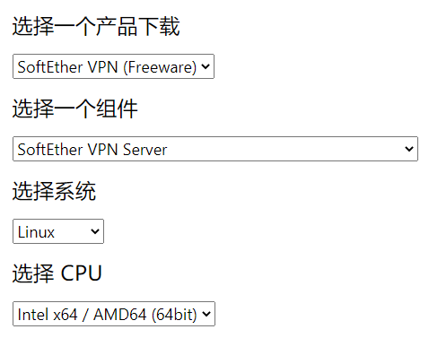

然后远程连接我们的ECS（xShell等工具连接），输入`cd /usr/local`进入个人默认的程序安装路径。然后输入`wget https://github.com/SoftEtherVPN/SoftEtherVPN_Stable/releases/download/v4.34-9744-beta/softether-vpnserver-v4.34-9744-beta-2020.03.20-linux-x64-64bit.tar.gz`将SoftEther下载到服务端（上一步复制的链接）。

输入`tar -zxvf softether-vpnserver-v4.34-9744-beta-2020.03.20-linux-x64-64bit.tar.gz`对SoftEther的压缩包进行解压，输入`rm softether-vpnserver-v4.34-9744-beta-2020.03.20-linux-x64-64bit.tar.gz`对压缩包进行删除（输入`yes`确认删除），最后留下的`vpnserver`文件夹就是SoftEther。

输入`cd vpnserver`进入这个文件夹，再输入`make`进行编译安装，一路按`1`同意。

```txt
cd /usr/local
wget clone https://github.com/SoftEtherVPN/SoftEtherVPN_Stable/releases/download/v4.34-9744-beta/softether-vpnserver-v4.34-9744-beta-2020.03.20-linux-x64-64bit.tar.gz
tar -zxvf softether-vpnserver-v4.34-9744-beta-2020.03.20-linux-x64-64bit.tar.gz
rm softether-vpnserver-v4.34-9744-beta-2020.03.20-linux-x64-64bit.tar.gz
cd vpnserver
make
```

安装好SoftEther后，我们要让SoftEther在服务端开机自运行。输入`vim /etc/systemd/system/vpnserver.service`，再输入`i`进入输入模式，输入以下内容：

```txt
[Unit]
Description=vpnserver daemon
After=network.target

[Service]
Type=forking
ExecStart=/usr/local/vpnserver/vpnserver start
ExecStop= /usr/local/vpnserver/vpnserver stop

[Install]
WantedBy=multi-user.target
```

按Esc退出输入模式，输入`:wq`退出并保存。最后输入`systemctl start vpnserver && systemctl enable vpnserver`就设置好了开机启动。可以让服务端停止后再启动（重启），然后输入`netstat -tanlp`查看进程（杀进程使用`kill -9 xxx`）。

参考命令：

```text
# 刷新服务列表
systemctl daemon-reload
# 设置开机自启
systemctl enable vpnserver
# 关闭开机自启
systemctl disable vpnserver
# 启动服务
systemctl start vpnserver
# 停止服务
systemctl stop vpnserver
```

### 给服务端设置安全组

云服务器**内部**的SoftEther依赖的`5555`可以不用管，因为你在服务器命令行里输入`firewall-cmd --state`，会发现阿里云服务器操作系统内的防火墙是默认关闭的，所以内部使用`5555`端口可以不用管了。如果你要放开云服务器本身的防火墙并添加`7000`端口，可以参考如下命令。

```text
# 先查看防火墙状态
firewall-cmd --state
# 启用防火墙
systemctl start firewalld
# 停用防火墙
systemctl stop firewalld
firewall-cmd --zone=public --add-port=5555/udp --permanent 
firewall-cmd --zone=public --add-port=5555/tcp --permanent 
# 放行端口后要重新加载
firewall-cmd --reload
```

而**外部**想访问服务器以及它的一些端口，那就必须放开一些端口，这个是在[阿里云控制台](https://ecs.console.aliyun.com/)——网络与安全——安全组。外部的手机电脑想连接云服务器SoftEther的虚拟网络，必须开放`500`和`4500`。至于`5555`那是内部用的，跟外部使用无关。`500`和`4500`开放给谁，也要限定好，不是谁想加就加的。

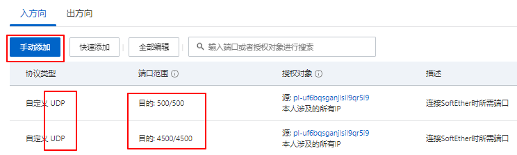

安全组的授权对象我们使用的是[前缀列表](https://ecs.console.aliyun.com/#/prefixList/cn-shanghai)

### 远程管理工具

在云服务器里对SoftEther服务进行配置管理是相当的不方便，SoftEther官方给我们提供了一个远程管理工具。比如我在家里的windows系统上使用“远程管理工具”，对云服务器里的SoftEther服务进行管理，这就比较类似于本地使用XShell管理云服务器。

我们用浏览器打开[softether-download](http://www.softether-download.com/)网址，选择`SoftEther VPN Server Manager for Windows`组件（如果你MAC就选择MAC版），安装的时候一定要选择“仅限管理工具”（因为Server已经在云服务器上安装好了，本地机器就不用再安装了）。

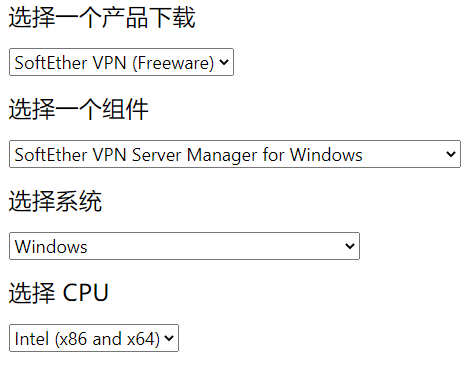  
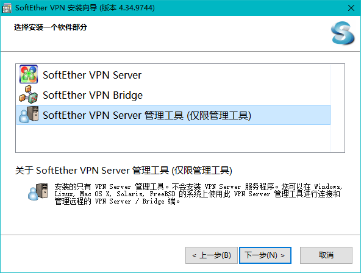

安装好后，它会自动打开`SE-VPN Server Manager (Tools)`，然后我们选择“新设置”

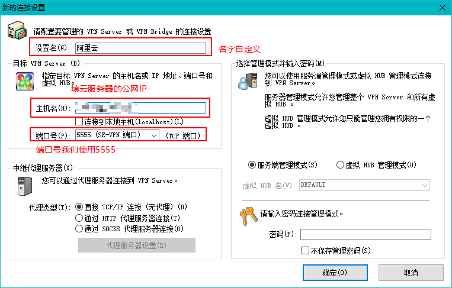

新设置创建好后，我们对它进行“连接”，第一次进入，如果在云服务器SoftEther服务端里没有设置过管理员密码（上一小节我们并没有设置，所以放到这里进行设置），则会在该远程管理工具里弹出管理员密码设置弹框。

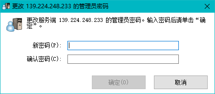

管理员密码设置过后，会弹出“SoftEther VPN Server简单安装”，我们直接关闭这个界面，意思是我们进行手动配置。

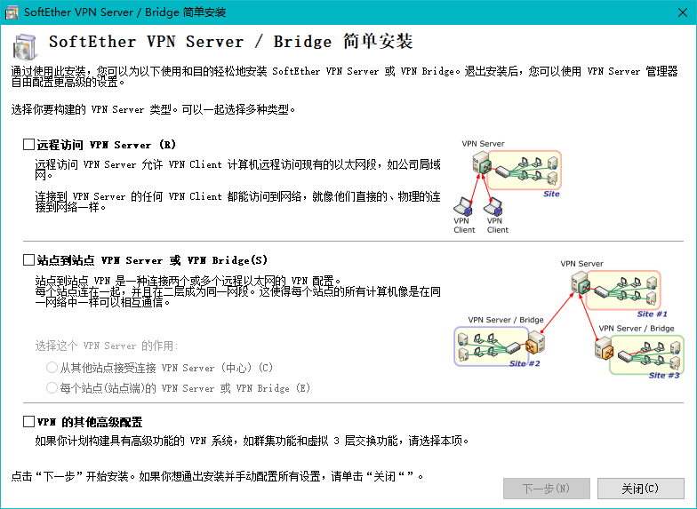

接下来会让你进行“IPsec/L2TP设置”，这个会涉及到客户端连接SoftEther VPN（也就是手机或电脑连接VPN）。一定要把共享密钥记住，在手机或电脑连接VPN时用到。

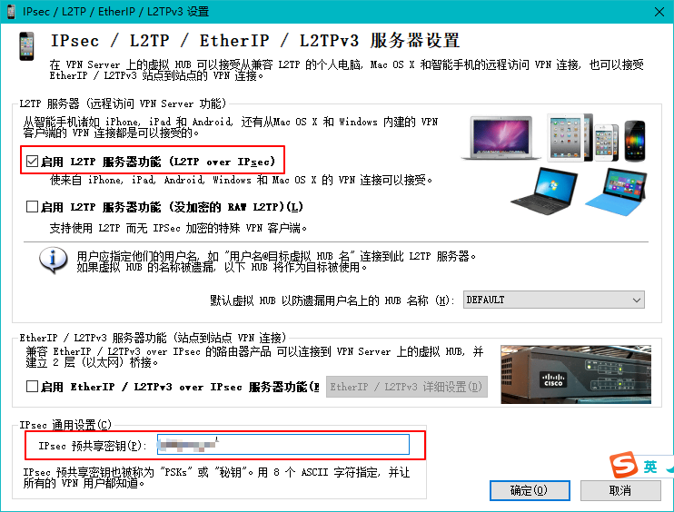

然后就会出现SoftEther远程管理器页面，我们可以对默认的hub进行管理，也可以删除默认的建立新的hub。我们这里就删除默认新建hub了。

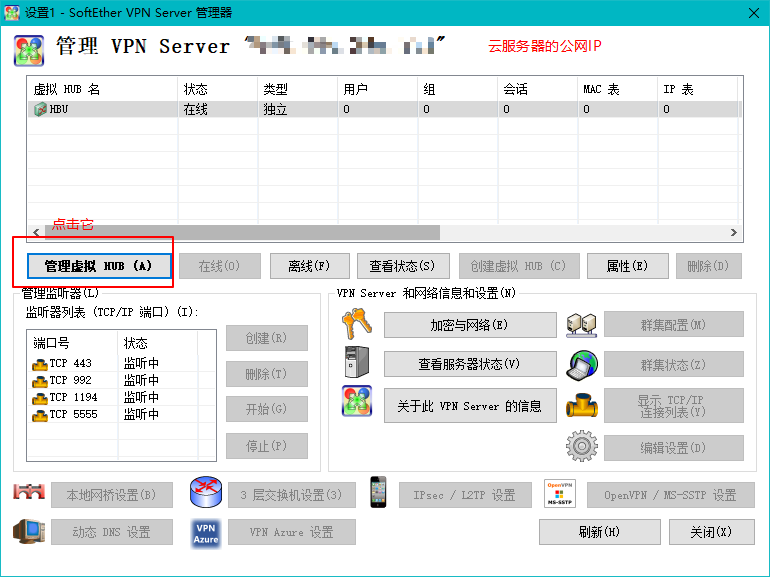  
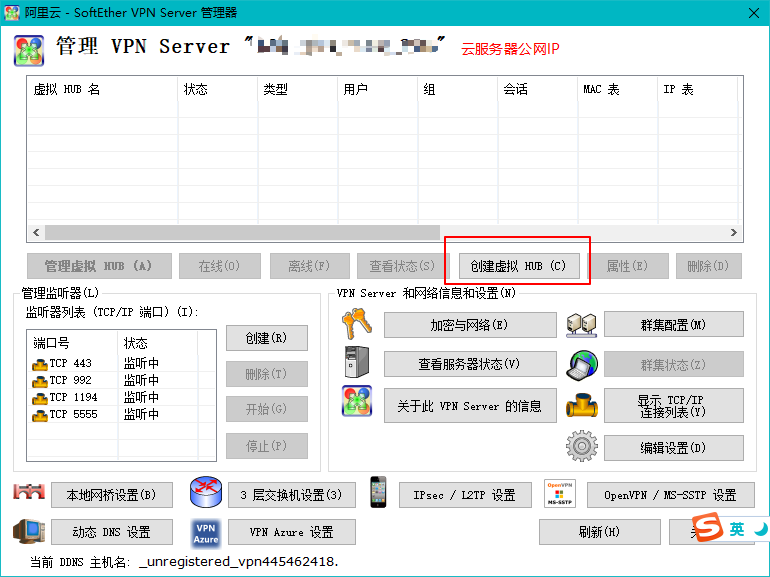  
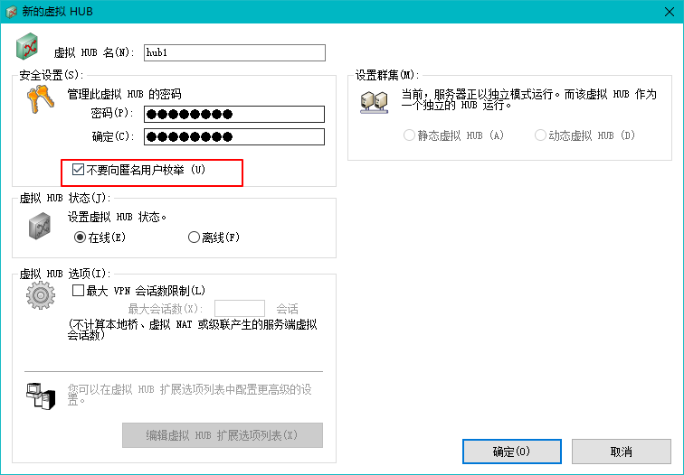

对新hub进行“管理虚拟HUB”，新建用户，你有几台客户端机器就新建几个用户。

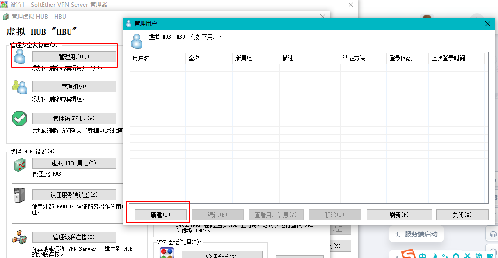  
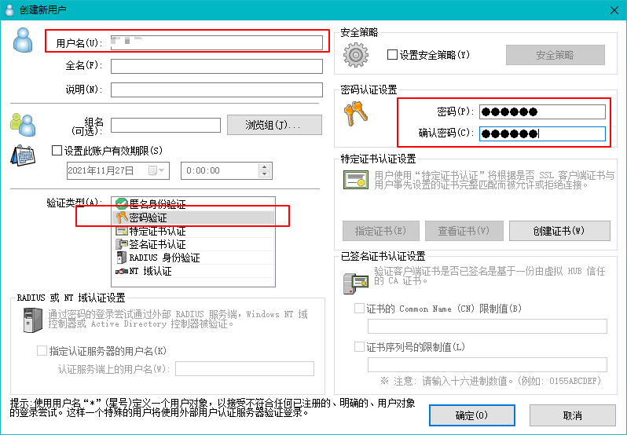

开启NAT地址转换和DHCP服务，这个是为了给客户端机器分配虚拟网络IP的。值得注意的是，“应用到客户端的选项”我们全部清空了，意思是让客户端使用自己的网关，否则可能上不了网。

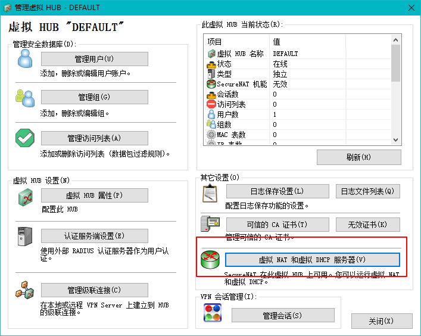  
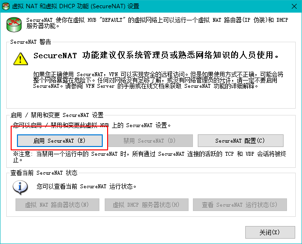  
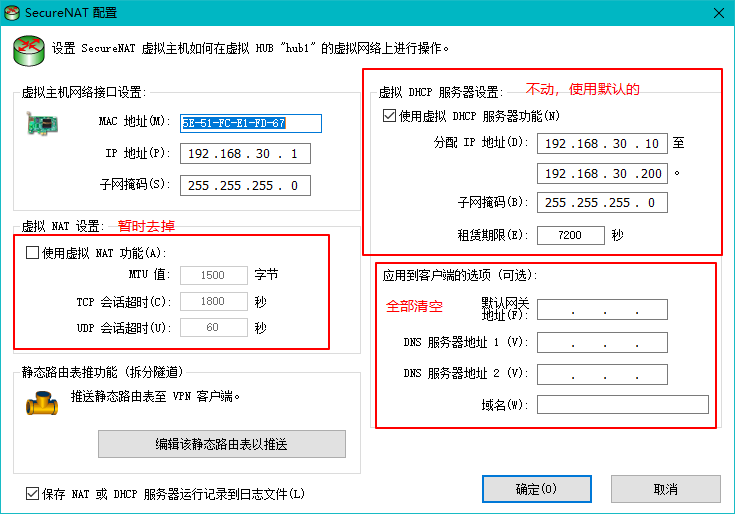

其他除了`5555`端口暂时都删除

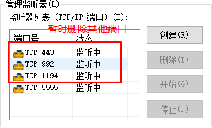

OpenVpn设置暂时用不着，因为我们使用的是“IPsec/L2TP”方式进行连接的。

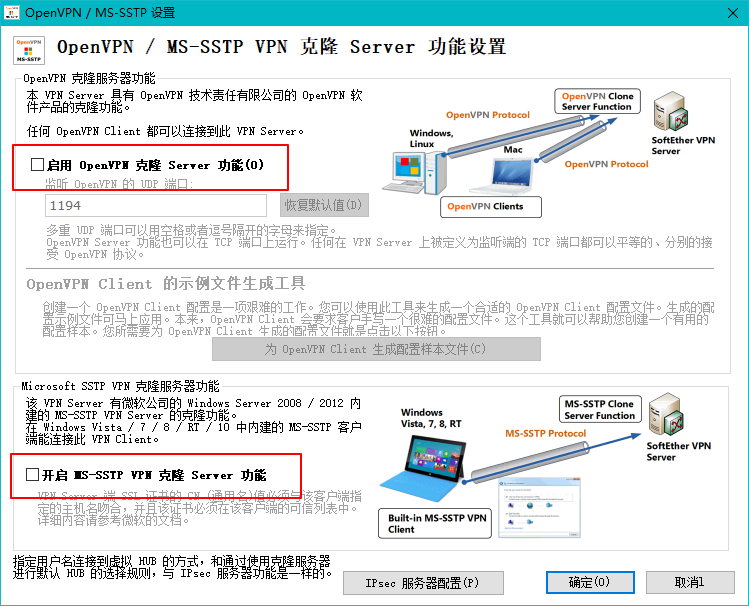

### 客户端连接

**Windows连接SoftEther VPN**，我们并没有使用SoftEther提供的客户端进行SoftEther VPN的连接，而是使用**windows**自带的VPN功能进行连接的。值得注意的是，预共享密钥就是我们在上一小节“IPsec/L2TP设置”里的共享密钥，至于用户就是“管理虚拟HUB”里新建的用户，用户名的格式得是`用户名@hub名`。

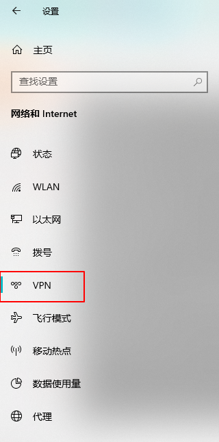  
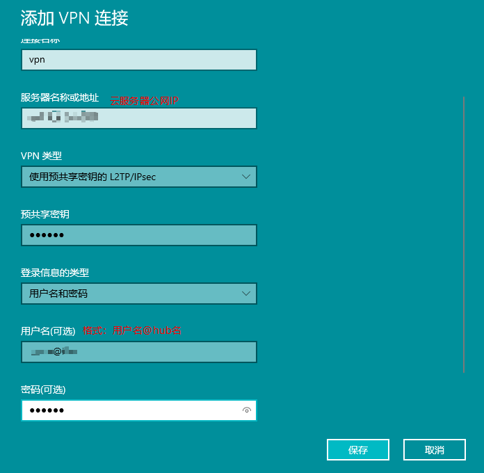

windows连接SoftEther VPN后，可能上不了网。需要进行一个设置，不使用远程网络的默认网关，对于本地的请求还是走本地网关。

  
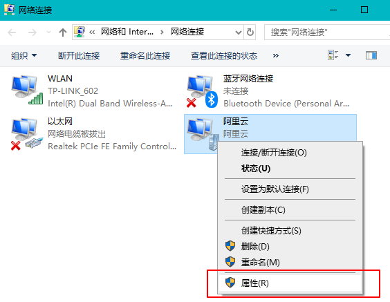  
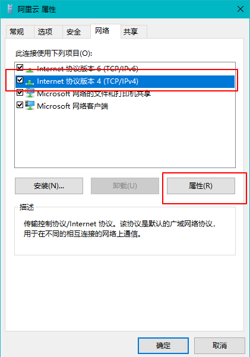  
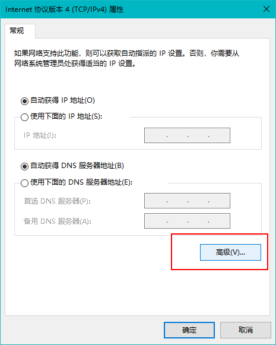  
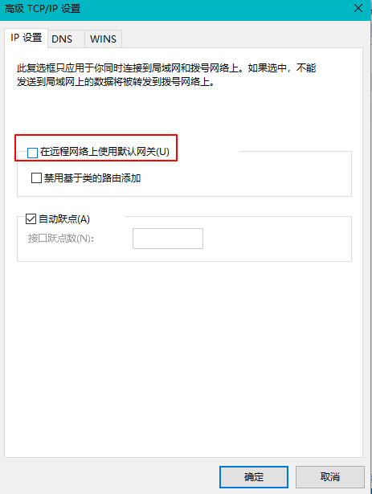  

**IOS连接SoftEther VPN**，通用——VPN——添加VPN配置，“类型”选择“L2TP”，“描述”随意填写，“服务器”填云服务器的公网IP地址，“账户”就是“用户名@hub名”这样的格式，“密码”填用户对应密码，“密钥”就是“IPsec/L2TP设置”里的共享密钥，“发送所有流量”取消勾选。

**安卓连接SoftEther VPN**，以三星S8为例，连接——更多连接设置——VPN——添加VPN配置文件，“姓名”随意填写，“类型”选择“L2TP/IPSec PSK”，“服务器地址”填云服务器的公网IP地址，“L2TP密钥”不填，“IPSec识别符”不填，“IPSec预分享密钥”填“IPsec/L2TP设置”里的共享密钥，勾上“显示购机选项”，“DNS搜索域”和“DNS服务器”不填，“转发路由”填hub默认分配IP端`192.168.30.0/24`（子网掩码是`255.255.255.0`所以长度是24），用户名就是“用户名@hub名”这样的格式，“密码”填用户对应密码。

`/24`的意思是`11111111.11111111.11111111.00000000`（24个1），转为十进制是`255.255.255.0`，这个`255.255.255.0`表示`192.168.30.0`的最后一位可以是是`1~244`，即`192.168.30.1`到`192.168.30.244`。

### 连不上或者连上了不能上网

连不上的原因，很大原因是云服务器端口没开放。开放5555端口是为了SoftEther的使用，开发500和4500是为了电脑和手机能正常连接SoftEther。


电脑连上但不能上网，要关闭“远程网络的默认网关”，IOS也是同理得去掉“发送所有流量”的勾，安卓的话就是“转发路由”填hub默认分配IP端，这些操作都在上一节说过了。它们这样做的原因是本地请求直接走本地网关，有关VPN请求就走VPN。

## SoftEther配合RDC

SoftEther也可以使用RD Client进行远程桌面控制，对虚拟局域网中任意两台客户端都可以使用，只要获取它对应的**虚拟局域网IP**。更多的是一个虚拟局域网的功能，可以联机打游戏、访问局域网内机器里的资料等等。

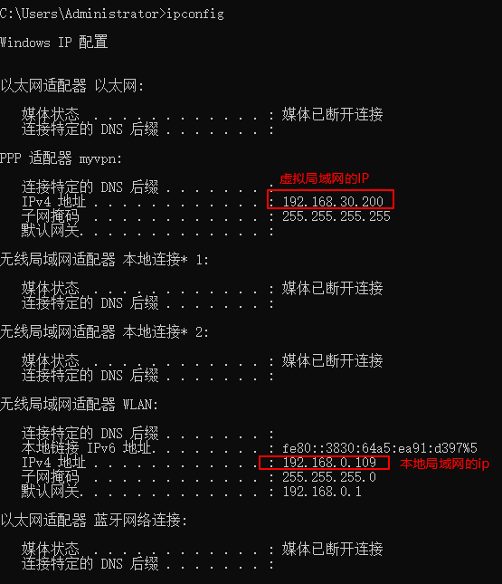

使用RD Client进行远程桌面控制的时候，我们就输入上面这个**虚拟局域网**的IP地址`192.168.30.200`。如果你的控制端和被控制端都在**本地局域网**，就直接用第二个红色框IP`192.168.0.109`。（至于RD Client到底怎么用就不展开了）

每次重连SoftEther VPN，被控制端机器获取的IP地址可能和上一次不一样，这就导致控制端使用RD Client时填写的IP也得跟着改动。所以我们得让这个IP一个固定IP地址。我们先查看SoftEther的DHCP设置，有效IP段是`192.168.30.10`到`192.168.30.200`。再让被控制端机器的VPN的虚拟网卡获取IP固定为`192.168.30.200`。

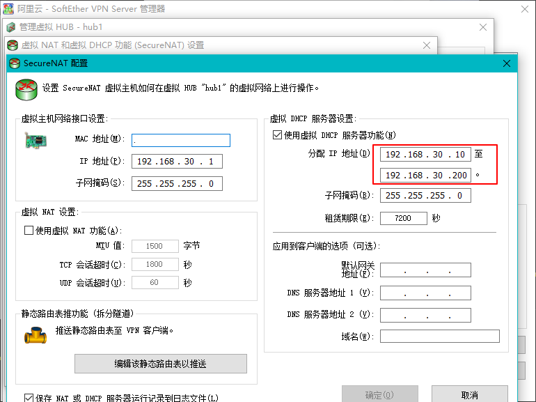

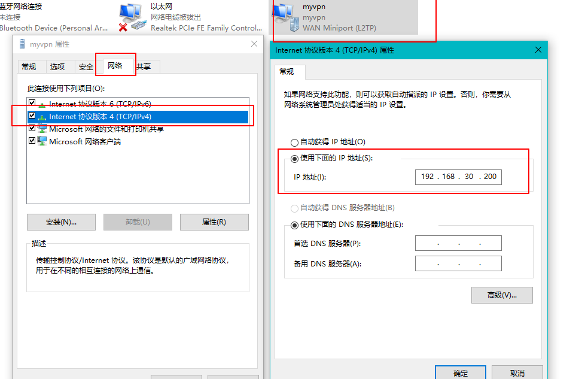

**手动连接**VPN其实很麻烦，一旦我们不在电脑前就无法手动连VPN了，所以我们需要电脑开机后**自动连接VPN**。Windows环境的话，在SoftEther目录（其他目录也可以）下新建startvpn.bat批处理文件，使用文本编辑器打开并编辑：

```text
@echo off
rem WIFI名称
set wifi_name=TP-LINK_602
rem 连接WIFI
(netsh WLAN show interfaces | findStr %wifi_name% >nul && ( 
    echo wifi already connected
)) || (
    netsh wlan connect ssid=%wifi_name% name=%wifi_name%
    echo wifi connect succeed
)
rem 延迟2秒
timeout /t 2 /nobreak
rem 连接VPN
(ipconfig|find/i "myvpn" && (
    echo vpn already connected
)) || (
    rasdial myvpn user2@hub1 123456
    echo vpn connect succeed
)
```

大致解释一下：`@echo off`是不显示执行框，`rem`是注释标识符，`set`定义一个变量，`netsh WLAN show interfaces`是查看当前连接wifi的信息，`findStr %wifi_name%`是进一步查看wifi连接信息里的wifi名，`echo xxx`是提示语xxx，`netsh wlan connect ssid=%wifi_name% name=%wifi_name%`是连接到某个wifi，查看ssid可以使用`netsh wlan show networks mode=bssid`，`ipconfig|find/i "myvpn"`表示连上vpn没有如果连上是能查到vpn名称的，`rasdial myvpn user2@hub1 123456`是连接到名为`myvpn`的vpn，账号格式是`用户名@hub名`。

我们将准备好的startvpn.bat加入到任务计划程序，让startvpn.bat在电脑开机时执行。打开电脑的“任务计划程序”，选择右侧的“创建任务...”。

- 在常规这个页签里，名称填为“myvpn”，然后勾上“不管用户是否登录都要运行”、“使用最高权限运行”、“隐藏”。
- 在触发器这个页签里，选择新建，然后开始任务选择“启动时”，可以自己选择是否重复执行以及间隔。
- 在操作这个页签里，选择新建，然后点击“浏览”选择前面创建的“startvpn.bat”，最后在“起始于”里填写startvpn.bat的父路径（D:\SoftEther VPN Server Manager）。
- 返回常规页签，然后点击确定，输入电脑登录密码，就完成了VPN的自动连接。

至于怎么让被控制端机器怎么**自动开机**，这就涉及到“电源管理”，比如戴尔的BOIS的“Power Management”、“Auto On Mode”、“Auto On Time”、“wake ON lan/wan ”、“USB Wake Support”等。

## 说在最后

SoftEther相比Frp就安全一些，有用户分配、密码验证、秘钥验证等等，并且客户端使用不需要下载什么文件软件等，直接使用系统自带工具连接。如果只是单纯的用RDC远程桌面控制，用Frp就足够了；如果要多台机器联机使用就用SoftEther。

最好不要使用该技术应用到国外云服务器上，就算你用了也要低调使用（学习IT技术、理智获取国外资讯等），也不要做违法犯罪的事（这个就不用多说了吧）。
