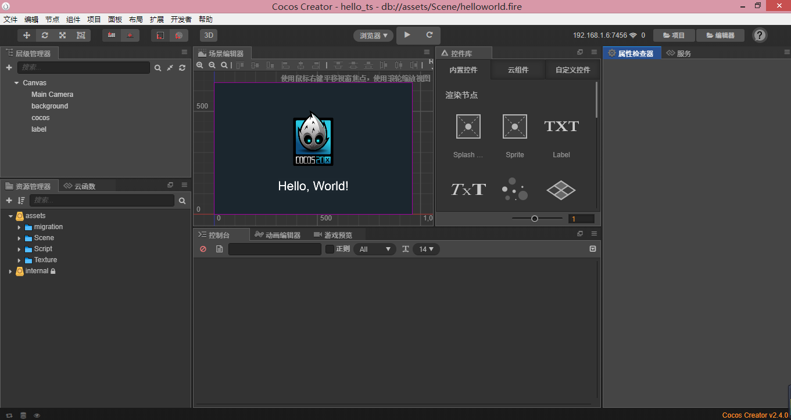

# 环境搭建

## CocosCreator安装

1. 在[引擎官网](https://www.cocos.com/creator/)下载对应操作平台的CocosCreator版本。  

2. 可能会要求先下载安装 **Cocos Dashboard**，如果已经安装过就直接使用它来下载CocosCreator。在安装Cocos Dashboard过程中，会提示安装 **Visual Studio和C++编译配套工具**，当前暂不考虑发布到windows平台所以跳过这一步（[后面需要发布到原生平台时再考虑](https://docs.cocos.com/creator/manual/zh/publish/setup-native-development.html)）。  

3. 安装好Cocos Dashboard后，打开它并在设置里将 **“编辑器目录”** 和 **“语言”** 设置好。然后点开 **“编辑器”** 标签，下载稳定版本的CocosCreator；它会临时下载到C盘，但不用担心，它过会就自动移动到之前设置好的 **“编辑器目录”** 里。

4. 打开 **“编辑器目录”**，可以看到已经安装好的CocosCreator，双击 **“CocosCreator.exe”** 就可以使用Cocos Creator来开发了，当然你也可以通过Cocos Dashboard的“项目”来打开Cocos Creator。

5. 一些注意事项需到引擎官网的[“安装和启动”](https://docs.cocos.com/creator/manual/zh/getting-started/install.html)上查看，这里不展开了。  

## 代码管理(Git)、扩展包管理(npm)

1. 先下载安装[Git](https://git-scm.com/) 和[Node.js](https://nodejs.org/zh-cn/)。Git的使用可以查看之前写的——[Git的使用](/book-web/常用工具/Git的使用.md)，Npm的使用可以查看之前写的——[Npm的使用](/book-web/常用工具/Npm的使用.md)。  

2. 定位到之前新建的CocosCreator项目的根目录下，在空白处右击并选择 **“Git Bash Here”**，在命令行窗口中输入 **git init**，为项目添加代码管理工具。当然，如果项目已经存在于线上git代码库了，直接使用 **git clone xxx** 命令克隆下来即可。

3. 命令行窗口不要关闭，继续输入 **npm init** ，为该项目添加npm管理工具，后面需要什么依赖再安装什么依赖。当然，你也可以先将 **package.json** 配置好（需要的依赖包），然后运行 **npm install** 将所有的依赖下载好。

## 代码编辑器(VSCode)

1. 使用Cocos Creator直接编写脚本效率不高也不方便，所以得给项目专门配置一个代码编辑工具[VSCode](https://code.visualstudio.com/)，VSCode的使用可以查看之前写的——[VSCode的使用](/book-web/常用工具/VSCode的使用.md)。  

2. 要为VSCode编辑状态下注入符合Cocos Creator组件脚本使用习惯的语法提示。使用Cocos Creator打开某个项目，然后依次点击主菜单里 **“开发者”-“VSCode工作流”-“安装VSCode扩展插件”**，控制台里出现“VS Code extension installed to ...”的字样就表示VSCode的cocos提示插件安装成功了。该操作会将Cocos Creator API适配插件安装到VSCode **全局** 的插件文件夹中。  

3. 普通提示可能不够，需要再加个插件让VSCode具有引擎API的智能提示。**“开发者”-“VSCode工作流”-“更新VSCode智能提示数据”**，控制台里出现“API data generated and copied to ...”的字样就表示智能提示配置完毕。该操作会自动将“根据引擎API生成的creator.d.ts数据文件”复制到项目根目录下。  

4. 如果使用的是[TypeScript](https://www.tslang.cn/)来编写脚本的，那要配置 **tsconfig.json**。**“开发者”-“VSCode工作流”-“添加TypeScript项目配置”**，控制台里出现“TypeScript Configuration file has been copied to ...”的字样就表示插件配置完毕。该操作会自动为项目生成tsconfig.json并放到项目根目录下，这个配置并不完善需要自己补充。当然，对应的 **tslint.json** 也要自己完善一下。没有安装ts的记得 **“npm install --save-dev typescript”** 安装一下。

5. 当在VSCode上修改脚本后，需要让CocosCreator编辑器获取焦点（切换到该应用）才能进行编译预览。可以在VSCode上配置编译任务，来触发CocosCreator进行编译。首先下载安装[curl](https://curl.haxx.se/windows/)，然后在Cocos Creator编辑器选择 **“开发者”-“VSCode工作流”-“添加编译任务”**。还可以为该任务配置快捷键{"key": "alt+q","command": "workbench.action.tasks.runTask","args": "mycompile"}。  

## 代码调试(Debugger)

1. 安装[谷歌浏览器](https://www.google.cn/chrome/)；再安装VSCode的插件——Debugger for Chrome，这个在VSCode编辑器的左侧“扩展”里搜索“Debugger for Chrome”再点击“Install”。

2. 打开CocosCreator编辑器，**“开发者”-“VSCode工作流”-“添加Chrome Debug配置”**，控制台里出现“Chrome debug setting has been updated to ...”的字样就表示流程配置完毕。该操作会自动为项目的.vscode目录下生成launch.json文件。

3. 项目预览时使用的端口要与launch.json里的url后面的端口保持一致。

## 代码测试(mocha、chai)

1. 引擎里的元素在Node环境下可能跑不起来（没有Window），所以用单元测试测跟引擎元素无关的逻辑。这样只需要用到mocha+chai，而[mochawesome](https://www.npmjs.com/package/mochawesome)、[nyc](https://www.npmjs.com/package/nyc)两种报告其实没什么必要。

2. 关于mocha和chai的内容可以查看这篇——[基于mocha+chai的单元测试](/book-web/web前端测试与调试/基于mocha+chai的单元测试.md)。

3. 可以等引擎团队推出专门的测试框架（unity就有自己的测试框架）；自己写的话，要引一些包修改一些东西有些麻烦，平常使用mock数据来对自己的组件进行测试就可以了。

## CocosCreator项目结构

&nbsp;&nbsp;&nbsp;&nbsp;打开Cocos Creator，根据需要选择新建空项目还是实例项目；然后在底部填好项目创建目录，最后点击“新建”即可。创建之后的项目有特定的文件夹结构，可以稍微了解一下。

```text
ProjectName（项目文件夹）
  │--assets （ 资源文件夹：存放游戏所需的本地资源、脚本和第三方库文件。会生出对应的.meta文件。）
  │--library （ 资源库：assets中的资源导入后生成的，后面会被处理成最终游戏发布时需要的形式。）
  │--local（ 本地设置：项目在本机上的配置信息，包括编辑器面板布局，窗口大小，位置等信息。）
  │--packages（ 扩展插件文件夹：存放项目里的自定义插件。删除插件时只需删除对应文件夹即可。）
  │--settings （ 项目设置： 保存项目相关的设置，如构建发布菜单里的包名、场景和平台选择等。）
  │--temp（ 临时文件夹：用于缓存一些CocosCreator在本地的临时文件。）
  │--.gitignore（ git忽略设置：设置项目中一些无需提交到git的文件或文件夹。）
  │--creator.d（ 智能提示：CocosCreator生成的智能提示文件，用于编辑器上编辑时出现的智能提示。）
  │--jsconfig.json（ javascript配置：用于配置项目的js版本信息、基本规范等。）
  │--project.json（ 同assets的.meta：作为验证CocosCreator项目合法性的标志。两者合法才能打开项目。）
  │--tsconfig.json（ typescript配置：用于配置项目的ts版本信息、基本规范等。）
```

## 认识CocosCreator编辑器

- CocosCreator编辑器主要由 **资源管理器、场景编辑器、层级管理器、属性检查器、控件库、动画编辑器、控制台** 等组成。
- 项目打开时，默认的界面布局如下  
  
- 可以对它们进行移动或组合，还可以改变他们的大小边界。想恢复原始界面，可以点击上方的 **“布局”-“恢复默认布局”**，当然你也可以选择 **“经典布局”** 和 **“竖屏游戏布局”**。
