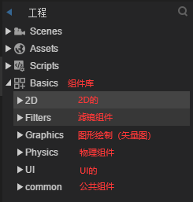
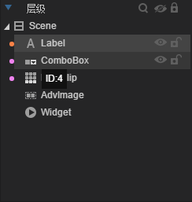

# 组件库的介绍

## 全面了解组件库

组件库在 **Basics** 里，有这样几大类：  


### 2D 基础组件

2D 基础组件比较轻量，但是不能相对布局，可以外部套一层 box 进行布局，它也没有九宫格和数据源。

- Animation：动画基础组件，动画都是基于这个组件运行的（动画创建、播放、控制等）
- HTMLDivElement：富文本组件，html 图文类用于显示 html 内容，例如 a 标签（点击后会派发 link 事件）、span、p、div 等等
- Sprite：精灵，比较底层的显示组件，很多 UI 组件都是继承自它，它本身没有宽高也没有鼠标事件
- Text：文本组件，用于显示文本，很多 UI 组件自带了 Text

### Filters 滤镜组件

滤镜组件的使用是直接将滤镜拖入到 img 或其他组件里面，在 IDE 就可以修改属性并查看实时效果；滤镜比较耗性能，可以使用美术提供的滤镜效果。

- BlurFilterSetter：模糊滤镜，让图片产生模糊效果
- ColorFilterSetter：颜色滤镜，叠加到图片上的颜色
- GlowFilterSetter：发光滤镜，图片背景的发光效果，也可以制作阴影效果

### Graphics 绘图组件

绘图组件主要分为矢量组件和纹理组件，不建议使用矢量组件（性能不太好也可能因为适配不同产生边缘锯齿），比较建议使用纹理节点（有较好的性能，但是它不能添加子节点，它就是一个图）

- 矢量组件
  - Circle：圆形
  - Curves：多曲线
  - Line：直线
  - Lines：多段直线
  - Pie：扇形
  - Poly：多边形
  - Rect：矩形
- 纹理组件
  - FillText：静态文本用 Text 或 Label，动态文本建议使用 FillText；因为动态的文本在使用 Text 会创建新图集比较耗内存，而 FillText 是使用旧图集或一个字一个字提交（创建效率低一些），图集利用率和共享好，但是复杂的“蝌蚪文”不建议使用 FillText（中英文可以），分割时可能会出错。
  - FillTexture：填充纹理，纵横重复显示
  - Texture：纹理，是一个显示图片，在多张图片展示时性能比较好相比于 sprite 或 img

### UI 组件

2D 基础组件不能使用相对布局、九宫格和数据源，但是轻便性能会更好；而 UI 组件可以使用相对布局、九宫格和数据源；  
UI 组件都是继承自 sprite，UI 组件主要分为基础组件和容器组件；其实 Sprite 也可以作为容器存放一些内容的。

UI 组件分类与继承关系：

```text
Sprite 显示精灵
    ├──UIComponent UI组件
    │   ├──基础显示组件
    │   │   ├──Button 按钮组件
    │   │   │   ├──CheckBox 多选框组件
    │   │   │   └──Radio 单选框组件
    │   │   ├──Clip 位图切片组件
    │   │   │   └──FontClip 字体切片组件
    │   │   ├──ColorPicker 选色器组件
    │   │   ├──ComboBox 下拉框组件
    │   │   ├──ScrollBar 滚动条组件
    │   │   │   ├──HScrollBar 水平滚动条组件
    │   │   │   └──VScrollBar 垂直滚动条组件
    │   │   ├──Slider 滑动条组件
    │   │   │   ├──HSlider 水平滑动条组件
    │   │   │   └──VSlider 垂直滑动条组件
    │   │   ├──Image 位图组件
    │   │   ├──Label 文本框组件
    │   │   │   └──TextInput 输入框组件
    │   │   │       └──TextArea 文本域组件
    │   │   ├──ProgessBar 进度条组件
    │   │   └──WXOpenDataViewer 微信开放域组件
    │   └──Box 容器组件
    │       ├──Tree 树
    │       ├──LayoutBox 布局器
    │       │   ├──HBox 水平布局器
    │       │   └──VBox 纵向布局器
    │       ├──List 列表
    │       ├──Panel 面板
    │       ├──UIGroup
    │       │   ├──RadioGroup 单选框按钮组
    │       │   └──Tab 标签（页签）
    │       └──ViewStack 页签对应的容器
    └──Scene 场景组件，没有相对布局
        └──View 显示组件，有相对布局
            └──Dialog 弹窗组件
```

### Common 组件

小游戏使用的组件

## 全面了解组件资源库


- 组件都有自己的资源，这些资源在 **Assets** 里，像引擎自带的在 Assets/comp 里，可以看到他们的命名很规范，遵守命名规范的资源会被引擎识别成对应的组件

| 基础显示组件名称 | 组件中文名称     | 资源前缀（全写，不区分大小写）    | 资源前缀(缩写，区分大小写) |
| ---------------- | ---------------- | --------------------------------- | -------------------------- |
| Label            | 文本框           | label\_                           | —                          |
| TextInput        | 输入框           | textinput\_                       | input\_                    |
| TextArea         | 带滚动条的文本域 | textarea\_                        | area\_                     |
| Button           | 按钮             | button\_                          | btn\_                      |
| CheckBox         | 多选框           | checkbox\_                        | check\_                    |
| Radio            | 单选框           | radio\_                           | —                          |
| Tab              | 标签             | tab\_                             | —                          |
| RadioGroup       | 单选框按钮组     | radiogroup\_                      | —                          |
| VSlider          | 垂直滑动条       | vslider\_                         | —                          |
| HSlider          | 水平滑动条       | hslider\_                         | —                          |
| Clip             | 位图切片         | clip\_                            | —                          |
| fontclip         | 字体切片         | fontclip\_                        | —                          |
| ProgressBar      | 进度条           | progressbar\_                     | progress\_                 |
| ComboBox         | 下拉框           | combobox\_                        | combo\_                    |
| VScrollBar       | 垂直滚动条       | vscrollbar\_                      | vscroll\_                  |
| HScrollBar       | 水平滚动条       | hscrollbar\_                      | hscroll\_                  |
| Image            | 位图             | Image\_                           | img\_                      |
| sprite           | 精灵             | 不按组件规则命名的都被视为 sprite |

- 特殊组件会有多个资源，使用$符合来区别不同状态所需要的资源。
- Assets 资源库也存放游戏项目的资源，要符合命名规则，然后就可以拖拽到场景编辑器里使用了。
- Assets 资源库里的“组件”可以进行属性的预设（双击），但是这个“组件”肯定是基础显示组件类型的，不会是容器组件类型的。
- Assets 资源库里面的文件夹可以双击对其设置打包类型，“打包”和“不打包”，意思是不打包成图集直接使用碎图，也可以单独对资源设置打包类型。

## 层级面板节点与节点树

### 层级面板



- 后拖进去的后挡住前面拖进去的（先进去的在底层），会优先看到上层的东西
- 层级的改变可以通过鼠标拖拽或者 Ctrl+方向键

### 节点

- 节点 Node 是可放在显示列表中所有对象的基类；该显示列表管理着 Laya 运行时显示的所有对象。
- Sprite 是 Node 的一个子类，那么 UI 组件也算作一个节点，这些节点可以添加子节点。
- 功能类组件跟 UI 组件有区别，单功能类组件不在显示列表所以不会显示，也不能添加子节点，例如：脚本、物理组件、Widget 等等。
- 像纹理组件 Texture 就不是节点，它无法添加子节点，如果将多个 Texture 添加到 Sprite 里，最终只生效一个，虽然看起来像是父子关系，其实不是的，只有节点与节点之间才有父子关系，Sprite 里 Texture 其实就是作用在 Sprite 本身的（算作 Sprite 的功能属性）。
- 节点之间，父影响子，但子不影响父。

### 节点树

- 开发中常用的手段，将游戏中一个模块里所有的东西放到一个容器里，这个容器与里面的其他节点构成了节点树
- 只要改变最外层的位置和大小就可以改变当前模块所有的内容，也就是父影响子。
- 如果你用不到，可以将容器打散，右键即可。
