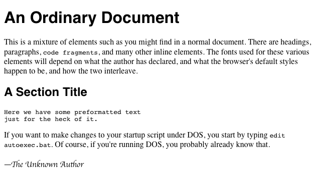
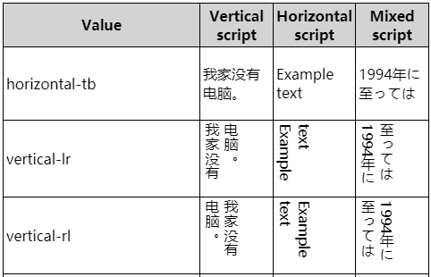

# 字体与文本属性

## 一、字体

### 1.1 使用字体

css有5种**通用家族字体**（泛型字体）：

| 名称       | 定义                                                                      |
| ---------- | ------------------------------------------------------------------------- |
| serif      | 有衬线的字体 （衬线一词是指字体笔画尾端的小装饰，存在于某些印刷体字体中） |
| sans-serif | 没有衬线的字体                                                            |
| monospace  | 每个字符具有相同宽度的字体，通常用于代码列表。                            |
| cursive    | 用于模拟笔迹的字体，具有流动的连接笔画。                                  |
| fantasy    | 用来装饰的字体                                                            |

客户端中常见的**网页安全字体**：

| 字体名称        | 泛型       | 注意                                                                                                                                             |
| --------------- | ---------- | ------------------------------------------------------------------------------------------------------------------------------------------------ |
| Arial           | sans-serif | 通常认为最佳做法还是添加 Helvetica 作为 Arial 的首选替代品，尽管它们的字体面几乎相同，但 Helvetica 被认为具有更好的形状，即使Arial更广泛地可用。 |
| Courier New     | monospace  | 某些操作系统有一个 Courier New 字体的替代（可能较旧的）版本叫Courier。使用Courier New作为Courier的首选替代方案，被认为是最佳做法。               |
| Georgia         | serif      |                                                                                                                                                  |
| Times New Roman | serif      | 某些操作系统有一个 Times New Roman 字体的替代（可能较旧的）版本叫 Times。使用Times作为Times New Roman的首选替代方案，被认为是最佳做法。          |
| Trebuchet MS    | sans-serif | 您应该小心使用这种字体——它在移动操作系统上并不广泛。                                                                                             |
| Verdana         | sans-serif |                                                                                                                                                  |

调用字体是使用`font-family`，例如

```css
body {font-family: serif;} /*正个页面的文字使用衬线字体*/
h1, h2, h3, h4 {font-family: sans-serif;} /*标题使用非衬线字体*/
code, pre, tt, kbd {font-family: monospace;} /*代码块等其他地方使用等宽字体*/
p.signature {font-family: cursive;} /*某个特殊的段落使用仿笔迹字体*/
```

  

建议`font-family`使用**字体栈**，也就是多个值使用`,`来分隔，当第一个字体无法被解析时会对下一个字体进行解析。

```css
h1 { font-family: Arial, sans-serif; }
h2 { font-family: Charcoal, sans-serif; }
p { font-family: "Times New Roman", serif; }
address { font-family: Chicago, sans-serif; }
```

字体如果名称比较特殊或者它带的关键字与其他字体冲突，那么可以将字体使用`''`或者`""`来包裹起来。

```css
p { font-family: Times, "Times New Roman", "New Century Schoolbook", Georgia, "New York", serif; }
h2 { font-family: Wedgie, "Karrank%", Klingon, fantasy; }
h3 { font-family: Author, "cursive", cursive; }
```

### 1.2 @font-face

在css里使用字体时，该字体是需要存在于客户端（浏览器）里的，而客户端一般只安装了被广泛使用的一些字体。如果我们想使用自定义字体或者还在小范围流行的字体，可以通过WebFont功能来从服务器下载该字体。

具体使用的是`@font-face`，它最常用的两个描述符`font-family`和`src`，其中`font-family`是用来定义下载字体的名字，`src`是字体下载源（可以是多个，用逗号分隔），`src`中还可以使用`format()`用来显式地声明字体文件格式，不支持的格式可以直接跳过节约宽带。

```css
@font-face {
    font-family: WebFont;                                       /*定义字体名称*/
    src: url('font/Fontin_Sans_R_45b.otf') format("opentype");  /*字体下载url*/
}
h1 { font-family: WebFont; } /*使用该字体*/
```

在一些场景里需要使用类似**斜体**、**粗体**和**压缩**字体，那么先在服务器里准备好斜体和粗体的字体，然后在`@font-face`里添加`font-style: italic`、`font-weight: bold`或`font-stretch: condensed`，不是都写在一个`@font-face`里的，是有哪些字体就对应写上几个`@font-face`。

```css
@font-face {
    font-family: WebFont;
    src: url('Fontin_Sans_R_45b.otf') format("opentype");  /*正常字体*/
}
@font-face {
    font-family: WebFont;
    font-style: italic;
    src: url('Fontin_Sans_I_45b.otf') format("opentype");  /*斜体字体*/
}
@font-face {
    font-family: WebFont;
    font-weight: bold;
    src: url('Fontin_Sans_B_45b.otf') format("opentype");  /*粗体字体*/
}
@font-face {
    font-family: WebFont;
    font-style: italic;
    font-weight: bold;
    src: url('Fontin_Sans_BI_45b.otf') format("opentype");  /*粗斜体字体*/
}
@font-face {
    font-family: WebFont;
    font-style: italic;
    font-stretch: condensed
    src: url('Fontin_Sans_IC_45b.otf') format("opentype");  /*斜体压缩字体*/
}
```

也可以采用**先客户端后服务端**，客户端的使用是将`src:url()`改为`src:local()`

```css
@font-face {
    font-family: WebFont;
    src: local("Helvetica Neue"), url('MgOpenModernaRegular.ttf');  /*先在客户端查找，找不到再去服务端查找*/
}
```

### 1.3 字体粗细

一般来说，字体的粗细越粗，文字的颜色就越深。`font-weight`就是用来描述字体的粗细的，它的值有：

- `normal`：默认，该标准字体的默认粗度。
- `bold`：粗体。
- `bolder`：更粗。
- `lighter`：更细。
- `100 | 200 | 300 | 400 | 500 | 600 | 700 | 800 | 900`：100最细900最粗，400对应`normal`，700对应`bold`。

其实`100`到`900`可能并没有一一对应（映射）到真实的粗细字体：

- 如果`500`没有映射值，它将被赋予和`400`相同粗细的字体。
- 如果`300`没有映射值，它将被赋予比`400`更细的下一个字体。但是如果没有更细的字体可用，那`300`被赋予和`400`相同粗细的字体。此方法也同样适用于`200`和`100`。
- 如果`600`没有映射值，它将被赋予比`500`更粗的下一个字体。但是如果没有更粗的字体可用，那`600`被赋予和`500`相同粗细的字体。此方法也同样适用于`700`、`800`和`900`。

`bolder`和`lighter`在使用时有个比较坑的点，它是在继承到的`font-weight`基础上更粗或者更细，也就是说它是一个相对值。比如父级是`100`，那子级使用`bolder`的话就可能会是`normal`或者`bold`。可以看下面这个例子：

```html
<html>
<head>
    <style type="text/css">
    p { font-weight: normal; }
    p em { font-weight: bolder; }  /* 假设粗体字体存在，那这个em就是'bold' */
    h1 { font-weight: bold; } /* 假设粗体字体存在，那此时'bold'对应700 */
    h1 b { font-weight: bolder; }  /* 更粗的字体也存在的话，那这个b是'800' */
    div { font-weight: 100; } /* 假设更细的字体存在，100会有映射值，那使用bolder会是'normal'。*/
    div strong { font-weight: bolder; } /* 不存在的话，100会映射到'normal'，那使用bolder就会是'bold'  */
    </style>
</head>
<body>
    <p class="one">Within this paragraph we find some <em>emphasized text</em>.</p>
    <h1>This H1 contains <b>bold text!</b></h1>
    <div>Meanwhile, this DIV element has some <strong>strong text</strong> but it shouldn’t look much different, at least in terms of font weight.</div>
</body>
</html>
```

如果你怕`100`到`900`映射不到值，可以在下载字体时不使用`normal`和`bold`，而是使用`100`到`900`这9个值：

```css
@font-face {
  font-family: "SwitzeraADF";
  font-weight: 300;
  src: url("f/SwitzeraADF-Light.otf") format("opentype");
}
@font-face {
  font-family: "SwitzeraADF";
  font-weight: 500;
  src: url("f/SwitzeraADF-DemiBold.otf") format("opentype");
}
@font-face {
  font-family: "SwitzeraADF";
  font-weight: 700;
  src: url("f/SwitzeraADF-Bold.otf") format("opentype");
}
@font-face {
  font-family: "SwitzeraADF";
  font-weight: 900;
  src: url("f/SwitzeraADF-ExtraBold.otf") format("opentype");
}
```

### 1.4 字体大小

字体大小使用`font-size`这个属性，这个属性的值有`xx-small | x-small | small | medium | large | x-large | xx-large | smaller | larger | <length> | <percentage>`。

```html
<html>
<head>
    <style type="text/css">
    p.one { font-size: xx-small }
    p.two { font-size: x-small; }
    p.three { font-size: small; }
    p.four { font-size: medium; }
    p.five { font-size: large; }
    p.six { font-size: x-large; }
    p.seven { font-size: xx-large; }
    </style>
</head>
<body>
    <p class="one">This paragraph (class 'one') has a font size of 'xx-small'.</p>
    <p class="two">This paragraph (class 'two') has a font size of 'x-small'.</p>
    <p class="three">This paragraph (class 'three') has a font size of 'small'.</p>
    <p class="four">This paragraph (class 'four') has a font size of 'medium'.</p>
    <p class="five">This paragraph (class 'five') has a font size of 'large'.</p>
    <p class="six">This paragraph (class 'six') has a font size of 'x-large'.</p>
    <p class="seven">This paragraph (class 'seven') has a font size of 'xx-large'.</p>
</body>
</html>
```

`smaller`和`larger`是更小和更大，是在一个继承到的字体大小基础上除以或者乘以一个放大系数，这个放大系数在css1的时候是1.5，现在css3是个比较复杂的比率。

`<percentage>`就是使用百分比了，是相对于父元素字体大小的百分比。

`<length>`就是使用长度单位的大小了，例子如下：

```html
<html>
<head>
    <style type="text/css">
    p { line-height: 1; margin: 0.5em; }
    p.one { font-size: 36pt; }
    p.two { font-size: 3pc; }
    p.three { font-size: 0.5in; }
    p.four { font-size: 1.27cm; }
    p.five{ font-size: 12.7mm; }
    </style>
</head>
<body>
    <p class="one">36 point font size</p>
    <p class="two">3 pica font size</p>
    <p class="three">0.5 inch font size</p>
    <p class="four">1.27 centimeter font size</p>
    <p class="five">12.7 millimeter font size</p>
</body>
</html>
```

**最常用的长度单位**：

- **px**: 像素，相对于显示器屏幕分辨率而言的。这是一个绝对单位，它导致了在任何情况下，页面上的文本所计算出来的像素值都是一样的。
- **em**: 1em 等于我们设计的当前元素的父元素上设置的字体大小。大多数浏览器的默认字体是16px，那么一开始1em等于16px，但这样的换算很麻烦，所以在html或者body选择器中声明了`font-size: 62.5%`，那么1em就等于10px，在对旧项目使用em时就很方便的对px除以10就可以得到新的em了。
- **rem**: 这个单位的效果和 em 差不多，除了 1rem 等于 HTML 中的根元素的字体大小 ，而不是父元素。这可以让你更容易计算字体大小，但是遗憾的是， rem 不支持 Internet Explorer 8 和以下的版本。

**字体替换**问题：

`font-size-adjust`设置的值是字体的aspect（比例值），aspect是“该字体的x高度”除以“该字体尺寸”。如果页面某个局部需要使用新字体，但需要新旧字体的展示大小一样（以免影响内容大小或布局）。那么就可以通过`font-size-adjust`和`font-size`来调整新字体最终展示效果，也就是让替换前后的小写字母`x`展示效果一样。

推导过程，`x`展示效果要一样，那么可得到这样一个等式：`替换后字体大小 * 替换后的aspect = 替换前的字体大小 * 替换前的aspect`。最后就可以得到替换字体后，`font-size`要设置的新值为`替换后字体大小 = 替换前的字体大小 * 替换前的aspect / 替换后的aspect`。

```html
<html>
<head>
    <style type="text/css">
        div {
            font-family: Comic Sans MS;
            font-size: 16px;
            font-size-adjust: 0.54;
        }
        div#div2 {
            font-family: Times New Roman;   /*将Comic Sans MS替换成Times New Roman*/
            font-size: 19px;                /* 16 * 0.54 / 0.46 约等于19 */
            font-size-adjust: 0.46;
        }
    </style>
</head>
<body>
    <div id="div1">It is fine today.Never change your plans because of the weather.</div>
    <div id="div2">It is fine today.Never change your plans because of the weather.</div>
</body>
<html>
```

### 1.5 斜体、字体压缩拉伸

`font-style`属性用于设置字体是否**斜体**，值一般就是三个`italic | oblique | normal`，italic是最常用的斜体，而oblique是一种比较少用的斜体。oblique的整体倾斜效果没有italic大，oblique就算是倾斜的，它的一部分还是有那种直立的效果（可以通过某种方法将normal处理成oblique）。可以看这下面这个图示：

  

如果italic没有映射到真实的斜体，可以使用oblique的版本作为italic来使用，而反过来一般是不行。

`font-stretch`属性用于设置字体**压缩拉伸**的，可能是拉伸的也可能是压缩的，其值`normal | ultra-condensed | extra-condensed | condensed | semicondensed | semi-expanded | expanded | extra-expanded | ultraexpanded`，这种和**字体大小**的值用法类似，如果没有映射到真实的值就可能在页面上不起作用。

  

## 二、文本属性

### 2.1 缩进

`text-indent`属性设置在块级元素上，会对其内部的文本第一行的开头进行**缩进**，它的值有`<length>`和`<percentage>`两种方式（百分比是相对于父容器宽度）。解释说明：`text-indent`是设置在块级元素上，或者说是设置在具有**块级**特性的元素上，然后对其**内部**具有**内联**特性的元素进行缩进。如果你不想对块级父容器设置`text-indent`，但又想让其内部有缩进的效果，那么可以试着使用左外边距margin-left。

```html
<html>
<head>
    <style type="text/css">
    .one { text-indent: 3rem; }
    .two { text-indent: 3rem; } /* 无效，得设置在块级元素上 */
    .three { margin-left: 3rem; }
    </style>
</head>
<body>
    <p class="one">Said Tommy the Cat as he reeled back to clear whatever foreign matter may have nestled its way into his mighty throat.</p>
    <span class="two">Said Tommy the Cat as he reeled back to clear whatever foreign matter may have nestled its way into his mighty throat. </span><br>
    <span class="three">Said Tommy the Cat as he reeled back to clear whatever foreign matter may have nestled its way into his mighty throat. </span>
</body>
</html>
```

### 2.2 水平对齐

`text-align`属性也设置在**块级**元素上，会对其内部的文本每一行的文字进行**水平方向上的对齐**，可取值比较多`start | end | left | right | center | justify | match-parent`。解释说明：`text-align`设置在具有**块级**特性的元素上，然后对其**内部**具有**内联**特性的元素进行**水平对齐**。

1. left和right与书写模式无关，就是于行框的左或者右边进行对齐。
2. start和end就取决于书写模式。比如从左到右的顺序，那start跟left是一样的效果，end和right是一样的效果。
   - start：表示文本对齐到其行框的开始边缘。
   - end：表示文本对齐到其行框的结束边缘。
3. justify是两端对齐，会保证每一行文本显示长度一样，也就说在单词不足的情况下可能会拉伸显示效果。对最后一行无效，justify-all可以让最后一行也强制两端对齐，不过有些浏览器没有实现该功能。
4. match-parent和inherit类似，区别在于start和end的值根据父元素的direction确定，并被替换为恰当的left或right。

```html
<html>
<head>
    <style type="text/css">
    .table { width: 700px; display: table; }
    .row { display: table-row; }
    .cell {
        display: table-cell;
        width: calc(33.33% - 1rem);
        box-sizing: border-box;
        margin: .5rem;
        padding: .5rem;
        background-color: #FFF;
        overflow: hidden;
    }
    p {
        font: .8rem sans-serif;
        max-width: 100%;
        box-sizing: border-box;
        overflow: hidden;
        resize: horizontal;
        background: #E4F0F5;
        padding: .5rem;
        margin: .5rem 0 0;
    }
    .taLeft       { text-align: left;        }
    .taRight      { text-align: right;       }
    .taCenter     { text-align: center;      }
    .taJustify    { text-align: justify;     }
    .taJustifyAll { text-align: justify-all; }
    .taStart      { text-align: start;       }
    .taEnd        { text-align: end;         }

    .rtl { direction: rtl; }
    .ltr { direction: ltr; }
    </style>
</head>
<body>
    <div class="table">
        <div class="row">
            <div class="cell">
                left
                <p class="taLeft">Lorem ipsum dolor sit amet, consectetur adipiscing elit. Nam pellen tesque vehicu la con vallis.</p>
            </div>
            <div class="cell">
                start (ltr)
                <p class="taStart ltr">Lorem ipsum dolor sit amet, consectetur adipiscing elit. Nam pellen tesque vehicu la con vallis.</p>
            </div>
            <div class="cell">
                start (rtl)
                <p class="taStart rtl">Lorem ipsum dolor sit amet, consectetur adipiscing elit. Nam pellen tesque vehicu la con vallis.</p>
            </div>
        </div>
        <div class="row">
            <div class="cell">
                right
                <p class="taRight">Lorem ipsum dolor sit amet, consectetur adipiscing elit. Nam pellen tesque vehicu la con vallis.</p>
            </div>
            <div class="cell">
                end (ltr)
                <p class="taEnd ltr">Lorem ipsum dolor sit amet, consectetur adipiscing elit. Nam pellen tesque vehicu la con vallis.</p>
            </div>
            <div class="cell">
                end (rtl)
                <p class="taEnd rtl">Lorem ipsum dolor sit amet, consectetur adipiscing elit. Nam pellen tesque vehicu la con vallis.</p>
            </div>
        </div>
        <div class="row">
            <div class="cell">
                center
                <p class="taCenter">Lorem ipsum dolor sit amet, consectetur adipiscing elit. Nam pellen tesque vehicu la con vallis.</p>
            </div>
            <div class="cell">
                justify
                <p class="taJustify">Lorem ipsum dolor sit amet, consectetur adipiscing elit. Nam pellen tesque vehicu la con vallis.</p>
            </div>
            <div class="cell">
                justify-all
                <p class="taJustifyAll">Lorem ipsum dolor sit amet, consectetur adipiscing elit. Nam pellen tesque vehicu la con vallis.</p>
            </div>
        </div>
    </div>
    </div>
</body>
</html>
```

如果想让文本**最后一行**进行不同于整个文本的对齐方式，那么可以使用`text-align-last`，它的值有`auto | start | end | left | right | center | justify`。

### 2.3 垂直对齐

#### 2.3.1 基线与行高

可以参考前面一章的内容——[line-height和baseline](./2.盒模型.md#53-line-height和baseline)

**基线(baseline)**是用于在上面放置字符的一条假象的基准线，像`g`和`p`会有下降。基线位置的确定最好还是去看一下前一章的内容。

  

**行高(line-height)**主要用于给文字撑出高度用的，最后的值也会作为内联非替换元素的`inline box`的高度。

`line-height`取值`<number> | <length> | <percentage> | normal`。`normal`是默认值，具体值通常是字体大小的 1.2 倍；`<number>`是个无单位数值，会乘以该元素的字体大小，与`<percentage>`差不多；`<length>`就是最常见的长度值了。不推荐在行高上使用`em`，因为`em`是取父级字体大小可能不适用本元素的高度。

#### 2.3.2 垂直对齐

可以参考前面一章的内容——[vertical-align](./2.盒模型.md#54-vertical-align)

**垂直对齐**使用`vertical-align`，它是直接设置在**内联**元素（内联特性）或者单元格上的，也就说你在块级元素上设置`vertical-align`，其子元素或者内容是没有垂直对齐的。`vertical-align`的值有`baseline | sub | super | top | text-top | middle | bottom | text-bottom | <length> | <percentage>`。

- **baseline**：默认值，让元素的baseline与父元素的baseline进行对齐。
- **middle**：中间对齐，让元素的中部与父元素的baseline加上**x-height**的一半（`baseline + x-height / 2`）进行对齐。
- **sub**：下标基线对齐，让元素的baseline与父元素的**下标基线**进行对齐。
- **super**：上标基线对齐，让元素的baseline与父元素的**上标基线**进行对齐。
- **text-top**：文本框顶部对齐，让元素的`inline box`**顶部**与父元素的文本框（单行）顶部进行对齐。
- **text-bottom**：文本框底部对齐，让元素的`inline box`**底部**与父元素的文本框（单行）底部进行对齐。
- **top**：`line box`顶部对齐，让元素的`inline box`顶部与当前行的`line box`顶部进行对齐。
- **bottom**：`line box`底部对齐，让元素的`inline box`底部与当前行的`line box`底部进行对齐。

```html
<html>
<head>
    <style type="text/css">
      .outer { background-color: red; }
      .inner {
        display: inline-block;
        width: 100px;
        height: 100px;
        background-color: skyblue;
        /*底部空隙的问题是预留了字符下降的空间与也就是line-height的影响*/
        /*vertical-align: middle;*/
      }
    </style>
</head>
<body>
    <div class="outer">
        <li class="inner"></li>
        <li class="inner"></li>
        <li class="inner"></li>
    </div>
</body>
</html>
```

```html
<html>
<head>
    <style type="text/css">
    body { width: 500px; }
    span.raise { vertical-align: super; }
    span.lower { vertical-align: sub; }
    </style>
</head>
<body>
    <p>This paragraph contains <span class="raise">superscripted</span>
    and <span class="lower">subscripted</span>  text.</p>
</body>
</html>
```

`vertical-align`的另外两种取值:

- `<length>`使元素的基线对齐到父元素的基线之上的给定长度。可以是负数。
- `<percentage>`使元素的基线对齐到父元素的基线之上的给定百分比，该百分比是line-height属性的百分比。可以是负数。

#### 2.3.3 单元格的垂直对齐

一般`vertical-align`都是设置在**内联元素**上，然后让内容元素相对于它所在的**line box**容器进行垂直对齐的。但是`vertical-align`有个特殊场景，就是设置在单元格上，让单元格内容相对于单元格容器进行垂直对齐。

在单元格上设置`vertical-align`，其值一般是`top | bottom | middle | baseline`，取这些值会被忽略`sub | super | text-top | text-bottom`。

```html
<html>
<head>
    <style type="text/css">
    .outer {
        display: table-cell;
        /*让单元格里整个内容，相对于单元格这个容器进行一个垂直居中对齐*/
        vertical-align: middle;
        width: 280px;
        height: 200px;
        border: 1px solid;
        margin: 0;
    }
    .inner1 {
        display: inline-block;
        /*让inner1的底部与当前行文本底部对齐*/
        vertical-align: text-bottom;
        width: 50px;
        height: 50px;
        border: 1px solid blue;
    }
    .inner2 {
        display: inline-block;
        /*让inner2的中部与当前行“基线加上x一半高度”这个位置进行对齐*/
        vertical-align: middle;
        width: 40px;
        height: 40px;
        border: 1px solid red;
    }
    </style>
</head>
<body>
    <div class="outer">Xx
        <div class="inner1"></div>Xx
        <div class="inner2">Xx</div>Xx<br>XxXxXxXxXxXxXxXx
    </div>
</body>
</html>
```

小节一下：`text-align`设置在父级块元素，让子级内联元素去对齐。`vertical-align`设置在子级内联元素，让它本身相对于`line box`去对齐，特殊情况下设置在父级单元格上，让子级元素（块级和内联都行）去对齐。

### 2.4 文本间距

#### 2.4.1 词间距

`word-spacing`属性单词之间的间距的，默认值是normal，可以设置其他长度值（为0跟normal一样的效果）。是对于单词来说的，但是在非英语文本下，无法定义这个“词”是什么，所以它可能会失效

```html
<html>
<head>
    <style type="text/css">
    p.spread { word-spacing: 0.5em; }
    p.tight { word-spacing: -0.5em; }
    p.base { word-spacing: normal; }
    p.norm { word-spacing: 0; }
    p.text { word-spacing: 0.5em; }
    </style>
</head>
<body>
    <p class="spread">The spaces between words in this paragraph will be increased by 0.5em.</p>
    <p class="tight">The spaces between words in this paragraph will be decreased by 0.5em.</p>
    <p class="base">The spaces between words in this paragraph will be normal.</p>
    <p class="norm">The spaces between words in this paragraph will be normal.</p>
    <p class="text">你是谁？</p>
</body>
</html>
```

#### 2.4.2 字间距

词间距无法影响到字母间的间距，字间距`letter-spacing`就是来控制字间距的（`<length> | normal`），其实它也能影响到词间距。

```html
<html>
<head>
    <style type="text/css">
    p { letter-spacing: 0; }    /*  identical to 'normal'  */
    p.spacious { letter-spacing: 0.25em; }
    p.tight { letter-spacing: -0.25em; }
    </style>
</head>
<body>
    <p>The letters in this paragraph are spaced as normal.</p>
    <p class="spacious">The letters in this paragraph are spread out a bit.</p>
    <p class="tight">The letters in this paragraph are smooshed together a bit.</p>
</body>
</html>
```

### 2.5 文本大小写

`text-transform`属性用于操作文本里单词的大小写，值`uppercase`是全部大写，`lowercase`是全部小写，`capitalize`是首字母小写，`none`就不设置大小写按照原文来。

```html
<html>
<head>
    <style type="text/css">
    h1 { text-transform: capitalize; }
    strong { text-transform: uppercase; }
    p.cummings { text-transform: lowercase; }
    p.raw { text-transform: none; }
    </style>
</head>
<body>
    <h1>The heading-one at the beginninG</h1>
    <p>By default, text is displayed in the capitalization it has in the source document, but<strong>it is possible to change this</strong> using the property 'text-transform'.</p>
    <p class="cummings">For example, one could Create TEXT such as might have been Written by the late Poet e.e.cummings.</p>
    <p class="raw">If you feel the need to Explicitly Declare the transformation of text to be 'none', that can be done as well.</p>
</body>
</html>
```

### 2.6 文本修饰

`text-decoration`用于对文本进行修饰，也就是加横线的。有这些值：`none | [ underline ‖ overline ‖ line-through ‖ blink ]`。

- `none`：关闭了任何可能应用于元素的修饰。用于显示**默认**的文本或者**去掉超链接的下划线**。
- `underline`：给文本加下划线。
- `overline`：给文本加上划线。
- `line-through`：给文本加上删除线。
- `blink`：将本文显示得忽明忽暗，这个功能浏览器不一定实现了。

可以组合使用，但可能会被覆盖：

```html
<html>
<head>
    <style type="text/css">
    a { text-decoration: none; }
    a:hover,
    a:visited {
      text-decoration: underline overline;
    }
    h2.stricken { text-decoration: line-through; }
    h2 { text-decoration: underline overline; }
    </style>
</head>
<body>
    <a href="https://www.baidu.com">百度一下</h1>
    <h2 class="stricken">章节2.1<h2>
    <h2>章节2.2<h2>
</body>
</html>
```

`text-decoration`会用的问题，如果在父元素里使用它，在子元素里可能屏蔽不了。

```html
<html>
<head>
    <style type="text/css">
    p { text-decoration: underline; color: black; }
    /* 使用颜色silver，再text-decoration改为underline，能降低子元素的下划线显示 */
    strong { color: gray; text-decoration: none; }
    </style>
</head>
<body>
    <p>This paragraph, which is black and has a black underline, also contains<strong>strongly emphasized text</strong> which has the black underline beneath it as well.</p>
</body>
</html>
```

### 2.7 文本阴影

`text-shadow`属性用来给文本加阴影背景的。使用方法：**text-shadow: length length length color**，值的意思分别是“横方向距离”、“纵方向距离”、“阴影模糊半径”、“阴影颜色”；前两个值为正数时是往右和下偏移，负数就是相反方向；第三个值是阴影所在模糊半径，为0时跟原文字一样，越大就越模糊。

```html
<html>
<head>
    <style type="text/css">
        div {
            text-shadow: 5px 5px 5px gray;
            color: navy;
            font-size: 50px;
            font-weight: bold;
            font-family: 宋体;
        }
    </style>
</head>
<body>
    <div>你好</div>
</body>
<html>
```

我们甚至可以给文字设置多个阴影：**text-shadow: length length length color,length length length color,length length length color**

### 2.8 处理文本空白

`white-space`属性用于处理文本里的空白，其值`normal | nowrap | pre | pre-wrap | pre-line`。

- `normal`：连续的空白符会被**合并**，换行符会被当作空白符来处理，满一行（达到父容器宽度）时才会换行。
- `nowrap`：与normal大部分一致，唯一的区别就是在满一行（达到父容器宽度）时不会进行换行。
- `pre`：连续的空白符会被**保留**，遇到换行符会换行，满一行（达到父容器宽度）时不会进行换行。
- `pre-wrap`：连续的空白符会被**保留**，遇到换行符会换行（填充`line box`才会换行)，满一行（达到父容器宽度）时会换行。
- `pre-line`：连续的空白符会被**合并**，遇到换行符会换行（填充`line box`才会换行)，满一行（达到父容器宽度）时会换行。
- 可能还会有`break-spaces`，与`pre-wrap`的行为相同，除了：
  - 任何保留的空白序列总是占用空间，包括在行尾。
  - 每个保留的空格字符后都存在换行机会，包括空格字符之间。
  - 这样保留的空间占用空间而不会挂起，从而影响盒子的固有尺寸（最小内容大小和最大内容大小）。

| white-space  | 空格(含制表符) | 换行符 | 文字满一行 | 行尾空格 |
| ------------ | -------------- | ------ | ---------- | -------- |
| normal       | 合并           | 合并   | 换行       | 删除     |
| nowrap       | 合并           | 合并   | 不换行     | 删除     |
| pre          | 保留           | 换行   | 不换行     | 保留     |
| pre-wrap     | 保留           | 换行   | 换行       | 挂起     |
| pre-line     | 合并           | 换行   | 换行       | 删除     |
| break-spaces | 保留           | 换行   | 换行       | 换行     |

```html
<html>
<head>
    <style type="text/css">
    body { width: 300px; }
    /*normal和nowrap效果大部分一致，超过父容器宽度时，normal会换行，nowrap却不会*/
    p { white-space: nowrap; } /* normal和nowrap替换看效果*/
    </style>
</head>
<body>
    <!--normal和nowrap，都会让多余的空格进行合并，并且换行符也会被视为空格。超过父容器宽度时就不一样了。-->
    <p>This paragraph is not allowed to wrap,
    which means that the only way to end a line is to insert a line-break
    element.  If no such element is inserted, then the line will go forever,
    forcing the user to scroll horizontally to read whatever can't be
    initially displayed <br>in the browser window.</p>
</body>
</html>
```

```html
<html>
<head>
    <style type="text/css">
    body { width: 100px; }
    /*多余空白被保留，遇到换行符和<br>进行换行，但是超过父容器宽度时却不会自动换行*/
    p { white-space: pre; }
    </style>
</head>
<body>
    <p>This   paragraph   is   not   allowed   to   wrap,
    which  means   that the only way   to end a    line is to insert a line-break element.  If no such element is inserted,    then the line will go forever,
    forcing the user to    scroll    horizontally to    read whatever can't be
    initially displayed <br>in the browser window.</p>
</body>
</html>
```

```html
<html>
<head>
    <style type="text/css">
    body { width: 500px; }
    /*pre-wrap其实和pre差不多，多余空白被保留，遇到换行符和<br>进行换行。但是在超过父容器宽度时换行*/
    /*pre-line，多余空白被合并，遇到换行符和<br>进行换行，在超过父容器宽度时换行*/
    p { white-space: pre-line; } /* pre-wrap和pre-line替换看效果*/
    </style>
</head>
<body>
    <!--normal和nowrap，都会让多余的空格进行合并，并且换行符也会被视为空格。超过父容器宽度时就不一样了。-->
    <p>        This   paragraph   is   not   allowed   to   wrap,
    
    which  means   that the only way   to end a    line is to insert a line-break element.  If no such element is inserted,    then the line will go forever,
    forcing the user to    scroll    horizontally to    read whatever can't be
    initially displayed <br>in the browser window.</p>
</body>
</html>
```

`tab-size`用于设置（在块级元素上，对内部的内联元素作用）制表符对应的空格，默认情况下是8个空格。它还可以设置长度，一个制表符的长度。

```html
<html>
<head>
    <style type="text/css">
    p { white-space: pre-wrap; margin: 0.5em; }
    code { font: 1em monospace, serif; }
    .cl01 { tab-size: 8; }
    .cl02 { tab-size: 4; }
    .cl03 { tab-size: 2; }
    .cl04 { tab-size: 0; }
    .cl05 { tab-size: 8; white-space: normal; }
    </style>
</head>
<body>
    <p class="cl01">            This sentence is preceded by three tabs, set to a length of 8.
    </p>
    <p class="cl02">            This sentence is preceded by three tabs, set to a length of 4.
    </p>
    <p class="cl03">            This sentence is preceded by three tabs, set to a length of 2.
    </p>
    <p class="cl04">            This sentence is preceded by three tabs, set to a length of 0.
    </p>
    <p class="cl05">            This sentence is preceded by three tabs, set to a length of 8—but <code>white-space</code> is <code>normal</code>.
    </p>
</body>
</html>
```

### 2.9 处理文本换行

#### 2.9.1 连字符

在长单词换行或者连起来的词组时常使用连字符`-`，在编码中是`U+00AD`或`&shy;`。在css中是`hyphens`属性，值有`manual | auto | none`。`manual`表示手动插入`U+00AD`或`&shy;`才会显示连字符，`none`会忽略连字符即使使用了`U+00AD`或`&shy;`，`auto`是自动根据文本的换行对长单词添加连字符。不过连字符在浏览器可能不会被实现，这个得注意。

#### 2.9.2 word-break

`word-break`用于文本换行时，对单词或者其他文字的处理行为，其值有`normal`、`keep-all`、`break-all`。`normal`表示使用浏览器**默认**换行规则，`keep-all`表示只能在半角空格或连字符处换行、`break-all`表示允许在单词内换行。

**浏览器默认换行**：英文下，不会在单词内换行，只会在**半角空格或连字符**的地方换行；中文不会有这样的问题，标点符号也不会作为一行的首字，会拿一个汉字和标点符号一起换行。

```html
<html lang="en">
<head>
<style type="text/css">
p {border: 1px dotted orange;}
div {float: left; width: 12em; margin-right: 3em;}
div h6 {text-align: center;}
.d01 {word-break: normal;}
.d02 {word-break: break-all;}
.d03 {word-break: keep-all;}
.cl02 {direction: rtl;}
</style>
</head>
<body>
    <div class="d01">
        <h6>word-break: normal;</h6>
        <p class="cl01">It is fine today.Never change your plans because of the weather.</p>
        <p class="cl02">هذا هو سلسلة طويلة غامضة من النص العربي، الذي يتدفق من اليمين إلى اليسار.</p>
        <p class="cl03">これは、左から右に流れる漠然と日本語テキストの長い文字列です。</p>
        <p class="cl04">天气真不错，出去逛逛吧？去哪呢？去南京东路步行街吧！</p>
    </div>
    <div class="d02">
        <h6>word-break: break-all;</h6>
        <p class="cl01">It is fine today.Never change your plans because of the weather.</p>
        <p class="cl02">هذا هو سلسلة طويلة غامضة من النص العربي، الذي يتدفق من اليمين إلى اليسار.</p>
        <p class="cl03">これは、左から右に流れる漠然と日本語テキストの長い文字列です。</p>
        <p class="cl04">天气真不错，出去逛逛吧？去哪呢？去南京东路步行街吧！</p>
    </div>
    <div class="d03">
        <h6>word-break: keep-all;</h6>
        <p class="cl01">It is fine today.Never change your plans because of the weather.</p>
        <p class="cl02">هذا هو سلسلة طويلة غامضة من النص العربي، الذي يتدفق من اليمين إلى اليسار.</p>
        <p class="cl03">これは、左から右に流れる漠然と日本語テキストの長い文字列です。</p>
        <p class="cl04">天气真不错，出去逛逛吧？去哪呢？去南京东路步行街吧！</p>
    </div>
</body>
</html>
```

可以看上面这个例子里，`break-all`对英文不友好因为**切断**了单词，对中文挺正常的（与`normal`中文环境下一致）；而`keep-all`在英文下还挺正常的（与`normal`英文环境下一致），但对中文就不友好了，必须遇到标点符号才能换行。综上，最好还是使用`word-break: normal`。

#### 2.9.2 overflow-wrap

英文的换行只在半角空格或连字符的地方换行，但是长单词里没有半角空格和连字符，那它显示时就会**超过边界**，那么使用`overflow-wrap: break-word`可以解决长单词的问题。`overflow-wrap`的另外一个值`normal`，表示在正常断点处换行，如果长单词超过边界就直接溢出显示。

因为历史原因，`word-wrap`属性原本属于微软的一个私有属性，在 CSS3 现在的文本规范草案中已经被重名为`overflow-wrap`。`word-wrap`现在被当作 `overflow-wrap`的“别名”。 稳定的谷歌Chrome和Opera浏览器版本支持这种新语法。

`white-space: pre`的设置会让`overflow-wrap: break-word`对长单词的处理失效，因为`white-space: pre`只在换行符和`<br>`时换行，在满父容器一行时也不会自动换行的。

```html
<html lang="en">
<head>
<style type="text/css">
p { width: 14em; margin: 2px; background: gold; }
.ow-anywhere { overflow-wrap: normal; }
.ow-break-word { overflow-wrap: break-word; }
.word-break { word-break: break-all; }
.pre { overflow-wrap: break-word; white-space: pre; }
</style>
</head>
<body>
    <p>They say the fishing is excellent at
    Lake <em class="normal">Chargoggagoggmanchauggagoggchaubunagungamaugg</em>,
    though I've never been there myself. (<code>normal</code>)</p>
    <p>They say the fishing is excellent at 
    Lake <em class="ow-anywhere">Chargoggagoggmanchauggagoggchaubunagungamaugg</em>, 
    though I've never been there myself. (<code>overflow-wrap: normal</code>)</p>
    <p>They say the fishing is excellent at
    Lake <em class="ow-break-word">Chargoggagoggmanchauggagoggchaubunagungamaugg</em>,
    though I've never been there myself. (<code>overflow-wrap: break-word</code>)</p>
    <p>They say the fishing is excellent at
    Lake <em class="word-break">Chargoggagoggmanchauggagoggchaubunagungamaugg</em>,
    though I've never been there myself. (<code>word-break: break-all;</code>)</p> 
    <p>They say the fishing is excellent at
    Lake <em class="pre">Chargoggagoggmanchauggagoggchaubunagungamaugg</em>,
    though I've never been there myself. (<code>overflow-wrap: break-word;white-space: pre;</code>)</p> 
</html>
```

### 2.10 书写模式

#### 2.10.1 writing-mode

`writing-mode`属性用于指定三种书写模式，值有`horizontal-tb | vertical-rl | vertical-lr`。

- `horizontal-tb`：表示一个水平的内联方向，一个从上到下的块方向。默认为文字是从左到右然后从上到下。
- `vertical-rl`：表示一个垂直的内联方向，一个从右到左的块方向。默认为文字是从上到下然后从右到左。
- `vertical-lr`：表示一个垂直的内联方向，一个从左到右的块方向。默认为文字是从上到下然后从左到右。



#### 2.10.2 text-orientation

在确定了书写模式后，我们可以更改个别文本的字符方向，因为有可能需要显示不同语言的文本，或者表头需要临时的不同字符方向的显示。

`text-orientation`属性就是用于此，有三个值`mixed | upright | sideways`。特别要注意的是，水平书写方式是正常的，`text-orientation`是不会起作用，但是会改变`writing-mode: vertical-rl`和`writing-mode: vertical-lr`里的字符展示方向，也就是说`text-orientation`只会影响**纵向**的。

- `mixed`：默认值。各种语言混合的，原本是怎么展示的就怎么展示。比如英文在垂直展示时是“躺着”的就仍然“躺着”，中文在垂直展示时是“站着”的就仍然“站着”。
- `upright`：将字符进行直排。比如英文在垂直展示时是“躺着”的，那现在是“站着”的，中文不变。
- `sideways`：所有字符被布局为与水平方式一样，只是整个文本被顺时针旋转90°。也就是说，它是将`horizontal-tb`情况下的展示效果顺时针旋转90°。

```html
<html>
<head>
    <style>
    [lang="zh"] { color: blue; }
    .arena p[class] {
        border: 1px dotted;
        float: left;
        width: 11rem;
        height: 9em;
        margin-right: 2rem;
        margin-left: 0;
        writing-mode: vertical-lr;
    }
    .cl1 { text-orientation: mixed; }
    .cl2 { text-orientation: upright; }
    .cl3 { text-orientation: sideways; }
    div.labels { clear: left; display: flex; }
    div.labels h6 {
        display: inline-block;
        width: 11rem;
        text-align: center;
        height: auto;
        margin-top: 0.5em;
        margin-right: 2em;
    }
    </style>
</head>
<body>
    <div class="arena">
        <p>This is a paragraph of <span lang="zh">中文</span> and English text, largely unstyled. <span lang="jp">今天天气不错。</span></p>
        <p class="cl1">This is a paragraph of <span lang="zh">中文</span> and English text, largely unstyled. <span lang="jp">今天天气不错。</span></p>
        <p class="cl2">This is a paragraph of <span lang="zh">中文</span> and English text, largely unstyled. <span lang="jp">今天天气不错。</span></p>
        <p class="cl3">This is a paragraph of <span lang="zh">中文</span> and English text, largely unstyled. <span lang="jp">今天天气不错。</span></p>
        <div class="labels">
            <h6>mixed</h6>
            <h6>upright</h6>
            <h6>sideways</h6>
        </div>
    </div>
</body>
</html>
```

#### 2.10.3 direction

在以前可以通过改变内联基线方向来影响文本的方向，也就是`direction`属性和`unicode-bidi`属性，我们不建议使用它们，因为你可能稍不注意就改变了页面其他地方的显示效果，这两个属性是浏览器文档设计者专用的，我们web开发人员了解一下就好。

不建议使用的原因还有一个，html有个`dir`决定元素方向，而css的`direction`的效果和它一样并且会覆盖html的`dir`效果，建议是使用html的`dir`而不是css的`direction`。

`direction`属性有两个值，`ltr`表示从左到右的方向，这是书写模式下默认的方向（英文等），另一个是与之相反的`rtl`从右到左。这个属性会影响到块级元素内部文本的方向、表格列的布局、溢出方向等等。
