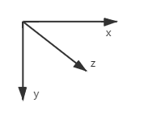
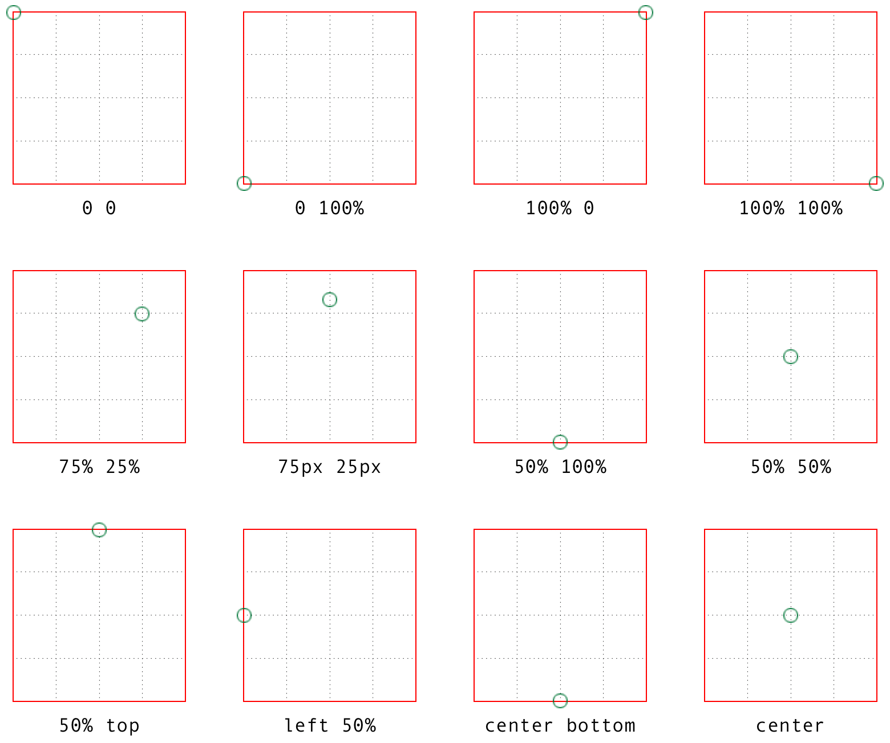
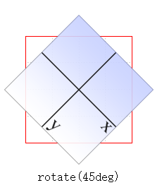

# 变换、过渡、动画

## 一、CSS坐标系

在CSS中，系统使用三个轴：x轴（横轴）、y轴（纵轴）、z轴（深度轴）。x轴向**右**是正方向，向**左**是负方向；y轴得注意了，它向下是正方向，而向上是负方向的，如果使用过绝对定位的应该能理解到；z轴的正方向是朝向我们开发者的，负值是远离我们的方向（朝屏幕里）。



```css
/* 左移动5个ems，向下移动33个像素，朝我们移动了200个像素 */
translateX(-5em) translateY(33px) translateZ(200px)
```

## 二、变换

### 2.1 变换源点

在对一个元素进行变换时，一般都是取它的中心点为坐标系原点（作为**变换源点**），比如一个矩形就是宽一半高一半的那个点，长方体就是长宽高各一半的那个点。

变换源点是可以修改的，比如`transform-origin: 10px 20px`，取元素**展示尺寸**左上角顶点的右边10px和下边20px的位置为变换源点。也可以使用非长度数值，例如`left | center | right | top | bottom`。

  

### 2.2 变换类型

在CSS中可以通过**transform**属性来让元素进行**变换**，主要有4种变换类型：移动、缩放、旋转以及倾斜。

#### 2.2.1 移动

`transform: translate()`是用来**移动**元素的，`translate()`需要传一到两个参数告诉css在**水平**和**垂直**方向上要移动的距离。当然也可以使用`translateX()`和`translateY()`来单独对**水平**和**垂直**方向进行移动。参数形式可以是长度数值也可以是**百分比**，如果是百分比，距离将以元素**自身大小**的百分比计算。

`translate()`是在2d上进行移动变换的，其实在3d上有`translate3d()`来进行移动变换，可接受三个参数分别控制X、Y、Z方向的位移，其效果与组合使用`translateX()`、`translateY()`、`translateZ()`是一样的。有一点要注意，`translate3d()`的第三个参数以及`translateZ()`的参数，也就是z方向的移动参数，暂时不能使用百分比形式。

```html
<html>
<head>
    <style type="text/css">
        div {
            border: 1px solid #333333;
            width: 100px;
            height: 10px;
            margin-top: 50px;
            transform: translate(10px, 10px);
        }
    </style>
</head>
<body>
    <div></div><!--向右移动10个像素，向下移动10个像素-->
</body>
<html>
```

#### 2.2.2 缩放

`transform: scale()`是用来**缩放**元素的，`scale()`需要传一到两个参数告诉css在**水平**和**垂直**方向上的缩放系数。当然也可以使用`scaleX()`和`scaleY()`来单独对**水平**和**垂直**方向进行缩放。参数形式要是**正数**才行。

`scale()`是在2d上进行缩放变换的，其实在3d上有`scale3d()`来进行缩放变换，可接受三个参数分别控制X、Y、Z方向的缩放，其效果与组合使用`scaleX()`、`scaleY()`、`scaleZ()`是一样的。

```html
<html>
<head>
    <style type="text/css">
        div {
            border: 1px solid #333333;
            width: 100px;
            height: 10px;
            margin-top: 50px;
            transform: scale(0.5, 2);
        }
    </style>
</head>
<body>
    <div></div><!--水平缩短一半，垂直放大2倍-->
</body>
<html>
```

#### 2.2.3 旋转

`transform: rotate()`是用来**旋转**元素的，`rotate()`需要传一个参数告诉css需要旋转什么样的角度。下面这个图例就是最常见的2d旋转效果，其实你仔细想一下它围绕着哪一个轴旋转的？

  

是的，上面这个是绕**Z轴**进行旋转的，也就是说`rotate()`和`rotateZ()`是等价的。移动和缩放是沿着轴方向进行变换，旋转是围绕轴心进行变换，这个一定得理解清楚。

`rotate()`的旋转轴心是Z轴，**垂直**于电脑屏幕并且正方向是指向观察者（开发者）的，它只接收一个参数（角度单位deg、grad、rad、turn），其参数角度是正值的话就是顺时针旋转，负值是逆时针旋转。

```html
<html>
<head>
    <style type="text/css">
        div {
            border: 1px solid #333333;
            width: 100px;
            height: 10px;
            margin-top: 50px;
            transform: rotate(45deg);
        }
    </style>
</head>
<body>
    <div></div><!--没加transform时是水平的，加了transform后div是斜着45度显示的-->
</body>
<html>
```

有2d平面的旋转当然也有3d的旋转，`rotateX()`和`rotateY()`就是分别沿着X轴和Y轴的旋转变换，参数形式和`rotate()`一样。下面两个div你可要想清楚了，要先找到X和Y轴再来考虑它的显示效果。

```html
<html>
<head>
    <style type="text/css">
        .div1 {
            border: 1px solid #333333;
            width: 100px;
            height: 10px;
            margin-top: 50px;
            transform: rotateX(45deg);
        }
        .div2 {
            border: 1px solid #333333;
            width: 100px;
            height: 10px;
            margin-top: 100px;
            transform: rotateY(45deg);
        }
    </style>
</head>
<body>
    <!--没加transform时看起来高就是10px，加了transform后高在视觉上只有7.07左右，因为10除以了根号2-->
    <div class="div1"></div>
    <!--没加transform时看起来宽就是100px，加了transform后宽在视觉上只有70.72左右，因为100除以了根号2-->
    <div class="div2"></div>
</body>
<html>
```

上面这两个例子都是向页面里旋转了45度，只不过轴心一个是X轴一个是Y轴。想象轴的正方向指向观察者（开发者），再按照**正值顺时针**和**负值逆时针**的转法来旋转的。

#### 2.2.4 倾斜

`transform: skew()`是用来**倾斜**元素的，`skew()`需要传一到两个参数告诉css在**水平**和**垂直**方向上的扭曲程度。当然也可以使用`skewX()`和`skewY()`来单独对**水平**和**垂直**方向进行扭曲。参数形式要是角度单位deg、grad、rad、turn。

怎么理解呢？比如沿横坐标扭曲元素是改变x值，那么y数值是不变的，最后元素显示效果就会是纵轴方向上有倾斜角度。举个最简单的例子，头和身体一部分水平左移了，那么这个人看起来就是竖直方向的左倾斜了，**水平处理但出现的是竖直倾斜效果**。

那么**偏移方向怎么算**呢？`skewX(param)`，param是正值就是Y轴正方向往X轴正方向偏移param角度，负值就是Y轴正方向往X轴负方向偏移param角度。`skewY(param)`，param是正值就是X轴正方向往Y轴正方向偏移param角度，负值就是X轴正方向往Y轴负方向偏移param角度。

PS：在3d上没有倾斜，只有2d的。也就说**没有skewZ()或者skew3d()这样的方法**。

```html
<html>
<head>
    <style type="text/css">
        div {
            border: 1px solid #333333;
            width: 100px;
            height: 20px;
            margin-top: 50px;
            transform: skew(30deg);
        }
    </style>
</head>
<body>
    <div></div><!--X方向扭曲元素，是竖直方向的倾斜，倾斜角度是于Y轴正方向往X轴正方向偏移-->
</body>
<html>
```

### 2.3 组合变换

在一些场景下需要对一个元素进行多次变化，那么就可以使用**组合变换**，例如`#example { transform: rotate(30deg) skewX(-25deg) scaleY(2); }`。
处理transform里的函数时是从左往右依次进行的，在具体场景里变换顺序是很重要的，比如下面这个例子的两种变换效果是不一样的。

```css
img#one {
  transform: translateX(200px) rotate(45deg);
}
img#two {
  transform: rotate(45deg) translateX(200px);
}
```

上面这个例子能看出一个问题，我们变换的坐标系不止原点与中心点重合，X、Y、Z轴方向也是与元素本身这个矩形框的**横纵深方向是重合**的。旋转或者倾斜后，元素的坐标系xyz方向和页面内的参考坐标系xyz方向可能不一致了，那么下次变换是在现在元素本身坐标系xyz方向上移动。简单来说，**变换操作跟页面参考坐标系没有关系**，不要想不通它明明应该是往水平方向移动的为什么它却斜着移动的了。

在组合变换中，所有函数都必须**正确格式化**，也就说只要有一个函数错了，整个transform值都无效。例如`img#one { transform: translateX(100px) scale(1.2) rotate(22); }`中rotate的入参没有单位，那么整个transform都无效。

### 2.4 变换矩阵

像前面的移动、缩放、旋转、倾斜在处理背后都有一个对应的**变换矩阵**，变换矩阵是建立在线性代数与几何的基础上的。2d变换是3×3矩阵，3d变换时4×4矩阵。`transform: matrix()`可以直接使用变换矩阵，`matrix()`函数就是用来接收矩阵数据的。

#### 2.4.1 矩阵运算

设A为`m × p`的矩阵，B为`p × n`的矩阵，那么称`m × n`的矩阵C为矩阵A与B的乘积。具体相乘的细节就是，A的第i行与B的第j行对应相乘（因为都有p个）再把p个乘积相加，得到值可以构成C的(i,j)位置上的值。

```js
a11, a12, a13     b11, b12, b13     a11*b11+a12*b21+a13*b31, a11*b12+a12*b22+a13*b32, a11*b13+a12*b23+a13*b33
a21, a22, a23  ×  b21, b22, b23  =  a21*b11+a22*b21+a23*b31, a21*b12+a22*b22+a23*b32, a21*b13+a22*b23+a23*b33
a31, a32, a33     b31, b32, b33     a31*b11+a32*b21+a33*b31, a31*b12+a32*b22+a33*b32, a31*b13+a32*b23+a33*b33
```

#### 2.4.2 2d矩阵变换

matrix(a, b, c, d, tx, ty)对应的2d矩阵如下。可以使用`matrix(scaleX(), skewY(), skewX(), scaleY(), translateX(), translateY())`来理解，a和d是放大系数，c和b是倾斜系数，abcd绝对值小于1的话就是旋转系数，但这并不意味matrix是简单的**组合变换**，实际上**简单变换**、**复杂变换**以及**组合变换**背后才是matrix在运作，要理解但不能误解。

```js
a, c, tx
b, d, ty
0, 0, 1
```

普通变换可以转为**2d矩阵变换**，例如：

- `translate(x, y)`可以写成`matrix(1, 0, 0, 1, x, y)`；
- `scale(x, y)`可以写成`matrix(x, 0, 0, y, 0, 0)`；
- `rotate(x)`可以写成`matrix(cos(x), -sin(x), sin(x), cos(x), 0, 0)`；
- `skew(x, y)`可以写成`matrix(1, tan(y), tan(x) , 1, 0, 0)`。

例子：

```html
<html>
<head>
    <style type="text/css">
        div {
            width: 80px;
            height: 80px;
            background-color: skyblue;
        }
        .changed {
            /* 可以写成transform: matrix(1, 2, -1, 1, 80, 80); */
            transform: translate(80px, 80px) skew(-45deg, 63deg);
            background-color: pink;
        }
    </style>
</head>
<body>
    <div>Normal</div>
    <div class="changed">Changed</div>
</body>
<html>
```

矩阵计算：

```js
// translate(80px, 80px) 与 skew(-45deg, 63deg)，矩阵形式相乘得到新矩阵就可以使用matrix了
1, 0, 80     1, -1, 0     1, -1, 80
0, 1, 80  ×  2,  1, 0  =  2,  1, 80
0, 0, 1      0,  0, 1     0,  0, 1
```

你可能想过将`matrix(1, 2, -1, 1, 80, 80)`的矩阵分拆成两个符合matrix规则的矩阵，然后反推得到`translate(80px, 80px)`和`skew(-45deg, 63deg)`。在简单场景下是可以的，比如根据之前提到的`matrix(scaleX(), skewY(), skewX(), scaleY(), translateX(), translateY())`，
可能会得到`transform: scaleX(1) skewY(-45deg) skewX(63deg) scaleY(1) translateX(100px) translateY(100px);`，但还不够需要再分析。

```js
// 其中x和y是原来的坐标，而x-y+80这个值是新的横坐标值，2x+y+80这个值是新的纵坐标值
1, -1, 80     x     x-y+80
2,  1, 80  ×  y  =  2x+y+80
0,  0, 1      1     1
```

- 根据矩阵计算的过程，常数项80没有受到系数干扰，`translate(80px, 80px)`是最优先的，因为如果先倾斜元素坐标系会改变再去移动就晚了；
- 没有缩放只有倾斜，那么可以使用`skewY(-45deg) skewX(63deg)`，但是横纵的倾斜是同时进行的，那么应该是`skew(-45deg, 63deg)`。
- 注意1：translate优先的原理分析在**组合变换**里说过了（顺序很重要）。
- 注意2：skew要同时处理两个方向，因为如果扭曲完一个方向以达到45度的倾斜效果，那再去扭曲另一个方向达到63度的话之前45度的倾斜效果会受到影响。

如果将上面的`transform: matrix(1, 2, -1, 1, 80, 80)`改为`transform: matrix(2, 2, -1, 2, 80, 80)`，此时既有缩放又有倾斜，再来反推是非常困难的，所以**不要试图将matrix反推得到组合变换**，一般是将复杂的组合变换简写为matrix矩阵变换的形式（为了维护也可以不简写）。

#### 2.4.3 3d矩阵变换

matrix(a, b, c, d, e, f, g, h, i, j, k, l, m, n, o, p)对应的3d矩阵如下。可以使用`matrix(scaleX(), skewY(), skewX(), scaleY(), translateX(), translateY())`来理解

```js
a, e, i, m
b, f, j, n
c, g, k, o
d, h, l, p
```

普通3d变换可以转为**3d矩阵变换**，例如：

- `translate3d(x, y, z)`可以写成`matrix(1,0,0,0,0,1,0,0,0,0,1,0,x,y,z,1)`；
- `scale3d(x, y, z)`可以写成`matrix(x,0,0,0,0,y,0,0,0,0,z,0,0,0,0,1)`；
- 旋转和倾斜比较复杂暂时没查到资料。

## 三、过渡

### 3.1 元素过渡

元素样式的改变可以在一瞬间就完成，新属性替换旧属性再到重新绘制这个过程一般不会超过16毫秒，即使超过也是一步完成变化的，不会逐渐过渡。

CSS提供了`transition`来控制某个属性在一段时间内属性值变化的过渡效果。用法：`transition: property duration timing-function delay`，其中property就是被监控的属性，duration是过渡时间，timing-function是过渡方式，delay是延时触发的时间。

```html
<html>
<head>
    <style type="text/css">
        div {
            width: 100px;
            height: 20px;
            background-color: skyblue;
            transition: background-color 1s linear 3s;
        }
        div:hover {
            background-color: pink;
        }
    </style>
</head>
<body>
    <!--当鼠标悬浮时，3秒后div背景颜色开始逐渐变为粉色，过渡用时1秒-->
    <div>Normal</div>
</body>
<html>
```

### 3.2 过渡多个属性

`transition: property duration timing-function delay`是可以分开写的，看个人的习惯了。例如`transition-property: transform;`、`transition-duration: 200ms;`、`transition-timing-function: ease-in;`、`transition-delay: 50ms;`。

`transition`可以同时对多个属性进行过渡，使用`,`分隔开，同样的`transition-property`也可以写上多个属性，如果这些属性的过渡效果一样，那么其他的`transition-duration`、`transition-timing-function`、`transition-delay`就可以写一样的了。当然，如果效果不一样duration、timing-function、delay也要使用逗号将值分开。

```html
<html>
<head>
    <style type="text/css">
        div {
            width: 100px;
            height: 20px;
            background-color: skyblue;
            transition: background-color 1s linear, color 1s linear, width 1s linear;
        }
        div:hover {
            background-color: pink;
            color: #ffff00;
            width: 200px;
        }
    </style>
</head>
<body>
    <div>Normal</div>
</body>
<html>
```

```html
<html>
<head>
    <style type="text/css">
        div {
            width: 100px;
            height: 20px;
            background-color: skyblue;
            /*与上面的例子是一样的效果*/
            transition-property: background-color, color, width;
            transition-duration: 1s;
            transition-timing-function: linear;
        }
        div:hover {
            background-color: pink;
            color: #ffff00;
            width: 200px;
        }
    </style>
</head>
<body>
    <div>Normal</div>
</body>
<html>
```

如果`transition-property`的值只是`all`的话，表示对所有属性都进行过渡；`all`也可以放在一群由逗号分隔的属性之前，它有什么意义呢？表示大部分属性都按照同一套过渡效果来进行，而**all后面的属性会是例外**。除了用`all`还有个`none`表示覆盖清除过渡，其实可以将过渡**总时间**设置为0。

```html
<html>
<head>
    <style type="text/css">
        div {
          color: #f00;
          border: 1px solid #00ff00;
          border-radius: 0;
          transform: scale(1) rotate(0deg);
          opacity: 1;
          box-shadow: 3px 3px rgba(0, 0, 0, 0.1);
          width: 50px;
          padding: 50px;
          transition-property: all, border-radius, opacity;
          transition-duration: 1s, 3s, 5s;
        }
        div.normal:hover {
            background-color: pink;
            color: #ffff00;
            padding: 100px;
        }
        div.change:hover {
            background-color: pink;
            color: #ffff00;
            padding: 100px;
            border-radius: 10px;
            opacity: 0.1;
        }
    </style>
</head>
<body>
    <div class="normal">Normal</div>
    <!--1秒改变背景和字体颜色还有内边距，3秒改变圆角，5秒逐渐透明-->
    <div class="change">Change</div>
</body>
<html>
```

### 3.3 使用过渡注意点

#### 3.3.1 过渡事件

在上面那个例子，触发的transitionend事件有不少，比如`border-radius`对应就有4个（因为它有4个角），比如`padding`也触发4个（上右下左4个边距）。

我们可以监听transitionend事件，示例如下。transitionend事件有三个重要属性，propertyName：刚完成过渡的CSS属性名；pseudoElement：发生过渡的伪元素；elapsedTime：过渡持续的时间。

```js
document.querySelector("div").addEventListener("transitionend", function(e) {
  console.log(e.propertyName, e.pseudoElement, e.elapsedTime);
});
```

仅当属性值成功过渡到新值时，transitionend 事件才会触发。如果过渡被中断（比如同一元素的同一属性发生了另一次更改），则 transitionend 事件不会被触发。

#### 3.3.2 过渡时间

transition-duration一定得是**非负值**，并且单位一定要带上，比如0s或0ms。如果transition-duration里有负值，这个时间将会失效。transition-duration和transition-delay的**总和**只要大于0了，就一定会触发transitionend事件。

可能会想为什么说他俩总和大于0？transition-duration是要大于等于0，而**transition-delay是可以有负值的**。transition-delay负值表示立即执行，并且会影响到总过渡时间，看一下下面这个例子。

```html
<html>
<head>
    <style type="text/css">
    div.outer {
        width: 300px;
        padding-top: 50px;
        border: 1px solid blue;
    }
    div.inner {
        width: 100px;
        height: 50px;
        border: 1px solid red;
        transition: transform 4s linear -2s;
    }
    div.active {
        transform: translateX(200px);
    }
    </style>
</head>
<body>
    <!--鼠标悬浮于此时，立即往右位移100px，然后剩余2秒继续位移100px-->
    <div class="outer">
        <div class="inner"></div>
    </div>
    <script>
    document.body.querySelector(".outer").addEventListener("mouseover", function(e) {
        document.body.querySelector(".inner").classList.add("active");
    });
    document.body.querySelector(".outer").addEventListener("mouseleave", function(e) {
        document.body.querySelector(".inner").classList.remove("active");
    });
    </script>
</body>
<html>
```

可以看到`transition-delay`为负两秒，总时间是`4-2=2`秒，首先是瞬间完成100px的位移，然后继续完成剩下的，这两个阶段应该完成的距离与他们时间占比有关。

#### 3.3.3 过渡方式

transition-timing-function 的值有 `ease`（慢快慢）、`linear`（线性）、`ease-in`（慢快）、`ease-out`（快慢）、`ease-in-out`（与ease类似）、`step-start`、`step-end`、`step(n, start)` （其中 n 为插值步数）、`cubic-bezier(x1, y1, x2, y2)`（三次贝塞尔曲线）

  

  

## 四、动画

### 4.1 动画能做什么

**过渡**只是控制指定属性从开始值到结束值这一平滑的过程，在中间是不能给它加上超出开始或结束的其他值的，不然就会打断过渡。

为了达到那种细颗粒的更灵活的控制，CSS提供`animation`这个功能，可以定义多个关键帧以及所需的属性值。用法：`animation: duration timing-function delay iteration-count direction fill-mode play-state name`，关键帧定义是`@keyframes xxx`，animation中的name就是关键帧的名字xxx。

```html
<html>
<head>
    <style type="text/css">
    div {
        width: 300px;
        height: 100px;
        border: 1px solid blue;
        animation: 3s linear 0s infinite normal both running slidein;
    }
    @keyframes slidein {
      from { transform: scale(0); }
      to   { transform: scale(1); }
    }
    </style>
</head>
<body>
    <div></div>
</body>
<html>
```

### 4.2 动画关键帧

可以只定义开始和结尾，使用的是`from`和`to`，上一节例子里就是使用的这两个关键字。除了控制开始和结尾，我们还能在中途改变属性值，那就是使用**百分比**来控制，这个百分比是**动画持续时间**的时间百分比。

```html
<html>
<head>
    <style type="text/css">
    div {
        width: 300px;
        height: 100px;
        background-color:  blue;
        animation: 3s linear 0s infinite normal both running slidein;
    }
    @keyframes slidein {
      0% { transform: scale(0); background-color:  blue; }
      33% { background-color: darkblue; }
      66% { background-color: yellow; }
      100% { transform: scale(1); background-color: red; }
    }
    </style>
</head>
<body>
    <div></div>
</body>
<html>
```

#### 4.2.1 关键帧设置问题

如果没有定义`from`、`to`、`0%`、`100%`，那CSS会按照**没有动画时的样式**自动给他们定义对应的关键帧，也就是使用默认状态。如果有**同名**的`from`、`to`、`x%`，两者会结合但后面会覆盖前面的属性。

```html
<html>
<head>
    <style type="text/css">
    div {
        width: 300px;
        height: 100px;
        background-color:  blue;
        animation: 3s linear 0s 1 normal both running slidein;
    }
    @keyframes slidein {
      33% { background-color: darkblue; }
      66% { background-color: yellow; }
      90% { background-color: green; }
      90% { background-color: red; }
    }
    </style>
</head>
<body>
    <!--动画只播一次，最开始是蓝色，然后暗蓝，然后黄色，然后红色（覆盖绿色），最后是蓝色-->
    <div></div>
</body>
<html>
```

还有些要注意的，最好不要对`height: auto`和`height: 300px`之间设置动画，因为它没有中间点，就算设置了动画也是不可控的，可能达不到你想要的效果。除了`auto`还有`none`这种，`visibility: hidden` 和 `visibility: visible`也是。

#### 4.2.2 动态修改关键帧

css提供了三个接口用于查看、删除、增加关键帧。首先得获取目前的css样式，类似于这样的`document.styleSheets[n].cssRules[m]`，然后就可以对这个对象使用`findRule()`、`deleteRule()`和`appendRule()`了，可以看下面这个例子。

```html
<html>
<head>
    <style type="text/css">
    div {
        width: 300px;
        height: 100px;
        background-color:  blue;
        animation: 3s linear 0s 1 normal both running slidein;
    }
    @keyframes slidein {
      33% { background-color: darkblue; }
      66% { background-color: yellow; }
      90% { background-color: green; }
      90% { background-color: red; }
    }
    </style>
</head>
<body>
    <div></div>
    <script>
    // 这里自己找清楚关键帧在哪里
    var myAnimation = document.styleSheets[0].cssRules[1];
    // 查看关键帧里33%的内容
    var aRule = myAnimation.findRule("33%").cssText;
    // 去掉这条90% { background-color: red; }的内容，如果有重复先去掉最底下的
    myAnimation.deleteRule("90%");
    // 再去掉这条90% { background-color: green; }的内容
    // myAnimation.deleteRule("90%");
    // 添加最后一条关键帧
    myAnimation.appendRule("100% {background-color: white;}");
    </script>
</body>
<html>
```

动画还有对应的animationstart、animationend和animationiteration这三个事件，分别是在元素的动画结束时，开始时，或者完成一次迭代时触发，通过监听这些事件，可以做出更多动画变化。

### 4.3 动画的几个属性

animation是可以分开写的，如下`animation-duration`、`animation-timing-function`、`animation-delay`、`animation-iteration-count`、`animation-direction`、`animation-fill-mode`、`animation-play-state`和`animation-name`。前三个和**过渡**中同名属性几乎一样，可以跳转到[对应章节](./4.变换、过渡、动画.md#_3-3-使用过渡注意点)查看。

#### 4.3.1 iteration-count

`animation-iteration-count`表示动画**播放次数**，只能是非负值。如果不设置，动画默认播放一次。如果设置成infinite，动画会无限播放下去。如果设置成浮点数，整数好理解就是整数次，而小数部分就单次时间的百分比。

#### 4.3.2 direction

`animation-direction`表示动画**播放方向**，有四个值：

- **normal**，正向播放，如果是循环，播完又回到起点。
- **reverse**，反向播放，如果是循环，播完又回到“终点”（原终点）。
- **alternate**，正向交替播放，先正向播一遍然后反向播一遍，功能函数也反向，比如ease-in在反向时成为ease-out。
- **alternate-reverse**，反向交替播放，先反向播一遍然后正向播一遍，功能函数也反向，比如ease-in在反向时成为ease-out。

#### 4.3.3 fill-mode

`animation-fill-mode`表示动画没有开始或者已经结束时元素的样式采取什么保留方案，如果不设置fill-mode（值为none），在开始前和结束后都是采用默认的样式，但是在一些场景下我们需要保留动画最后状态下的样式。除了none还有三种方案：

- **forwards**，保留由执行期间遇到的最后一个关键帧的样式，最后一个关键帧取决于animation-direction和animation-iteration-count的值。
- **backwards**，执行前应用第一个关键帧中定义的值（尽管在animation-delay期间），第一个关键帧取决于animation-direction的值。
- **both**，同时采用forwards和backwards方案。

#### 4.3.4 play-state

`animation-play-state`表示动画动画是否运行或者暂停，有两个值：running和paused。可以通过查询它来确定动画是否正在运行。另外，它的值可以被设置为暂停和恢复的动画的重放。

```css
/*使用不同class来控制播放和暂停*/
.active {
  animation-play-state: running;
}
.paused {
  animation-play-state: paused;
}
```
