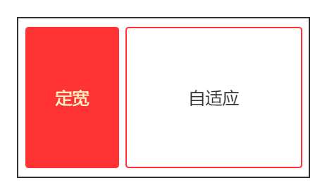
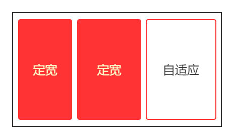
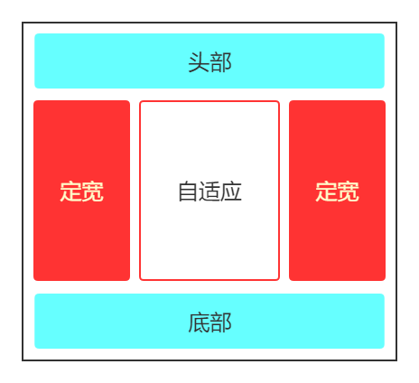
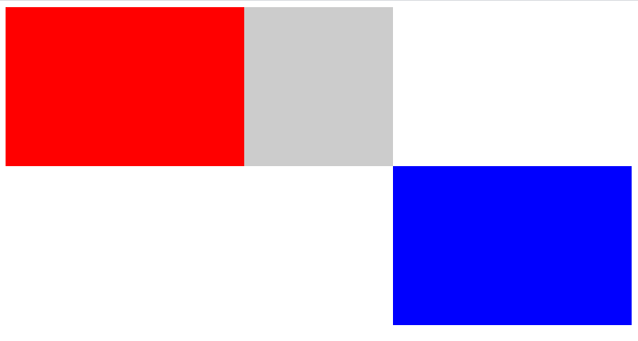
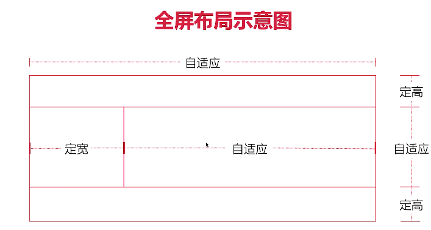

# 多列布局

## 一、什么是多列布局

**多列布局**会把内容按**列**排序的方式进行布局，就像文本在报纸上的排列那样。

多列布局的分类，大概分为**两列布局**、**三列布局**和**等分等高布局**。像两列布局和三列布局，列可采用**定宽**或者**自适应**，两列布局还好情况不复杂（左列定宽右列自适应），但是三列情况就多一些了。

**三列布局**中，如果左边两个是**定宽**右边那个是**自适应**，这个情况跟**两列布局**类似；如果左右两边是**定宽**而中间那个是**自适应**，这就有些复杂了，还会衍生出**圣杯布局**和**双飞翼布局**。

## 二、两列布局



**两列布局**一般情况是左列**定宽**右列**自适应**，它的实现方式有三种：

- float + calc()
- float + BFC
- 使用 table 表格

### 2.1 float + calc()

其实**float + calc()**这种实现方式的前身是**float + margin**，因为`calc()`这个方法是 css3 推出的，在 css3 之前是使用**边距**和**auto 宽度**来控制自适应列的展示的。

左列设置**左浮动**，这样后面的元素与左列会在同一行（浮动效果）从而形成两列；左列设置**固定宽度**，右列自适应并且不能被左列遮挡，需要设置左边距，宽度其实不用设置（宽度加上左边距等于一行，块级元素特性）。

```html
<html>
  <head>
    <style type="text/css">
      .left,
      .right {
        height: 200px;
      }
      .left {
        float: left;
        width: 300px;
        background-color: red;
      }
      .right {
        margin-left: 300px;
        background-color: #cccccc;
      }
    </style>
  </head>
  <body>
    <!--左列，左浮动，固定宽度-->
    <div class="left"></div>
    <!--右列，自适应宽度，设置好左边距-->
    <div class="right"></div>
  </body>
  <html></html>
</html>
```

如果右列的某个后代元素使用了**清除浮动**，这个后代元素会单独去新的一行里显示，这就破坏了两列布局。为什么会去新的一行里显示，可以回顾一下[清除浮动](./5.定位与浮动.md#_3-3-清除浮动)这一章节。另外一个问题是，一个浮动另一个不浮动，层级上有问题，并且这两个之间可能会留出空隙来（老版浏览器）。

为了解决上面的问题，可以直接让右列也浮动起来，右列宽度直接使用 css3 里的`calc()`来计算，`右列宽度 = 100% - 左列宽度`。

```html
<html>
  <head>
    <style type="text/css">
      .left,
      .right {
        height: 200px;
      }
      .left {
        float: left;
        width: 300px;
        background-color: red;
      }
      .right {
        float: right;
        width: calc(100% - 300px);
        background-color: #cccccc;
      }
    </style>
  </head>
  <body>
    <!--左列，左浮动，固定宽度-->
    <div class="left"></div>
    <!--右列，右浮动（左浮动也可以），calc()来自适应-->
    <div class="right"></div>
  </body>
  <html></html>
</html>
```

### 2.2 float + BFC

其实就是[BFC 的作用](./5.定位与浮动.md#_4-3-bfc的作用)之一，BFC 不会被浮动区域覆盖。float + BFC 这个方案优点就是简单，但是留下的问题就是一个不浮动另一个不浮动，不过问题不大。

```html
<html>
  <head>
    <style type="text/css">
      .left,
      .right {
        height: 200px;
      }
      .left {
        float: left;
        width: 300px;
        background-color: red;
      }
      /*display: flow-root会创建无副作用的BFC*/
      .right {
        display: flow-root;
        background-color: #cccccc;
      }
    </style>
  </head>
  <body>
    <div class="left"></div>
    <div class="right"></div>
  </body>
  <html></html>
</html>
```

### 2.3 使用 table 表格

对非`<table>`元素使用**表格布局**，来达到两列布局的效果。需要注意的点就是，采用 100%宽度的固定宽度布局，再加上两个 div，其中一个 div 是固定宽度，另一个不设置宽度，它会由总表宽减去已有宽度（左列的固定宽度）得到。这种两列布局，兼容性不错，就是得熟悉表格布局（边界模式和宽度计算方式）。

```html
<html>
  <head>
    <style type="text/css">
      /*表格布局，固定宽度，宽度设置页面的100%*/
      .parent {
        display: table;
        table-layout: fixed;
        width: 100%;
      }
      .left,
      .right {
        height: 200px;
      }
      .left {
        display: table-cell;
        width: 300px;
        background-color: red;
      }
      .right {
        display: table-cell;
        background-color: #cccccc;
      }
    </style>
  </head>
  <body>
    <div class="parent">
      <div class="left"></div>
      <div class="right"></div>
    </div>
  </body>
  <html></html>
</html>
```

## 三、三列布局



**三列布局**有一种情况是，左边两个是**定宽**右边那个是**自适应**，它的实现方式与两列布局基本一致，所以不再这一节里赘述了。

**三列布局**另一种情况是，左右两边是**定宽**而中间那个是**自适应**。

### 3.1 经典的圣杯布局

**圣杯布局**是头部、中间内容和底部构成，而这个最重要的中间内容就是一个**三列布局**，并且是左右两边是**定宽**而中间那个是**自适应**的情况。



在 css3 之前常使用**float + margin**来实现，你可能会写成这个样子：

```html
<html>
  <head>
    <style type="text/css">
      .left,
      .right,
      .center {
        height: 200px;
      }
      .left {
        float: left;
        width: 300px;
        background-color: red;
      }
      .center {
        margin-left: 300px;
        margin-right: 300px;
        background-color: #cccccc;
      }
      .right {
        float: right;
        width: 300px;
        background-color: blue;
      }
    </style>
  </head>
  <body>
    <div class="left"></div>
    <div class="center"></div>
    <div class="right"></div>
  </body>
  <html></html>
</html>
```

对应效果图：  


什么原因呢？可以想一下`right`这个 div 在没有浮动前处于什么位置？是不是在`center`这个 div 的下边界那里（块级元素特性）？再根据[浮动规则](./5.定位与浮动.md#_3-2-浮动规则)的其中一条“**浮动元素的顶边不能比它原本未浮动前所在框体顶边还高**”，现在你明白了怎么回事吧！

有一个解决办法就是把`right`这个 div 和`center`这个 div 的代码位置交换一下，但是代码阅读体验不好，并且还可能会**影响搜索引擎对网页的收录**。还有个解决办法就是把`center`这个 div 放到最前面，左右两个浮动 div 再使用**相对定位**。

```html
<html>
  <head>
    <style type="text/css">
      .left,
      .right,
      .center {
        height: 200px;
      }
      .center {
        margin-left: 300px;
        margin-right: 300px;
        background-color: #cccccc;
      }
      .left {
        float: left;
        position: relative;
        bottom: 200px;
        width: 300px;
        background-color: red;
      }
      .right {
        float: right;
        position: relative;
        bottom: 200px;
        width: 300px;
        background-color: blue;
      }
    </style>
  </head>
  <body>
    <div class="center"></div>
    <div class="left"></div>
    <div class="right"></div>
  </body>
  <html></html>
</html>
```

其实可以使用经典的解决方案，`center`这个 div 还是放到最前面，在让这三个 div 都浮动，利用“margin 为负值”将左右两个 div 提上来。因为让`center`这个 div 也浮动了（块级元素变为浮动元素），那么它的**自适应宽度失效**了（没法使用某一边的外边距了），那么就需要添加一个父级 div（父级的边界或者内边距可以约束子级浮动元素）。

```html
<html>
  <head>
    <style type="text/css">
      /* 设置父级BFC的原因是需要包含子级浮动的高度 */
      .parent {
        display: flow-root;
        padding-left: 300px;
        padding-right: 300px;
      }
      .left,
      .right,
      .center {
        height: 200px;
      }
      .center {
        float: left;
        width: 100%;
        background-color: #cccccc;
      }
      .left {
        width: 300px;
        float: left;
        margin-left: -300px;
        position: relative;
        right: 100%;
        background-color: red;
      }
      /*比较有趣的一点，.right设置float: left或float: right，效果一样*/
      .right {
        width: 300px;
        float: left;
        margin-right: -300px;
        background-color: blue;
      }
    </style>
  </head>
  <body>
    <div class="parent">
      <!--子元素都浮动，那就需要这个父级元素，最好设置成BFC-->
      <div class="center"></div>
      <div class="left"></div>
      <div class="right"></div>
    </div>
  </body>
  <html></html>
</html>
```

这个解决方案的重点就在于`margin-left: -300px`或者`margin-right: -300px`这种负值外边距的使用，它对浮动的影响可以查看之前的[边距对浮动的影响](./5.定位与浮动.md#_3-5-边距对浮动的影响)。

还有要注意的一点，并没有使用`margin-left: 100%`，因为考虑到 center 区域比 left 区域宽度小的话，left 这个浮动元素就回不到上一行了；并且它并不需要 min-width 的限制。最后要注意的一点就是，左右两列回到上一行后，左列还在 center 区域的右边界，需要使用相对定位将它定位到左边空处。

### 3.2 双飞翼布局

双飞翼布局是对经典圣杯布局的一种优化，最主要的优化就是去掉了相对定位，并且将父级元素的 contentArea 宽度设置为 100%（肯定比左右两列之和要大），这样就能避免类似于`margin-left: 100%`的问题（上一节说过），所以双飞翼可以直接使用`margin-left: 100%`来对左列设置位置。

```html
<html>
  <head>
    <style type="text/css">
      /* 设置父级BFC的原因是需要包含子级浮动的高度 */
      .parent {
        display: flow-root;
      }
      .left,
      .right,
      .center,
      .inner {
        height: 200px;
      }
      .center {
        float: left;
        width: 100%;
        background-color: #cccccc;
      }
      .inner {
        margin-left: 300px;
        margin-right: 300px;
        background-color: green;
      }
      .left {
        width: 300px;
        float: left;
        margin-left: -100%;
        background-color: red;
      }
      /*比较有趣的一点，.right设置float: left或float: right，效果一样*/
      .right {
        width: 300px;
        float: left;
        margin-left: -300px;
        background-color: blue;
      }
    </style>
  </head>
  <body>
    <div class="parent">
      <!--子元素都浮动，那就需要这个父级元素，最好设置成BFC-->
      <div class="center">
        <div class="inner"></div>
      </div>
      <div class="left"></div>
      <div class="right"></div>
    </div>
  </body>
  <html></html>
</html>
```

不过双飞翼有个问题，当浏览器缩小的比左右两列之和还小时，右列会覆盖左列（可以加上 min-width 限制）。

### 3.3 圣杯的其他实现

我们使用**float + calc()**来实现看看：

```html
<html>
  <head>
    <style type="text/css">
      .left,
      .right,
      .center {
        height: 200px;
        float: left;
      }
      .left {
        width: 300px;
        background-color: red;
      }
      .center {
        width: calc(100% - 600px);
        background-color: #cccccc;
      }
      .right {
        width: 300px;
        background-color: blue;
      }
    </style>
  </head>
  <body>
    <div class="left"></div>
    <div class="center"></div>
    <div class="right"></div>
  </body>
  <html></html>
</html>
```

如果使用**float + BFC**呢？其实跟**float + margin**类似，问题也一样，需要交换`right`这个 div 和`center`这个 div 的代码位置。

```html
<html>
  <head>
    <style type="text/css">
      .left,
      .right,
      .center {
        height: 200px;
      }
      .left {
        float: left;
        width: 300px;
        background-color: red;
      }
      .center {
        display: flow-root;
        background-color: #cccccc;
      }
      .right {
        float: right;
        width: 300px;
        background-color: blue;
      }
    </style>
  </head>
  <body>
    <div class="left"></div>
    <div class="right"></div>
    <div class="center"></div>
  </body>
  <html></html>
</html>
```

前两种都有双飞翼布局类似的问题，当浏览器缩小的比左右两列之和还小时，右列会跑到新行去（可以加上 min-width 限制）。

使用 table 表格的话，跟两列布局没什么区别，也不会出现什么问题。

```html
<html>
  <head>
    <style type="text/css">
      /*表格布局，固定宽度，宽度设置页面的100%*/
      .parent {
        display: table;
        table-layout: fixed;
        width: 100%;
      }
      .left,
      .right,
      .center {
        height: 200px;
      }
      .left {
        display: table-cell;
        width: 300px;
        background-color: red;
      }
      .right {
        display: table-cell;
        width: 300px;
        background-color: blue;
      }
      .center {
        background-color: #cccccc;
      }
    </style>
  </head>
  <body>
    <div class="parent">
      <div class="left"></div>
      <div class="center"></div>
      <div class="right"></div>
    </div>
  </body>
  <html></html>
</html>
```

## 四、等分布局

**等分布局**把一行分成若干列，这些列的**宽度**都相等。它的实现一般有两种：浮动和表格。

### 4.1 使用浮动或表格

4 个都向左浮动，分配的宽度为 25%

```html
<html>
  <head>
    <style type="text/css">
      .parent {
        display: flow-root;
      }
      .col {
        float: left;
        width: 25%;
        height: 200px;
      }
      .cell1 {
        background-color: red;
      }
      .cell2 {
        background-color: yellow;
      }
      .cell3 {
        background-color: blue;
      }
      .cell4 {
        background-color: green;
      }
    </style>
  </head>
  <body>
    <div class="parent">
      <div class="col cell1"></div>
      <div class="col cell2"></div>
      <div class="col cell3"></div>
      <div class="col cell4"></div>
    </div>
  </body>
  <html></html>
</html>
```

表格的话，设置父元素为`display: table`，4 个子元素为`display: table-cell`，表要记得设置宽度。

```html
<html>
  <head>
    <style type="text/css">
      /*表格布局，固定宽度，宽度设置页面的100%*/
      .parent {
        display: table;
        table-layout: fixed;
        width: 100%;
      }
      .col {
        display: table-cell;
        height: 200px;
      }
      .cell1 {
        background-color: red;
      }
      .cell2 {
        background-color: yellow;
      }
      .cell3 {
        background-color: blue;
      }
      .cell4 {
        background-color: green;
      }
    </style>
  </head>
  <body>
    <div class="parent">
      <div class="col cell1"></div>
      <div class="col cell2"></div>
      <div class="col cell3"></div>
      <div class="col cell4"></div>
    </div>
  </body>
  <html></html>
</html>
```

### 4.2 空白间隔问题


可能会遇到间隔问题，如上图。而空白间隔应该要比**展示列**多一个或者少一个，表格方式的倒还好（分离边界模型），主要是浮动方式修改起来有些麻烦。浮动方式修改，比较笨的解决办法是，使用空白 div 块来作为空白间隔；另外一种，让边距充当空白间隔，然后对多出或者缺少的空白间隔进行**特殊处理**。

  


边距充当空白间隔的问题和解决方案：

1. 如果对子级元素使用**外边距**充当空白间隔，按百分比分配宽度时就需要考虑外边距了。外边距没考虑好，浮动元素可能会跳到下一行去了。其实可以使用`box-sizing: border-box`将子级元素改为 IE 盒模型，**内边距**被包含在宽度中了，让内边距作为空白间隔，这就不会影响宽度分配了。
2. 但是空白间隔的**多出或者缺少**没有解决。子级元素的宽度分配是依赖于父级元素的，如果让父级元素设置**内边距**，或许可以增加一个空白间隔，但是无法抵消一个空白间隔（内边距不能为负数）。再者，我们希望空白间隔**也是用百分比**，子级元素倒好说，但是父级设置边距用百分比是没有参考对象。那么，综合这两个问题，可以引入一个**祖父元素**，对父级元素设置**外边距**使用**百分比**，这就可以增加或抵消一个空白间隔了。
3. 最后一个问题是，父级元素设置**外边距**的百分比数值，与子元素设置**内边距**的百分比数值，这两者之间有没有联系？答案是有的，下面我们来分析一下。


我们假设，祖父元素宽度为 A，父级元素宽度为 B，父级元素设置**外边距**的百分比数值为`x`，子元素设置**内边距**的百分比数值为`y`。它们有什么联系呢？联系就在于在最后一个空白区域，这个空白区域的宽度等于`B * y`，也等于`A - B`这个差值，这个差值其实就是父级元素设置外边距来额外添加的一个空白间隔，因为父级元素设置了这一个外边距，那么`1 - x = B / A`。

将这两个等式联合起来可以消掉 A 和 B，最后可以得到`x = y / (y + 1)`。我们看下面这个代码，子元素设置**内边距**的百分比数值为`5%`，根据前面这个结论式子，可以算出父级元素设置**外边距**的百分比数值为`4.762%`。**并且这个式子的关系，不会受等分数量还有祖父宽度的影响**

```html
<html>
  <head>
    <style type="text/css">
      .parent-fix {
        border: 1px solid red;
        width: 600px;
      }
      .parent {
        display: flow-root;
        margin-right: 4.762%;
      } /*是margin-right，因为要在最右边添加一个空白间隔*/
      .col {
        float: left;
        box-sizing: border-box;
        width: 20%;
        padding-left: 5%;
      }
      .cell1 {
        height: 100px;
        background-color: red;
      }
      .cell2 {
        height: 100px;
        background-color: yellow;
      }
      .cell3 {
        height: 100px;
        background-color: blue;
      }
      .cell4 {
        height: 100px;
        background-color: green;
      }
      .cell5 {
        height: 100px;
        background-color: skyblue;
      }
    </style>
  </head>
  <body>
    <div class="parent-fix">
      <div class="parent">
        <div class="col">
          <div class="cell1"></div>
        </div>
        <div class="col">
          <div class="cell2"></div>
        </div>
        <div class="col">
          <div class="cell3"></div>
        </div>
        <div class="col">
          <div class="cell4"></div>
        </div>
        <div class="col">
          <div class="cell5"></div>
        </div>
      </div>
    </div>
  </body>
  <html></html>
</html>
```

接下来我们看怎么抵消一个空白间隔。我们假设，祖父元素宽度为 A，父级元素宽度为 B，父级元素设置**外边距**的百分比数值为`x`，子元素设置**内边距**的百分比数值为`y`。要注意的一点，`x`我们取的是**绝对值**，因为父级**左外边距是负值**，它会让 A 祖父宽度比 B 父级宽度小，从而让第一个空白区域区域抵消掉。那么这个空白区域的宽度是`B - A`，并且也是等于`B * y`；前面是长度之差的关系，长度之比就是`1 + x = B / A`。

将这两个等式联合起来可以消掉 A 和 B，最后可以得到`x = y / (1 - y)`。我们看下面这个代码，子元素设置**内边距**的百分比数值为`5%`，根据前面这个结论式子，可以算出父级元素设置**外边距**的百分比数值为`5.263%`，使用时记得加上**负号**。**并且这个式子的关系，不会受等分数量还有祖父宽度的影响**

```html
<html>
  <head>
    <style type="text/css">
      .parent-fix {
        border: 1px solid red;
        width: 600px;
        overflow: hidden;
      }
      .parent {
        display: flow-root;
        margin-left: -5.263%;
      } /*是margin-left，因为要在最左边抵消一个空白间隔*/
      .col {
        float: left;
        box-sizing: border-box;
        width: 20%;
        padding-left: 5%;
      }
      .cell1 {
        height: 100px;
        background-color: red;
      }
      .cell2 {
        height: 100px;
        background-color: yellow;
      }
      .cell3 {
        height: 100px;
        background-color: blue;
      }
      .cell4 {
        height: 100px;
        background-color: green;
      }
      .cell5 {
        height: 100px;
        background-color: skyblue;
      }
    </style>
  </head>
  <body>
    <div class="parent-fix">
      <div class="parent">
        <div class="col">
          <div class="cell1"></div>
        </div>
        <div class="col">
          <div class="cell2"></div>
        </div>
        <div class="col">
          <div class="cell3"></div>
        </div>
        <div class="col">
          <div class="cell4"></div>
        </div>
        <div class="col">
          <div class="cell5"></div>
        </div>
      </div>
    </div>
  </body>
  <html></html>
</html>
```

表格方式怎么解决空白间隔的问题？如果表格的边界是**折叠边界模型**的话，解决方式和浮动基本一样，就不再赘述了。如果表格的边界是**分离边界模型**的话，可以使用`border-spacing`来充当空白间隔，并且它有个特点就是最左边和最右边都会与表有 space，这样就不用自己多添加一个空白间隔了，但是它有个缺点就是怎么用数值不能用百分比。

也就是说使用`border-spacing`可以实现“多一个空白间隔”的情况，少一个“空白间隔”可能还是得用之前的方式，这里也不再赘述了

```html
<html>
  <head>
    <style type="text/css">
      .parent {
        display: table;
        border-collapse: separate; /*分离边界模型*/
        table-layout: fixed;
        width: 600px;
        border-spacing: 20px 0; /*单元格与单元格之间，水平间距20px，垂直间距0*/
        border: 1px solid red;
      }
      .col {
        display: table-cell;
        height: 100px;
      }
      .cell1 {
        background-color: red;
      }
      .cell2 {
        background-color: yellow;
      }
      .cell3 {
        background-color: blue;
      }
      .cell4 {
        background-color: green;
      }
    </style>
  </head>
  <body>
    <div class="parent">
      <div class="col cell1"></div>
      <div class="col cell2"></div>
      <div class="col cell3"></div>
      <div class="col cell4"></div>
    </div>
  </body>
  <html></html>
</html>
```

空白间隔问题其实有一种更好的办法规避，那就是直接使用[弹性盒布局](./8.弹性盒布局.md)配合`justify-content`属性，都不需要上面这些计算过程，空白间隔大小自动分配。

## 五、等高布局

**等高布局**把一行分成若干列，这些列的**高度**都相等。它的实现一般有两种：1.表格，2.溢出配合边距。

### 5.1 使用表格

我们知道表格的高度和单元格高度是自动计算的，也就说它的高度是根据内容多少来显示的。那么同一行的高度呢？其实是默认**相等**的，除了跨行以外。

当然，基本的设置还是要有的，表格 display 值，单元格 display 值，表格要固定宽度并且显示设置宽度。

```html
<html>
  <head>
    <style type="text/css">
      .parent {
        display: table;
        table-layout: fixed;
        width: 600px;
      }
      .left {
        display: table-cell;
        background-color: red;
      }
      .right {
        display: table-cell;
        background-color: yellow;
      }
    </style>
  </head>
  <body>
    <div class="parent">
      <div class="left"></div>
      <div class="right">
        CSS1：1996年12月正式推出CSS1，对字体、尺寸、颜色、文本、位置、背景、边框等进行了规范，这个阶段主要使用table和CSS1来定位表单的外观和样式。
        CSS2：1998年5月正式推出CSS2，扩展了CSS1，添加了很多新属性和伪元素，这个阶段主要使用div和li来分割元素再搭配CSS2来定义表单界面的外观。
        CSS2.1：2004年2月正式推出了CSS2.1，纠正了CSS2中的一些错误，也删除了一些不被浏览器所支持的属性（有些出现在CSS3规范中了）。
        CSS3：2010年推出的全新版本CSS3，被分为若干个相互独立的模块，包括盒子模型、列表模块、超链接方式、语言模块、背景和边框、文字特效、多栏布局等模块。
      </div>
    </div>
  </body>
  <html></html>
</html>
```

### 5.2 溢出配合边距

这种方法非常巧妙，在学习使用这种方法时，最好了解一下[内外边距的影响](./2.盒模型.md#四、内外边距的影响)，还需要了解[overflow: hidden](./2.盒模型.md#_6-2-hidden)的触发临界点。

具体是让父级元素设置`overflow: hidden`，子级浮动并且设置`padding-bottom: 9999px;`和`margin-bottom: -9999px;`这种特殊的处理方式。这种特殊的处理方式有几种叫法：内外补丁负值法、内边距补偿法。

分析：

- 我们期望的**效果**是父容器的高度是随着**最高列**的**内容高度**来自动调整的。其他几列内容高度肯定是不如最高列的，那就需要使用**内边距**补偿短缺的高度。因为**内边距**算作展示效果里的，所有这个方法的等高布局是一种伪登高布局。
- 但是我们并不清楚实际场景中哪一列会是最高列，所以给所有列都设置了 padding，除最高列的其他列要补偿的高度并不相同，那可以先让 padding 都取一个**超大值**，再使用`overflow: hidden`将多余的**展示尺寸**都截取掉，这样就可以形成一个视觉上等高的几列。
- 我们知道这个父容器的**高度**并没有显示设置，它是依赖于子元素的**布局尺寸**撑起来的，而之前又使用了 padding，它既增大了**布局尺寸**也增大了**展示尺寸**，那么父容器的边界此时肯定是一直包裹这子元素的边界的，也就是说`overflow: hidden`并不会生效。
- 刚好 margin 取负值可以减少**布局**尺寸但又不影响**展示尺寸**，这样就可以让`overflow: hidden`生效了。还有就是，期望让父容器的高度是随着**最高列**的**内容高度**来自动调整，那就让 padding 和 margin 的绝对值相等，最后剩下的**布局尺寸**就是最高列的**内容高度**了。

```html
<html>
  <head>
    <style type="text/css">
      .parent {
        overflow: hidden;
        width: 600px;
      }
      .col {
        float: left;
        padding-bottom: 9999px;
        margin-bottom: -9999px;
      }
      .left {
        width: 50%;
        background-color: red;
      }
      .right {
        width: 50%;
        background-color: yellow;
      }
    </style>
  </head>
  <body>
    <div class="parent">
      <div class="col left">CSS</div>
      <div class="col right">
        CSS1：1996年12月正式推出CSS1，对字体、尺寸、颜色、文本、位置、背景、边框等进行了规范，这个阶段主要使用table和CSS1来定位表单的外观和样式。
        CSS2：1998年5月正式推出CSS2，扩展了CSS1，添加了很多新属性和伪元素，这个阶段主要使用div和li来分割元素再搭配CSS2来定义表单界面的外观。
      </div>
    </div>
  </body>
  <html></html>
</html>
```

其实每列的实际高度就是每列的 contentArea 高度，视觉上的等高是每列 contentArea 高度加上“还留在父元素框内的 padding 高度”，多余的 padding 都被`overflow: hidden`截掉了。

## 六、css3 中的多列布局

### 6.1 列数和最小宽度

css3 中通过`column-count`属性来对一个元素的内容进行多列布局，该属性的值可以是`auto`表示由 css 自动分配，也可以是一个**整数**表示有几列。

还有一个属性是`column-width`，表示列的宽度或者列的最小宽度，也可以设置`auto`也可以设置一个数值。

其实这两个属性可以简写在一起，比如`column-count: 4; column-width: 100px;`其实是可以简写成`columns: 4 100px;`，千万要注意是`columns`而不是`column`。

```html
<html>
  <head>
    <style type="text/css">
      .parent {
        border: 1px solid red;
        width: 600px;
        column-count: 4;
        column-width: 100px;
      }
      .col1 {
        height: 100px;
        background-color: red;
      }
      .col2 {
        height: 100px;
        background-color: yellow;
      }
      .col3 {
        height: 100px;
        background-color: blue;
      }
      .col4 {
        height: 100px;
        background-color: green;
      }
    </style>
  </head>
  <body>
    <div class="parent">
      <div class="col1"></div>
      <div class="col2"></div>
      <div class="col3"></div>
      <div class="col4"></div>
    </div>
  </body>
  <html></html>
</html>
```

### 6.2 空白间隔、间隔边框

`column-gap`这个属性可以更改列与列之间的空白间隔，默认值是`normal`对应的是`1em`的长度，可以设置具体数值（正整数）。

```html
<html>
  <head>
    <style type="text/css">
      .parent {
        border: 1px solid red;
        width: 600px;
        columns: 4 100px;
        column-gap: 20px;
      }
      .col1 {
        height: 100px;
        background-color: red;
      }
      .col2 {
        height: 100px;
        background-color: yellow;
      }
      .col3 {
        height: 100px;
        background-color: blue;
      }
      .col4 {
        height: 100px;
        background-color: green;
      }
    </style>
  </head>
  <body>
    <div class="parent">
      <div class="col1"></div>
      <div class="col2"></div>
      <div class="col3"></div>
      <div class="col4"></div>
    </div>
  </body>
  <html></html>
</html>
```

`column-rule`这个属性是用来设置**列与列之间**的边框的，它有三个方面：边框宽度、边框颜色和边框样式。可以分开写：`column-rule-width`、`column-rule-color`和`column-rule-style`。

```html
<html>
  <head>
    <style type="text/css">
      .parent {
        width: 600px;
        border: 1px solid red;
        columns: 4 100px;
        column-gap: 20px;
        column-rule: 2px solid green;
      }
      .col1 {
        height: 100px;
        background-color: red;
      }
      .col2 {
        height: 100px;
        background-color: yellow;
      }
      .col3 {
        height: 100px;
        background-color: blue;
      }
      .col4 {
        height: 100px;
        background-color: green;
      }
    </style>
  </head>
  <body>
    <div class="parent">
      <div class="col1"></div>
      <div class="col2"></div>
      <div class="col3"></div>
      <div class="col4"></div>
    </div>
  </body>
  <html></html>
</html>
```

可以看到空白间隔的宽度是包含里`column-rule`的宽度，也就是说`column-rule`的宽度不会自己再占空间。

### 6.3 横跨所有列

`column-span`这个属性是**为某列**设置是否横跨所有列，默认值是`none`表示不跨列，`all`表示跨所有列。

```html
<html>
  <head>
    <style type="text/css">
      .parent {
        width: 600px;
        border: 1px solid red;
        columns: 4 100px;
        column-gap: 20px;
        column-rule: 2px solid green;
      }
      .col1 {
        height: 100px;
        background-color: red;
      }
      .col2 {
        height: 100px;
        background-color: yellow;
      }
      .col3 {
        height: 100px;
        background-color: blue;
      }
      .col4 {
        height: 100px;
        background-color: green;
      }
      .col5 {
        height: 100px;
        background-color: skyblue;
        column-span: all;
      }
    </style>
  </head>
  <body>
    <div class="parent">
      <div class="col1"></div>
      <div class="col2"></div>
      <div class="col3"></div>
      <div class="col4"></div>
      <div class="col5"></div>
    </div>
  </body>
  <html></html>
</html>
```

## 七、全屏布局

**全屏布局**指的是 html 铺满整个浏览器页面，没有水平和垂直的滚动条，让 html 跟着页面大小变化而变化。



跟圣杯布局差不多。

```html
<html>
  <head>
    <style type="text/css">
      body,
      html {
        margin: 0;
      }
      .header {
        position: fixed;
        width: 100%;
        height: 100px;
        top: 0;
        left: 0;
        right: 0;
        background-color: skyblue;
      }
      .footer {
        position: fixed;
        width: 100%;
        height: 100px;
        bottom: 0;
        left: 0;
        right: 0;
        background-color: lightblue;
      }
      .content {
        position: fixed;
        width: 100%;
        top: 100px;
        bottom: 100px;
        left: 0;
        right: 0;
        background-color: red;
      }
      .left {
        float: left;
        width: 400px;
        height: 100%;
        overflow: auto;
        background-color: yellow;
      }
      /*.right {
            float: left; width: calc(100% - 400px); height: 100%;
            overflow: auto; background-color: green;
        }*/
      .right {
        height: 100%;
        margin-left: 400px;
        overflow: auto;
        background-color: green;
      }
    </style>
  </head>
  <body>
    <div class="header"></div>
    <div class="content">
      <div class="left"></div>
      <div class="right"></div>
    </div>
    <div class="footer"></div>
  </body>
</html>
```
