# 网格布局

## 一、网格布局简介

网格(Grid)布局是一种二维布局，将内容按照**行与列**的格式进行排版。可以定义网格线的重复模式，将元素附加到这些网格线上。

通过声明`display: grid`或`display: inline-grid`在元素上激活Grid布局。该元素会作为一个**网格容器**，与flex布局类似，让直接子元素作为**网格项**，其他后代并不会成为**网格项**。

PS：浮动元素会遮盖后方紧挨着的块级元素，但不会遮盖后方紧挨着的网格容器。块级元素嵌套可能会有外边距折叠，而网格容器嵌套是没有外边距嵌套的。

有一些 CSS 属性和特性并不适用于网格容器和网格项：

- css3的多列属性（`column-count`、`column-width`等）应用在Grid容器时会被忽略；
- 伪元素`::first-line`和`::first-letter`应用在Grid容器时会被忽略；
- `float`和`clear`应用在Grid容器时会被忽略；`float`对网格项还是有影响的；
- `vertical-align`对Grid项没有影响。

## 二、网格容器组成

**Grid容器**是一个“容器”，换句话说，它是一个“格式上下文”。在[BFC](./5.定位与浮动.md#四、bfc)就提到过这个概念，它是页面中一个独立的渲染区域，拥有自己的渲染规则，会隔离内部元素与外部元素。


- **网格轨道**（grid track）是两个相邻的网格线之间的连续轨道。列轨道其实是块轴轨道，行轨道其实是内联轨道。
- **网格单元**（grid cell）是由四条网格线围绕的空间，没有网格线贯穿其中，类似于表格单元。它不能直接用CSS网格属性来处理。
- **网格区域**（grid area）是由四条网格线围成的矩形区域，由一个或多个网格单元组成。它可以使用CSS网格属性来处理，并将网格项与它们关联。

值得注意的是**网格项**并不是与**网格区域**强关联的，网格区域可以不放网格项。网格区域可以重叠，也就是它们共用网格单元，对应的网格项也就可以重叠了。

## 三、放置网格线

`grid-template-rows`与`grid-template-columns`是用于定义（放置）网格线的，取值是`none | <track-list> | <auto-track-list>`。其中`none`表示不明确的网格（默认值），所有的行和其大小都将由`grid-auto-rows`属性隐式的指定。`<track-list> | <auto-track-list>`就比较复杂了，后面会一一介绍。

网格线是可以进行命名的，使用数字编号或者其他字词，也是可以数字和字词混用也就是有多个名字，不过要注意网格线不要重复命名（分属于行和列的可以重复）。

### 3.1 固定轨道

让`grid-template-rows`和`grid-template-columns`取相对固定的值。非负值的长度大小`<length>`，非负值且相对于网格容器的`<percentage>`。

这里说的“固定”意思是网格线之间的距离不随网格轨道中内容的变化而变化。

```html
<html>
<head>
    <style>
    .grid {
        display: inline-grid;
        /* 固定宽度，并且给网格线进行命名 */
        grid-template-columns: [start col-a] 200px [col-b] 50% [col-c] 100px [stop end last];
        /* 固定宽度，并且给网格线进行命名。可以将其中的80%换成minmax(300px, 400px) */
        grid-template-rows: [start masthead] 50px [content] 80% [footer] 30px [stop end];
        width: 700px; height: 400px; border: 1px solid;
    }
    .gridlines { text-align: center; border: 1px dashed; }
    ul li { display: flex; }
    ul li i { color: rebeccapurple; }
    .labels1 {
        display: grid; grid-template-columns: 200px 50% 100px 50px;
        width: 700px; padding: 0; margin-bottom: 0;
    }
    .labels1 li {
        justify-content: flex-end; align-items: start; flex-flow: column; border-left: 1px solid;
    }
    .labels2 {
        display: inline-grid; grid-template-rows: 50px 80% 30px;
        height: 400px; padding: 0; margin-left: 0; margin-top: 0; vertical-align: top;
    }
    .labels2 li { border-top: 1px solid; }
    .labels2 li i::after { content: " || "; margin-right: 4px; }
    .labels2 li i:last-child::after { content: ""; }
    </style>
</head>
<body>
    <section>
        <ul class="labels1">
            <li class="col"><i>start</i><i>col-a</i><i>1</i></li>
            <li class="col"><i>col-b</i><i>2</i></li>
            <li class="col"><i>col-c</i><i>3</i></li>
            <li class="col"><i>stop</i><i>end</i><i>last</i><i>4</i></li>
        </ul>
        <div class="grid">
            <span class="gridlines"></span><span class="gridlines"></span>
            <span class="gridlines"></span><span class="gridlines"></span>
            <span class="gridlines"></span><span class="gridlines"></span>
            <span class="gridlines"></span><span class="gridlines"></span>
            <span class="gridlines"></span>
        </div>
        <ul class="labels2">
            <li class="col"><i>start</i><i>masthead</i><i>1</i></li>
            <li class="col"><i>content</i><i>2</i></li>
            <li class="col"><i>footer</i><i>3</i></li>
            <li class="col"><i>stop</i><i>end</i><i>4</i></li>
        </ul>
    </section>
</body>
</html>
```

代码效果图：  
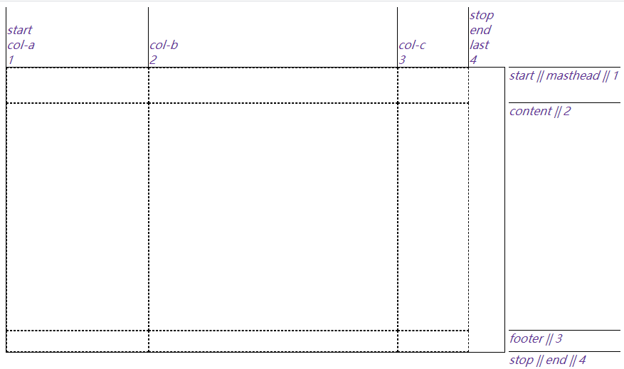

上面这个例子里第二列的宽度是网格容器的一半大小，虽然会随着网格容器宽度而变化，但不会根据网格项的**内容**而变化。

如果第二行content的高度为`100%`，它会将第三行挤出网格容器，这不会我们想要的结果，那么可以使用`minmax(a, b)`来约束第二行content的高度，其中“a”是最小尺寸，“b”是最大尺寸。`grid-template-rows: [start masthead] 50px [content] minmax(320px, 100%) [footer] 30px [stop end];`

`minmax(a, b)`中，如果“b”小于“a”，“b”将会被抛弃，“a”会作为固定值使用。觉得`minmax(a, b)`不好用那可以试试`calc()`。

### 3.2 弹性轨道

让`grid-template-rows`与`grid-template-columns`取比较灵活的值，`fr`单位就可以将可用（剩余）空间按照比例进行分配。例如`grid-template-columns: 1fr 1fr 1fr 1fr;`相当于`grid-template-columns: 25% 25% 25% 25%;`。另外就是固定轨道和弹性轨道混搭使用，可以看下面的例子

```html
<html>
<head>
    <style>
    section {position: relative;}
    .grid {
        display: grid; width: 800px; height: 15em;
        grid-template-columns: 15em 4.5fr 3fr 10%;
        grid-template-rows: 1fr; border: 1px solid;
    }
    .gridlines { display: grid; border: 1px dashed; }
    .gridlines i { height: 1.2em; }
    .gridlines i.col.measure {
        align-self: center; justify-self: stretch;
        text-align: center; height: 1.2em;
    }
    </style>
</head>
<body>
    <section>
        <div class="grid boxed lines">
            <span class="gridlines"><i class="col measure">15em</i></span>
            <span class="gridlines"><i class="col measure">4.5fr</i></span>
            <span class="gridlines"><i class="col measure">3fr</i></span>
            <span class="gridlines"><i class="col measure">10%</i></span>
        </div>
    </section>
</body>
</html>
```

代码效果图：  


也可以使用`minmax(a, b)`，例如`grid-template-columns: 15em 4.5fr 3fr 10%;`改为`grid-template-columns: 15em 4.5fr minmax(5em, 3fr) 10%;`，但要记住`fr`**不能用在minmax的第一个参数上**。改成`grid-template-columns: 15em 1fr minmax(0, 500px) 10%;`，如果不考虑边框的话，第一列占据240px，第二列的`1fr`实际占据0（这个是最后算的），第三列是480px，第四列是80px。

但是如果第二列里有内容，它就不会是0px了。由于第二列的每一项的宽度可能不一致，就需要`min-content`或`max-content`来约束。`min-content`表示内容尽可能窄，对于一段文本来说就是保证最长的单词在一行里，这样会有很多换行。`max-content`表示内容尽可能宽，对于一段文本来说就是不换行。如果每一列都使用`max-content`，那很有可能导致网格元素溢出，所以`max-content`经常搭配`minmax(a, b)`来使用（但可能会发生重叠）。

```html
<html>
<head>
    <style>
    .grid {
        display: grid; width: 250px; height: 150px;
        grid-template-rows: 1fr; border: 1px solid;
    }
    #div1 {
        grid-template-columns:
            max-content max-content
            max-content max-content;
    }
    #div2 {
        grid-template-columns:
            minmax(0, max-content) minmax(0, max-content)
            minmax(0, max-content) minmax(0, max-content);
    }
    .gridlines { border: 1px dashed; }
    .block {
        width: 50px; height: 50px;
        background-color: blue;
        opacity: 0.5; margin: 10px;
    }
    </style>
</head>
<body>
    <div class="grid" id="div1">
        <div class="gridlines"><div class="block"></div></div>
        <div class="gridlines"><div class="block" style="width: 100px;"></div></div>
        <div class="gridlines"><div class="block"></div></div>
        <div class="gridlines"><div class="block" style="height: 100px;"></div></div>
    </div>
    <br>
    <div class="grid" id="div2">
        <div class="gridlines"><div class="block"></div></div>
        <div class="gridlines"><div class="block" style="width: 100px;"></div></div>
        <div class="gridlines"><div class="block"></div></div>
        <div class="gridlines"><div class="block" style="height: 100px;"></div></div>
    </div>
</body>
</html>
```

代码效果图：  
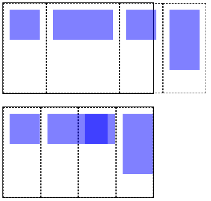

还可以使用`auto`，一般要么作为最小值要么作为最大值使用。其实使用`auto`时，是由`align-content`和`justify-content`来决定网格元素尺寸的，在后面几节了会讲。

### 3.3 内容适配轨道

`min-content`、`max-content`和`minmax(a, b)`会比较局限，对每一行内容做不到比较完美的适配。`fit-content()`函数就比较适合用来适配内容大小的，规范里有这样一个伪公式：`fit-content(arg) => min(max-content, max(min-content, arg))`，可以理解为取“中间”那个合适的值作为网格尺寸。

```html
<html>
<head>
    <style>
    .grid  {
        display: grid;
        grid-template-columns: fit-content(200px) fit-content(200px) fit-content(200px);
        border: 1px solid;
    }
    p { border: 1px dotted; margin: 0; padding: 10px 0; }
    </style>
</head>
<body>
    <section>
        <div class="grid">
            <p>Short content, 29 characters.</p>
            <p>This is longer content, which reaches a total of 63 characters.</p>
            <p>This is still longer content, going on and on, causing line-wraps and the growth of the row’s height as it makes its way up to 151 characters in total.</p>
        </div>
    </section>
</body>
</html>
```

以上代码效果图：  


```html
<html>
<head>
    <style>
    .grid  {
        display: grid;
        grid-template-columns: fit-content(200px) fit-content(200px) fit-content(200px);
        border: 1px solid;
    }
    p { border: 1px dotted; margin: 0; padding: 10px 0; }
    .img { width: 250px; height: 50px; background-color: blue; }
    </style>
</head>
<body>
    <section>
        <div class="grid">
            <p>Short content, 29 characters.</p>
            <p>This is longer content, which reaches a total of 63 characters.</p>
            <p>This is still longer content, going on and on, causing line-wraps and the growth of the row’s height as it makes its way up to 151 characters in total.</p>
        </div>
    </section>
</body>
</html>
```

以上代码效果图：  
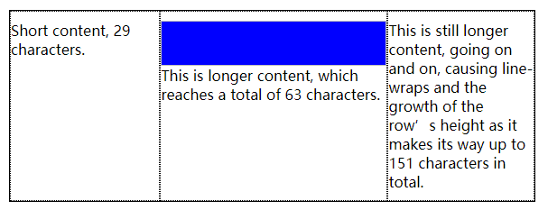

上面第二个例子中有一个img图像，第二列的`min-content`就是img的宽度也就是250px，`max-content`就是一段文本不换行的长度这里应该是非常大的（估计有500px）。又因为`fit-content(200px)`，可以带入伪公式：`fit-content(200px) => min(500px, max(250px, 200px))`，最后结果是250px。

### 3.4 重复网格线

我们前面的例子每一列的取值基本一样，其实可以使用`repeat()`函数来简化。比如要设置5个轨道，并且都是50px宽，那么可以`.grid { display: grid; grid-template-columns: repeat(5, 50px); }`。除了单个单个重复的，还能一系列一系列重复的，比如要设置3个`3em-1fr-1fr`，那么可以`.grid { display: grid; grid-template-columns: repeat(3, 3em 1fr 1fr); }`。

```html
<html>
<head>
    <style>
    section {position: relative;}
    .grid {
        display: grid; width: 800px; height: 15em;
        /* grid-template-columns: repeat(3, 3em 1fr 1fr) 3em; 可以平衡两端 */
        grid-template-columns: repeat(3, 3em 1fr 1fr);
        grid-template-rows: 1fr; border: 1px solid;
    }
    .gridlines { display: grid; border: 1px dashed; }
    .gridlines i { height: 1.2em; }
    .gridlines i.col.measure {
        align-self: center; justify-self: stretch;
        text-align: center; height: 1.2em;
    }
    </style>
</head>
<body>
    <section>
        <div class="grid boxed lines">
            <span class="gridlines"><i class="col measure">2em</i></span>
            <span class="gridlines"><i class="col measure">1fr</i></span>
            <span class="gridlines"><i class="col measure">1fr</i></span>
            <span class="gridlines"><i class="col measure">2em</i></span>
            <span class="gridlines"><i class="col measure">1fr</i></span>
            <span class="gridlines"><i class="col measure">1fr</i></span>
            <span class="gridlines"><i class="col measure">2em</i></span>
            <span class="gridlines"><i class="col measure">1fr</i></span>
            <span class="gridlines"><i class="col measure">1fr</i></span>
        </div>
    </section>
</body>
</html>
```

以上代码效果图：  


如果网格容器宽度或者高度固定，我们可以使用`repeat(auto-fill, xx)`**自动填充**网格，也就是将具体数值替换为`auto-fill`。这样的写法有个局限就是不能使用在“一系列一系列重复”网格中，也就是只有一个固定尺寸。还可以联合使用比如`grid-template-columns: repeat(3, 20em) repeat(auto-fill, 4em);`，也可以反过来`grid-template-columns: repeat(auto-fill, 4em) repeat(3, 20em);`，可以反过来的原因就是始终先算固定尺寸（3个20em），再用剩余空间算自动填充的（剩余的一些4em）。

```html
<html>
<head>
    <style>
    .grid {
        display: grid; width: 77em; height: 10em; border: 1px solid;
        grid-template-columns: repeat(auto-fill, 4em) repeat(3, 20em);
    }
    span { border: 1px dashed; }
    </style>
</head>
<body>
    <div class="grid">
        <span class="gridlines"><i class="col">4em</i></span>
        <span class="gridlines"><i class="col">4em</i></span>
        <span class="gridlines"><i class="col">4em</i></span>
        <span class="gridlines"><i class="col">4em</i></span>
        <span class="gridlines"><i class="col">20em</i></span>
        <span class="gridlines"><i class="col">20em</i></span>
        <span class="gridlines"><i class="col">20em</i></span>
    </div>
</body>
</html>
```

以上代码效果图：  


类似的还有`repeat(auto-fit, xx)`，与前面的`repeat(auto-fill, xx)`功能相同都是自动填充网格，区别就是使用auto-fit会**剔除**不使用的网格轨道（内部没有网格元素）。

```html
<html>
<head>
    <style>
    .grid { display: grid; width: auto; height: 10em; border: 1px solid; }
    .grid:nth-of-type(1) { grid-template-columns: repeat(auto-fit, 10em); }
    .grid:nth-of-type(2) { grid-template-columns: repeat(auto-fill, 10em); }
    span { border: 1px dashed; }
    .box01 { grid-column: 1; }
    .box02 { grid-column: 2; }
    .box03 { grid-column: 4; }
    .box04 { grid-column: 5; }
    .box05 { grid-column: 7; }

    p { text-align: center; font: bold 1em Consolas, monospace, sans-serif; margin: 1ch;}
    </style>
</head>
<body>
    <section>
        <p>repeat(auto-fit, 20em)</p>
        <div class="grid">
            <span class="box01">1</span>
            <span class="box02">2</span>
            <span class="box03">4</span>
            <span class="box04">5</span>
            <span class="box05">7</span>
        </div>
        <p>repeat(auto-fill, 20em)</p>
        <div class="grid">
            <span class="box01">1</span>
            <span class="box02">2</span>
            <span class="box03">4</span>
            <span class="box04">5</span>
            <span class="box05">7</span>
        </div>
    </section>
</body>
</html>
```

### 3.5 网格区域

`grid-template-areas`用于给网格划分区域的，直接定义**网格区域**。可以使用特定的字母或者单词来规定某块区域属于哪一块，比如`header`、`leftside`、`rightside`、`centent`和`footer`，也可以使用它们的首字母进行替代。

```html
<html>
<head>
    <style>
    .grid { display: grid;
            grid-template-areas:
            "h h h h"
            "l c c r"
            "l f f f";
        grid-template-rows: repeat(3, 3em);
        border: 1px solid;
    }
    span { border: 1px dashed; text-align: center; }
    .header { grid-area: h; }
    .leftside { grid-area: l; }
    .rightside { grid-area: r; }
    .content { grid-area: c; }
    .footer { grid-area: f; }
    </style>
</head>
<body>
    <div class="grid">
        <span class="box01 header">header</span>
        <span class="box02 content">content</span>
        <span class="box03 leftside">leftside</span>
        <span class="box04 rightside">rightside</span>
        <span class="box05 footer">footer</span>
    </div>
</body>
</html>
```

以上代码效果图：  


需要注意的一点，`grid-template-areas: "h h h h" "l c c r" "l f f f";`这样才能跨行，如果是`grid-template-areas: "h h h h l c c r l f f f";`得到就是一行12列的内容了，不会是三行的内容了。还有，跨行或跨列进行**合并**区域时，只能是**矩形**，不然areas模板会失效。比如`grid-template-areas: "h h h h" "l c c r" "l l f f";`就不会起作用。

网格区域还是需要网格线来约束大小的，可以看下面这个例子。其中空单元格可以使用`...`或者`.`来标记

```html
<html>
<head>
<style>
.grid { display: grid;
    grid-template-areas:
        "header  header  header  header"
        "left    ... ... right"
        "footer  footer  footer  footer";
    grid-template-columns: 1fr 100px 100px 1fr;
    grid-template-rows: 40px 100px 40px;
    border: 1px solid; width: 500px;
}
span { border: 1px dashed; }
.header { grid-area: header; }
.leftside { grid-area: left; }
.rightside { grid-area: right; }
.content { grid-area: content; }
.footer { grid-area: footer; }
</style>
</head>
<body>
    <div class="grid boxed lines small">
        <span class="header">header</span>
        <span class="leftside">left</span>
        <span class="rightside">right</span>
        <span class="footer">footer</span>
        <span class="gridlines"></span>
        <span class="gridlines"></span>
    </div>
</body>
</html>
```

以上代码效果图：  


给网格区域命名后，会自动给区域首尾的网格线命名了。比如header区域，第一行网格线和第一列网格线的名字都是`header-start`，第二行网格线和第二列网格线的名字都是`header-end`


## 四、添加网格元素

### 4.1 附加到网格线上

将元素附加到网格线上有四个属性`grid-row-start`、`grid-row-end`、`grid-column-start`和`grid-column-end`，可以理解为给元素的边界限定范围

```html
<html>
<head>
<style>
    .grid { display: grid; width: 50em; height: 25em;
        grid-template-row: repeat(3, 5em); grid-template-columns: repeat(3, 5em); }
    .box01 { grid-row-start: 2; grid-row-end: 4;
        grid-column-start: 1; grid-column-end: 3; background: skyblue; }
    .box02 { grid-row-start: 1; grid-row-end: 3;
        grid-column-start: 4; grid-column-end: 7; background: gray; }
    .box03 { grid-row-start: 2; grid-row-end: 3;
        grid-column-start: 8; grid-column-end: 9; background: yellow; }
    span { border: 1px dashed; }
    span[class*="box"] { z-index: 1; }
</style>
</head>
<body>
    <div class="grid boxed gridlines">
        <span class="box01">1</span><span class="box02">2</span><span class="box03">3</span>
        <span class="gridlines"></span><span class="gridlines"></span><span class="gridlines"></span>
        <span class="gridlines"></span><span class="gridlines"></span><span class="gridlines"></span>
        <span class="gridlines"></span><span class="gridlines"></span><span class="gridlines"></span>
        <span class="gridlines"></span><span class="gridlines"></span><span class="gridlines"></span>
        <span class="gridlines"></span>
    </div>
</body>
</html>
```

以上代码效果图：  


还有一种类似的方式，给它指定跨网格轨道的数量，比如`grid-column-start: 3; grid-column-end: span 2;`从第三个列线开始往end方向跨2个span。其中span后面的数值要是**正整数**，或者省略就是默认为1。如果是`grid-column-start: span 2; grid-column-end: 3;`，已第三列线为结束边界，往start方向跨2个span（也就是第1列线的位置）。

```html
<html>
<head>
<style>
    #grid { display: grid;  width: 50em; height: 25em;
        grid-rows: repeat(4, 2em); grid-columns: repeat(5, 5em);}
    .box01 { grid-row: 1; grid-column-start: 3; grid-column-end: span 2; background: skyblue; }
    .box02 { grid-row: 2; grid-column-start: span 2; grid-column-end: 3; background: gray; }
    .box03 { grid-row: 3; grid-column-start: 1; grid-column-end: span 5; background: yellow; }
    .box04 { grid-row: 4; grid-column-start: span 1; grid-column-end: 5; background: green; }
    span { border: 1px dashed; }
    span[class*="box"] { z-index: 1; }
</style>
</head>
<body>
    <div class="grid boxed gridlines" id="grid">
        <span class="box01">1</span><span class="box02">2</span><span class="box03">3</span>
        <span class="box04">4</span><span class="gridlines"></span><span class="gridlines"></span>
        <span class="gridlines"></span><span class="gridlines"></span><span class="gridlines"></span>
        <span class="gridlines"></span><span class="gridlines"></span><span class="gridlines"></span>
        <span class="gridlines"></span><span class="gridlines"></span>
    </div>
</body>
</html>
```

以上代码效果图：  
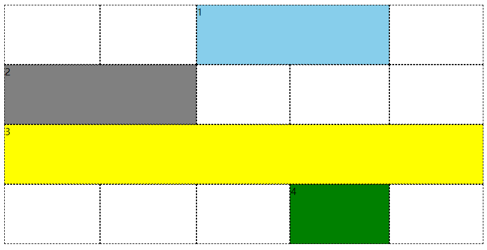

添加元素引用网格线时，并不限于使用编号，网格名称也是可以使用的，混用也可以。可以看下面的例子，`R 2`、`col-A 3`和`col-A -2`是**编号和名称混用**的场景，编号是可以使用**负数**的，它表示从网格右侧往左计数(尾端反向计数，尾端-1就是最后一个)，那么`col-A -2`的意思是从右往左数第2个col-A。

```html
<html>
<head>
<style>
    body {width: 64em; padding: 5em; margin: 1px;}
    #grid {display: grid; width: 54em;
        grid-template-rows: repeat(5, [R] 4em);
        grid-template-columns: 2em repeat(5, [col-A] 5em [col-B] 5em);}
    .one { grid-row-start: R 2; grid-row-end: 4;
        grid-column-start: col-B; grid-column-end: span 2; background: skyblue; }
    .two { grid-row-start: R; grid-row-end: span R 2;
        grid-column-start: col-A 3; grid-column-end: span 2 col-A; background: gray; }
    .three { grid-row-start: 4; grid-column-start: col-A -2; background: yellow; }

    span[class*="box"] {z-index: 1;}
    span { border: 1px dashed; }

    .labels#col {display: grid; grid-template-rows: 5em; grid-template-columns: 2em repeat(5, [col-A] 5em [col-B] 5em) 2em 2em;}
    .labels#row {display: grid; grid-template-rows: repeat(6, [R] 4em); grid-template-columns: 5em;}

    .labels#col {position: absolute; top: 0; left: 5em; margin: 0; padding: 1px;}
    .labels#row {position: absolute; top: 5em; left: 0; margin: 0; padding: 1px;}

    .labels#col li {display: flex; justify-content: flex-end; align-items: flex-start; flex-flow: column;}
    .labels#row li {display: flex; justify-content: flex-end; align-items: flex-start; flex-flow: row;}

    .labels li.line.label i {color: rebeccapurple; font: 1em Arvo, sans-serif;}
    .labels#col li.line.label i {border-left: 1px solid; padding-left: 0.25em;}
    .labels#col li i:last-child {padding-bottom: 0.5em;}
    .labels#col li.high i:last-child {padding-bottom: 4em;}

    .labels .line.col.label  {grid-template-row: 1; grid-template-column: auto / span 1;}

    .labels li.line.label i {color: rebeccapurple; font: 1em Arvo, sans-serif;}
    .labels#col li.line.label i {border-left: 1px solid; padding-left: 0.25em;}
    .labels#row li.line.label i {border-top: 1px solid; padding-top: 0.25em;}

    .labels#row li i {padding-right: 0.5em;}
    .labels#col li i:last-child {padding-bottom: 0.5em;}
    .labels#col li.high i:last-child {padding-bottom: 4em;}
</style>
</head>
<body>
    <div class="grid boxed gridlines" id="grid">
        <span class="box01 one">1</span><span class="box02 two">2</span><span class="box03 three">3</span>
        <span class="gridlines"></span><span class="gridlines"></span><span class="gridlines"></span>
        <span class="gridlines"></span><span class="gridlines"></span><span class="gridlines"></span>
        <span class="gridlines"></span><span class="gridlines"></span><span class="gridlines"></span>
        <span class="gridlines"></span><span class="gridlines"></span><span class="gridlines"></span>
        <span class="gridlines"></span><span class="gridlines"></span><span class="gridlines"></span>
        <span class="gridlines"></span><span class="gridlines"></span><span class="gridlines"></span>
        <span class="gridlines"></span><span class="gridlines"></span><span class="gridlines"></span>
        <span class="gridlines"></span><span class="gridlines"></span><span class="gridlines"></span>
        <span class="gridlines"></span><span class="gridlines"></span><span class="gridlines"></span>
        <span class="gridlines"></span><span class="gridlines"></span><span class="gridlines"></span>
        <span class="gridlines">
    </div>
    <ul class="labels" id="col">
        <li class="col line label"><i>1</i></li>
        <li class="col line label"><i>col-A</i><i>2</i></li>
        <li class="col line label"><i>col-B</i><i>3</i></li>
        <li class="col line label"><i>col-A</i><i>4</i></li>
        <li class="col line label"><i>col-B</i><i>5</i></li>
        <li class="col line label"><i>col-A</i><i>6</i></li>
        <li class="col line label"><i>col-B</i><i>7</i></li>
        <li class="col line label"><i>col-A</i><i>8</i></li>
        <li class="col line label"><i>col-B</i><i>9</i></li>
        <li class="col line label"><i>col-A</i><i>10</i></li>
        <li class="col line label"><i>col-B</i><i>11</i></li>
        <li class="col line label"><i>12</i></li>
    </ul>
    <ul class="labels" id="row">
        <li class="row line label"><i></i><i>1</i></li>
        <li class="row line label"><i>R</i><i>2</i></li>
        <li class="row line label"><i>R</i><i>3</i></li>
        <li class="row line label"><i>R</i><i>4</i></li>
        <li class="row line label"><i>R</i><i>5</i></li>
    </ul>
</body>
</html>
```

以上代码效果图：  


我们可以使用`grid-row`和`grid-column`来简写前面提到的四个属性（`grid-row-start`、`grid-row-end`、`grid-column-start`和`grid-column-end`），需要斜线`/`来分隔start和end。像这一小节开头的例子可以简写改成以下例子：

```html
<html>
<head>
<style>
    .grid { display: grid; width: 50em; height: 25em;
        grid-template-row: repeat(3, 5em); grid-template-columns: repeat(3, 5em); }
    .box01 { grid-row: 2 / 4; grid-column: 1 / 3; background: skyblue; }
    .box02 { grid-row: 1 / 3; grid-column: 4 / 7; background: gray; }
    .box03 { grid-row: 2 / 3; grid-column: 8 / 9; background: yellow; }
    span { border: 1px dashed; }
    span[class*="box"] { z-index: 1; }
</style>
</head>
<body>
    <div class="grid boxed gridlines">
        <span class="box01">1</span><span class="box02">2</span><span class="box03">3</span>
        <span class="gridlines"></span><span class="gridlines"></span><span class="gridlines"></span>
        <span class="gridlines"></span><span class="gridlines"></span><span class="gridlines"></span>
        <span class="gridlines"></span><span class="gridlines"></span><span class="gridlines"></span>
        <span class="gridlines"></span><span class="gridlines"></span><span class="gridlines"></span>
        <span class="gridlines"></span>
    </div>
</body>
</html>
```

以上代码效果图：  


### 4.2 隐式网格

前面的例子都是使用`grid-template-xxx`定义的显示网格，在添加元素时一般都在这些网格中，如果万一我们添加的元素超出了这些网格，浏览器会怎么处理？浏览器会自动创建对应的行线或列线。

```html
<html>
<head>
<style>
    #grid { grid-auto-rows: 2em; grid-auto-columns: 5em; width: 35em; }
    #grid { display: grid; grid-template-rows: 2em 2em;
        grid-template-columns: repeat(6, 4em); }
    .box01 { grid-column: 1; grid-row: 1 / 4; border: 5px solid; border-color: skyblue; }
    .box02 { grid-column: 2; grid-row: 3 / span 2; border: 5px solid; border-color: springGreen; }
    .box03 { grid-column: 3; grid-row: span 2 / 3; border: 5px solid; border-color: salmon; }
    .box04 { grid-column: 4; grid-row: span 4 / 5; border: 5px solid; border-color: hotPink; }
    .box05 { grid-column: 5; grid-row: span 6 / 5; border: 5px solid; border-color: lawnGreen; }
    .box06 { grid-column: 6; grid-row: -1 / span 3; border: 5px solid; border-color: orangeRed; }
    .box07 { grid-column: 7; grid-row: span 3 / -1; border: 5px solid; border-color: yellowGreen; }
    span { border: 1px dashed; }
    span[class*="box"] {z-index: 1;}
    span.explicit {background: #DDD; grid-area: 1 / 1 / 3 / 7;}
</style>
</head>
<body>
    <div class="grid gridlines" id="grid">
        <span class="box01">1</span><span class="box02">2</span><span class="box03">3</span>
        <span class="box04">4</span><span class="box05">5</span><span class="box06">6</span>
        <span class="box07">7</span><span class="explicit"></span><span class="gridlines"></span>
        <span class="gridlines"></span><span class="gridlines"></span><span class="gridlines"></span>
        <span class="gridlines"></span><span class="gridlines"></span><span class="gridlines"></span>
        <span class="gridlines"></span><span class="gridlines"></span><span class="gridlines"></span>
        <span class="gridlines"></span><span class="gridlines"></span><span class="gridlines"></span>
        <span class="gridlines"></span><span class="gridlines"></span><span class="gridlines"></span>
        <span class="gridlines"></span><span class="gridlines"></span><span class="gridlines"></span>
        <span class="gridlines"></span><span class="gridlines"></span><span class="gridlines"></span>
    </div>
</body>
</html>
```

以上代码效果图：  
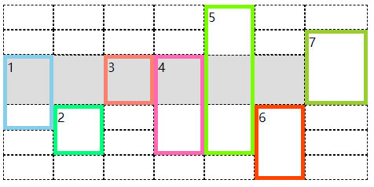

我们可以看到上面这个例子，显示规划了**两行六列**的网格，7个span中只有第3个没有超出，其他都超出了，浏览器自动为它们添加了行线或列线。值得注意的是第6个和第7个的`-1`指的是显示网格中**尾端反向**的网格线（这里就是首端正向第3条行线）。

前面的网格线都没有具体的名称，如果有具体的名称情况与上面的类似，主要就是在扩展隐式网格时还能为隐式网格线添加名字。比如下面这个例子中的`box01`，从`2`开始往下跨span类型的网格，要跨2条名称为`end`的网格线，但显示网格中只有一条`end`网格线，然后浏览器隐式生成一条`end`网格线（在下图中是斜体的）。同样`box02`，从`2`开始往下跨span类型的网格，要跨1条名称为`final`的网格线，但显示网格中没有，那将之前的隐式`end`网格线又新添一个名字`final`。后面的`box03`、`box04`和`box05`都是如此。

```html
<html>
<head>
<style>
    body {width: 64em; padding-left: 8.4em; padding-top: 1em; margin: 1px;}
    #grid {grid-auto-rows: 2em; grid-auto-columns: 5em; width: 35em; left: 5em; }
    #grid {display: grid; grid-template-rows: [begin] 2em [middle] 2em [end];
        grid-template-columns: repeat(5, 5em); }
    .box01 { grid-column: 1; grid-row: 2 / span end 2; border: 5px solid; border-color: skyblue; }
    .box02 { grid-column: 2; grid-row: 2 / span final; border: 5px solid; border-color: springGreen; }
    .box03 { grid-column: 3; grid-row: 1 / span 3 middle; border: 5px solid; border-color: salmon; }
    .box04 { grid-column: 4; grid-row: span begin 2 / end; border: 5px solid; border-color: hotPink; }
    .box05 { grid-column: 5; grid-row: span 2 middle / begin; border: 5px solid; border-color: lawnGreen; }
    span { border: 1px dashed; }
    span[class*="box"] {z-index: 1;}
    span.explicit {background: #DDD; grid-area: 1 / 1 / 3 / 6;}

    .labels#row {display: grid; grid-template-rows: repeat(7, 2em);}
    .labels#row {position: absolute; top: 1em; left: 0; margin: 0; padding: 1px;}
    .labels#row li {display: flex; justify-content: flex-end; align-items: flex-start; flex-flow: row;}

    .labels li.line.label i {color: rebeccapurple; font: 1em Arvo, sans-serif;}
    .labels li.line.label.implicit i { font-style: italic; }
    .labels#row li.line.label i {border-top: 1px solid; padding-top: 0.25em;}
    .labels#row li i {padding-right: 0.5em;}
    .labels li i::after { content: " || "; margin-right: 4px; }
    .labels li i:last-child::after { content: ""; }
</style>
</head>
<body>
    <div class="grid gridlines" id="grid">
        <span class="box01">1</span><span class="box02">2</span><span class="box03">3</span>
        <span class="box04">4</span><span class="box05">5</span><span class="explicit"></span>
        <span class="gridlines"></span><span class="gridlines"></span><span class="gridlines"></span>
        <span class="gridlines"></span><span class="gridlines"></span><span class="gridlines"></span>
        <span class="gridlines"></span><span class="gridlines"></span><span class="gridlines"></span>
        <span class="gridlines"></span><span class="gridlines"></span><span class="gridlines"></span>
        <span class="gridlines"></span>
    </div>
    <ul class="labels" id="row">
        <li class="row line label implicit"><i>middle</i></li>
        <li class="row line label implicit"><i>begin</i><i>middle</i></li>
        <li class="row line label"><i>begin</i><i>1</i></li>
        <li class="row line label"><i>middle</i><i>2</i></li>
        <li class="row line label"><i>end</i><i>3</i></li>
        <li class="row line label implicit"><i>final</i><i>middle</i></li>
        <li class="row line label implicit"><i>middle</i></li>
    </ul>
</body>
</html>
```

以上代码效果图：  


我们并没讲隐式添加的网格的尺寸为什么和显式的一样，因为上面的例子都使用了`grid-auto-rows`或`grid-auto-columns`来约束隐式网格尺寸，如果不使用这两个属性，那么新添的行的高度会根据这一行的内容高度作为最终高度，新添加的列的宽度会根据这一列的内容宽度作为最终宽度。这个同样也应用于网格流中，看下面这个例子。

```html
<html>
<head>
<style>
    .grid {display: inline-grid; vertical-align: top; margin-right: 3em;
        grid-template-rows: 120px 120px; grid-template-columns: 120px 120px;}
    #g1 {grid-auto-rows: 120px;}
    span[class*="box"] { font-size: 1.5em; border: 5px solid; }
    *[class*="01"] { color: hsl(0,67%,50%); background: hsla(0,67%,50%,0.2); border-color: skyblue; }
    *[class*="02"] { color: hsl(24,67%,50%); background: hsla(24,67%,50%,0.2); border-color: salmon; }
    *[class*="03"] { color: hsl(48,67%,50%); background: hsla(48,67%,50%,0.2); border-color: hotPink; }
    *[class*="04"] { color: hsl(72,67%,50%); background: hsla(72,67%,50%,0.2); border-color: lawnGreen; }
    *[class*="05"] { color: hsl(96,67%,50%); background: hsla(96,67%,50%,0.2); border-color: blueViolet; }
    *[class*="06"] { color: hsl(120,67%,50%); background: hsla(120,67%,50%,0.2); border-color: burlyWood; }
</style>
</head>
<body>
    <div class="grid boxed gridlines" id="g1">
        <span class="box01">1</span><span class="box02">2</span><span class="box03">3</span>
        <span class="box04">4</span><span class="box05">5</span><span class="box06">6</span>
    </div>
    <div class="grid boxed gridlines" id="g2">
        <span class="box01">1</span><span class="box02">2</span><span class="box03">3</span>
        <span class="box04">4</span><span class="box05">5</span><span class="box06">6</span>
    </div>
</body>
</html>
```

以上代码效果图：  


### 4.3 附加到网格区域中

事先定义好网格区域，直接使用`grid-area`可以将元素添加到网格区域中。其实在[网格区域](./9.网格布局.md#_3-5-网格区域)这节的例子里就使用了`grid-area`，如下。

```html
<html>
<head>
    <style>
    .grid { display: grid;
            grid-template-areas:
            "h h h h"
            "l c c r"
            "l f f f";
        grid-template-rows: repeat(3, 3em);
        border: 1px solid;
    }
    span { border: 1px dashed; text-align: center; }
    .header { grid-area: h; }
    .leftside { grid-area: l; }
    .rightside { grid-area: r; }
    .content { grid-area: c; }
    .footer { grid-area: f; }
    </style>
</head>
<body>
    <div class="grid">
        <span class="box01 header">header</span>
        <span class="box02 content">content</span>
        <span class="box03 leftside">leftside</span>
        <span class="box04 rightside">rightside</span>
        <span class="box05 footer">footer</span>
    </div>
</body>
</html>
```

以上代码效果图：  


以上只是`grid-area`为一个值的场景，有些场景下它有4个值并用`/`分隔。比如下面例子中的`grid-area: 1 / 1 / 2 / 2`，就是`上 / 左 / 下 / 右`的网格线顺序，与css属性的上右下左是反的。

```html
<html>
<head>
<style>
    #grid { width: 400px; height: 150px; }
    #grid {display: inline-grid;
        grid-template-rows:
            [r1-start] 1fr [r1-end r2-start] 2fr [r2-end];
        grid-template-columns:
            [col-start] 1fr [col-end main-start] 1fr [main-end];}
    .box01 {grid-area: r1 / main / r1 / main; border: 5px solid; border-color: skyblue; }
    .box02 { grid-area: r2-start / col-start / r2-end / main-end;
        border: 5px solid; border-color: springGreen; }
    .box03 {grid-area: 1 / 1 / 2 / 2; border: 5px solid; border-color: salmon; }
    span { border: 1px dashed; text-align: center; }
    ul li { display: flex; }
    ul li i { color: rebeccapurple; }
    .labels1 { display: grid; grid-template-columns: 1fr 1fr 1fr;
        width: 600px; padding: 0; margin-bottom: 0; margin-left: 160px; }
    .labels1 li { justify-content: flex-end; align-items: flex-start;
        flex-flow: column; border-left: 1px solid; }
    .labels2 { display: inline-grid; grid-template-rows: 1fr 2fr 1fr; height: 200px;
        padding: 0; margin-left: 0; margin-top: 0; vertical-align: top; }
    .labels2 li { border-top: 1px solid; justify-content: flex-end; }
    .labels2 li i::after { content: " || "; margin-right: 4px; }
    .labels2 li i:last-child::after { content: ""; }
</style>
</head>
<body>
    <ul class="labels1">
        <li class="col"><i>col-start</i><i>1</i></li>
        <li class="col"><i>col-end</i><i>main-start</i><i>2</i></li>
        <li class="col"><i>main-end</i><i>3</i></li>
    </ul>
    <ul class="labels2">
        <li class="col"><i>r1-start</i><i>1</i></li>
        <li class="col"><i>r1-end</i><i> r2-start</i><i>2</i></li>
        <li class="col"><i>r2-end</i><i>3</i></li>
    </ul>
    <div class="grid boxed gridlines" id="grid">
        <span class="box01 one" id="masthead">box01</span>
        <span class="box02 two" id="sidebar">box02</span>
        <span class="box03 three" id="main">box03</span>
    </div>
</body>
</html>
```

以上代码效果图：  
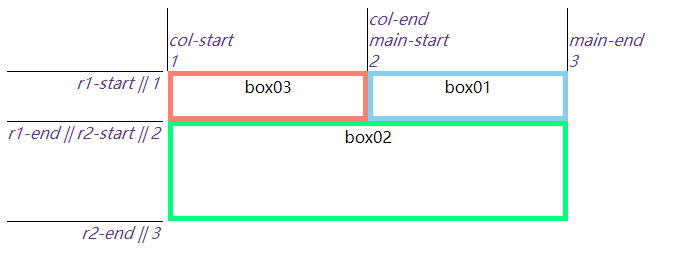

### 4.4 元素重叠以及异常处理

将元素添加到网格中时，元素是可以重叠的（可以是可以但要避免出现这样的情况）。

```html
<html>
<head>
<style>
    #grid { width: 54em; height: 17em; border: 1px solid; }
    #grid {display: grid;
        grid-template-rows: 50% 50%; grid-template-columns: 50% 50%;}
    .box01 { grid-area: 1 / 1 / 2 / 3; border: 5px solid; border-color: hotPink; }
    .box02 { grid-area: 1 / 2 / 3 / 2; border: 5px solid; border-color: skyblue; }
    span { border: 1px dashed; }
</style>
</head>
<body>
    <div class="grid boxed gridlines" id="grid">
        <span class="box01 one" id="masthead">1</span>
        <span class="box02 two" id="sidebar">2</span>
    </div>
</body>
</html>
```

以上代码效果图：  


不只是在数字引用的网格线下添加元素出现重叠的现象，网格区域也是同样的。后添加的会遮住先添加的。

```html
<html>
<head>
<style>
    #grid { width: 50em; height: 15em; border: 1px solid;
        grid-template-columns: 1fr 3fr;
        grid-template-rows: 4em 7em 4em; }
    #grid { display: grid;
        grid-template-areas:
            "header header"
            "sidebar content"
            "footer footer"; }
    #header { grid-area: header; border: 5px solid; border-color: skyblue; }
    #sidebar { grid-area: sidebar / sidebar / footer-end / sidebar;
        border: 5px solid; border-color: springGreen; }
    #footer { grid-area: footer; border: 5px solid; border-color: salmon; }
</style>
</head>
<body>
    <div class="grid boxed gridlines" id="grid">
        <span class="box01 one" id="header">header</span>
        <span class="box02 two" id="sidebar">sidebar</span>
        <span class="box03" id="footer">footer</span>
    </div>
</body>
</html>
```

以上代码效果图：  


&nbsp;&nbsp;&nbsp;&nbsp;添加元素时的异常处理：

1. 开始线数值大于结束线数值
   `grid-row-start: 5; grid-row-end: 2;`会自动转变为`grid-row-start: 2; grid-row-end: 5;`

2. 开始线和结束线都声明为跨度
   `grid-row-start: span; grid-row-end: span 3;`，结束线的跨度会被忽略，会转变为`grid-row-start: span 1; grid-row-end: auto;`，然后根据网格流自动放置，后面小节会讲。

3. 只用具名跨度指明网格元素位置
   `grid-row-start: span footer; grid-row-end: auto;`，这个和上面说的隐式网格很像，但是不一样，因为有个`auto`。这种情况也是会转变为`grid-row-start: span 1; grid-row-end: auto;`

4. `grid-area`四个值缺少一两个
   开始线值是网格线名称，缺少的结束线值与开始线值**相同**；开始线值是数值，缺少的结束线值则是`auto`

## 五、网格流

### 5.1 行优先和列优先

如果不明确指定网格元素在网格中的位置的话，网格元素会在**网格流**的作用下自动放在网格中合适的位置。网格流`grid-auto-flow`有两种模式：行优先和列优先。所谓“行优先”就是尽量占满一行再去排列下一行，“列优先”就是尽量先占满一列。

```html
<html>
<head>
<style>
    .grid { grid-template-columns: repeat(3, 200px);
        grid-template-rows: repeat(2, 50px); border: 1px solid; }
    .grid { display: grid; width: 600px; height: 100px;
        grid-auto-flow: column/*row*/;}
    .grid li { grid-row: auto; grid-column: auto; }
    ol { list-style:none; padding: 0; }
    .box01 { border: 5px solid; border-color: skyblue; }
    .box02 { border: 5px solid; border-color: springGreen; }
    .box03 { border: 5px solid; border-color: salmon; }
    .box04 { border: 5px solid; border-color: hotPink; }
    .box05 { border: 5px solid; border-color: lawnGreen; }
</style>
</head>
<body>
    <ol class="grid">
        <li class="box01">1</li><li class="box02">2</li>
        <li class="box03">3</li><li class="box04">4</li>
        <li class="box05">5</li>
    </ol>
</body>
</html>
```

以上代码效果图：  


可以看到上面的例子使用的是`grid-row: auto; grid-column: auto;`，因为默认每个网格元素一样大。但是如果每个网格元素的尺寸不一（并且大于网格区域的大小），再这样写就不合适了，必须给尺寸过大的网格元素添加**跨度**。

```html
<html>
<head>
<style>
    #grid {display: grid;
        grid-template-rows: repeat(4, 50px);
        grid-template-columns: repeat(4, 50px);
        grid-auto-rows: 50px;
        grid-auto-columns: 50px;
    }
    img {grid-row: auto; grid-column: auto;}
    img {width: 50px; height; 50px; border: 1px solid silver; box-sizing: border-box;}
    img.wide {width: 90px; height: 50px;}
    img.tall {width: 50px; height: 90px;}
    img.big {width: 90px; height: 90px;}
    img.wide {grid-column: auto / span 2;}
    img.tall {grid-row: auto / span 2;}
    img.big {grid-row: auto / span 2; grid-column: auto / span 2;}
</style>
</head>
<body>
    <div id="grid">
        
        
        
        
        
        
        
        
        
        
        
        
    </div>
</body>
</html>
```

以上代码效果图：  


### 5.2 网格流和浮动的区别

你会发现上面的例子上留出了很多间隙，原因是留出的空间放不下后面紧接着的元素了，就算能放下也不能超出前面元素的**顶边**。是不是觉得**网格流**和**浮动**有些像，但是浮动要比网格流规则更复杂。情况稍有不同，可以看下面例子中的13号元素的位置，想一想为什么。

```html
<html>
<head>
<style>
span { box-sizing: border-box; }

.float { display: inline-block; width: 320px; height: 320px; }
.float span { float: left; width: 80px; height: 80px; }
.float span.wide { width: 160px; }
.float span.tall { height: 160px; }

.grid { display: inline-grid;
    grid-template-columns: repeat(4, 80px);
    grid-template-rows: repeat(4, 80px);
    grid-auto-columns: 80px;
    grid-auto-rows: 80px;
    vertical-align: top;
    margin-left: 200px;
}
.grid { grid-auto-flow: row; }
.grid span { align-items: start; padding-top: 0.25em; }
.grid span.wide { grid-column: auto / span 2; }
.grid span.tall { grid-row: auto / span 2; }

span[class*="box"] { font-size: 1.5em; border: 5px solid; }
*[class*="01"] { color: hsl(0,67%,50%); background: hsla(0,67%,50%,0.2); border-color: skyblue; }
*[class*="02"] { color: hsl(24,67%,50%); background: hsla(24,67%,50%,0.2); border-color: salmon; }
*[class*="03"] { color: hsl(48,67%,50%); background: hsla(48,67%,50%,0.2); border-color: hotPink; }
*[class*="04"] { color: hsl(72,67%,50%); background: hsla(72,67%,50%,0.2); border-color: lawnGreen; }
*[class*="05"] { color: hsl(96,67%,50%); background: hsla(96,67%,50%,0.2); border-color: blueViolet; }
*[class*="06"] { color: hsl(120,67%,50%); background: hsla(120,67%,50%,0.2); border-color: burlyWood; }
*[class*="07"] { color: hsl(144,67%,50%); background: hsla(144,67%,50%,0.2); border-color: chartreuse; }
*[class*="08"] { color: hsl(168,67%,50%); background: hsla(168,67%,50%,0.2); border-color: chocolate; }
*[class*="09"] { color: hsl(192,67%,50%); background: hsla(192,67%,50%,0.2); border-color: cornflowerBlue; }
*[class*="10"] { color: hsl(216,67%,50%); background: hsla(216,67%,50%,0.2); border-color: cyan; }
*[class*="11"] { color: hsl(240,67%,50%); background: hsla(240,67%,50%,0.2); border-color: darkGoldenRod; }
*[class*="12"] { color: hsl(264,67%,50%); background: hsla(264,67%,50%,0.2); border-color: darkMagenta; }
*[class*="13"] { color: hsl(288,67%,50%); background: hsla(288,67%,50%,0.2); border-color: darkorange; }
*[class*="14"] { color: hsl(312,67%,50%); background: hsla(312,67%,50%,0.2); border-color: darkOrchid; }
*[class*="15"] { color: hsl(336,67%,50%); background: hsla(336,67%,50%,0.2); border-color: darkSalmon; }
*[class*="16"] { color: hsl(360,67%,50%); background: hsla(360,67%,50%,0.2); border-color: feldspar; }

</style>
</head>
<body>
    <div class="float">
        <span class="box01">1</span><span class="box02 wide">2</span><span class="box03">3</span>
        <span class="box04">4</span><span class="box05">5</span><span class="box06">6</span>
        <span class="box07">7</span><span class="box08 tall">8</span><span class="box09">9</span>
        <span class="box10">10</span><span class="box11 wide tall">11</span><span class="box12">12</span>
        <span class="box13">13</span><span class="box14">14</span><span class="box15">15</span>
        <span class="box16">16</span>
    </div>
    <div class="grid">
        <span class="box01">1</span><span class="box02 wide">2</span><span class="box03">3</span>
        <span class="box04">4</span><span class="box05">5</span><span class="box06">6</span>
        <span class="box07">7</span><span class="box08 tall">8</span><span class="box09">9</span>
        <span class="box10">10</span><span class="box11 wide tall">11</span><span class="box12">12</span>
        <span class="box13">13</span><span class="box14">14</span><span class="box15">15</span>
        <span class="box16">16</span>
    </div>
</body>
</html>
```

以上代码效果图：  
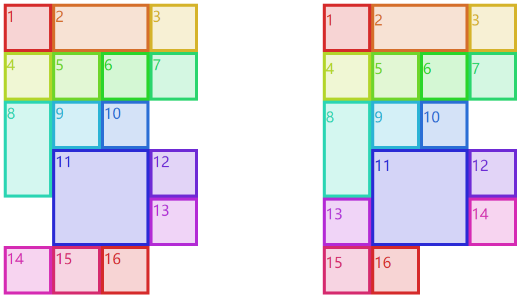

[浮动规则](./5.定位与浮动.md#_3-2-浮动规则)中有一条“**如果前面元素左浮动，那么后面浮动元素的左边界必定处于前面元素右边界的右侧，除非后面浮动元素的顶边在前面浮动元素的下边**”。11和12所在行没有13的位置了，11的左右都有13所需要的空间，但是由于前面这条规则，13只能放在11的右侧了。你可能想为什么不与14、15和16放在一行呢？因为[浮动规则](./5.定位与浮动.md#_3-2-浮动规则)中还有一条“**满足其他条件后，浮动元素要尽可能上移**”，所以13只能放在12的下面且11的右侧了。而网格流并没有这样的限制，它只需要保证“**不超出前面元素顶边**”就可以了（上面例子的右边这部分里的13就可以放在11的左侧了，但12仍旧和浮动场景一样，不能超过前面元素的顶边）。

### 5.3 密集流

“不超出前面元素顶边”是为了保证元素编号的不错乱，其实有一种**密集流**可以让网格元素紧靠着不用管什么编号顺序了，`grid-auto-flow: row dense;`是行优先的密集流，`grid-auto-flow: column dense;`是列优先的密集流。下面这个例子左边的12才不管前面的顶边在哪，会直接占据上面的空位；同样右边的11才不会管前面的左边界在哪，会直接占据左边的空位。

```html
<html>
<head>
<style>
span { box-sizing: border-box; }

.grid {display: inline-grid;
    grid-template-columns: repeat(4, 80px);
    grid-template-rows: repeat(4, 80px);
    grid-auto-columns: 80px;
    grid-auto-rows: 80px;
    vertical-align: top;
    margin-right: 5em;
}
#g1 {grid-auto-flow: row dense;}
#g2 {grid-auto-flow: column dense;}

#g1 span {align-items: start; padding-top: 0.25em;}
#g2 span {justify-content: flex-start; padding-left: 0.25em;}

.wide {grid-column: auto / span 2;}
.tall {grid-row: auto / span 2;}

span[class*="box"] { font-size: 1.5em; border: 5px solid; }
*[class*="01"] { color: hsl(0,67%,50%); background: hsla(0,67%,50%,0.2); border-color: skyblue; }
*[class*="02"] { color: hsl(24,67%,50%); background: hsla(24,67%,50%,0.2); border-color: salmon; }
*[class*="03"] { color: hsl(48,67%,50%); background: hsla(48,67%,50%,0.2); border-color: hotPink; }
*[class*="04"] { color: hsl(72,67%,50%); background: hsla(72,67%,50%,0.2); border-color: lawnGreen; }
*[class*="05"] { color: hsl(96,67%,50%); background: hsla(96,67%,50%,0.2); border-color: blueViolet; }
*[class*="06"] { color: hsl(120,67%,50%); background: hsla(120,67%,50%,0.2); border-color: burlyWood; }
*[class*="07"] { color: hsl(144,67%,50%); background: hsla(144,67%,50%,0.2); border-color: chartreuse; }
*[class*="08"] { color: hsl(168,67%,50%); background: hsla(168,67%,50%,0.2); border-color: chocolate; }
*[class*="09"] { color: hsl(192,67%,50%); background: hsla(192,67%,50%,0.2); border-color: cornflowerBlue; }
*[class*="10"] { color: hsl(216,67%,50%); background: hsla(216,67%,50%,0.2); border-color: cyan; }
*[class*="11"] { color: hsl(240,67%,50%); background: hsla(240,67%,50%,0.2); border-color: darkGoldenRod; }
*[class*="12"] { color: hsl(264,67%,50%); background: hsla(264,67%,50%,0.2); border-color: darkMagenta; }
*[class*="13"] { color: hsl(288,67%,50%); background: hsla(288,67%,50%,0.2); border-color: darkorange; }
*[class*="14"] { color: hsl(312,67%,50%); background: hsla(312,67%,50%,0.2); border-color: darkOrchid; }
*[class*="15"] { color: hsl(336,67%,50%); background: hsla(336,67%,50%,0.2); border-color: darkSalmon; }
*[class*="16"] { color: hsl(360,67%,50%); background: hsla(360,67%,50%,0.2); border-color: feldspar; }

</style>
</head>
<body>
    <div class="grid" id="g1">
        <span class="box01">1</span><span class="box02 wide">2</span><span class="box03">3</span>
        <span class="box04">4</span><span class="box05">5</span><span class="box06">6</span>
        <span class="box07">7</span><span class="box08 tall">8</span><span class="box09">9</span>
        <span class="box10">10</span><span class="box11 wide tall">11</span><span class="box12">12</span>
        <span class="box13">13</span><span class="box14">14</span><span class="box15">15</span>
        <span class="box16">16</span>
    </div>
    <div class="grid" id="g2">
        <span class="box01">1</span><span class="box02 wide">2</span><span class="box03">3</span>
        <span class="box04">4</span><span class="box05">5</span><span class="box06">6</span>
        <span class="box07">7</span><span class="box08 tall">8</span><span class="box09">9</span>
        <span class="box10 wide tall">10</span><span class="box11">11</span><span class="box12">12</span>
        <span class="box13">13</span><span class="box14">14</span><span class="box15">15</span>
        <span class="box16">16</span>
    </div>
</body>
</html>
```

以上代码效果图：  
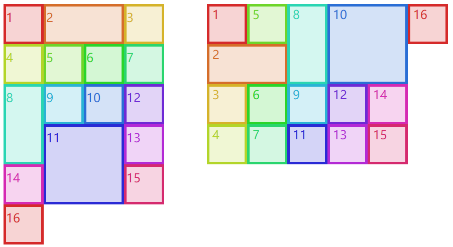

## 六、元素在网格空间中的布局

### 6.1 栏距

**栏距**就是两个网格轨道之间的距离，给网格单元之间添加间隔，与表格布局中的`border-spacing`很像。具体使用的是`grid-row-gap`和`grid-column-gap`，不能取百分比也不能使用`fr`，只能使用常用的距离单位`px`、`rem`等。当然，栏距有简写属性`grid-gap: xxx xxx`，第一个值就是行间距，第二个字就是列间距。

```html
<html>
<head>
<style>
    .grid { display: grid; width: 500px; height: 500px; border: 1px solid;
        grid-template-rows: 150px 1fr 150px; grid-template-columns: 15% 1fr 1fr;
        grid-column-gap: 1em; grid-row-gap: 25px; }
    span[class*="box"] { font-size: 1.5em; border: 5px solid; }
    *[class*="01"] { color: hsl(0,67%,50%); background: hsla(0,67%,50%,0.2); border-color: skyblue; }
    *[class*="02"] { color: hsl(24,67%,50%); background: hsla(24,67%,50%,0.2); border-color: salmon; }
    *[class*="03"] { color: hsl(48,67%,50%); background: hsla(48,67%,50%,0.2); border-color: hotPink; }
    *[class*="04"] { color: hsl(72,67%,50%); background: hsla(72,67%,50%,0.2); border-color: lawnGreen; }
    *[class*="05"] { color: hsl(96,67%,50%); background: hsla(96,67%,50%,0.2); border-color: blueViolet; }
    *[class*="06"] { color: hsl(120,67%,50%); background: hsla(120,67%,50%,0.2); border-color: burlyWood; }
    *[class*="07"] { color: hsl(144,67%,50%); background: hsla(144,67%,50%,0.2); border-color: chartreuse; }
    *[class*="08"] { color: hsl(168,67%,50%); background: hsla(168,67%,50%,0.2); border-color: chocolate; }
    *[class*="09"] { color: hsl(192,67%,50%); background: hsla(192,67%,50%,0.2); border-color: cornflowerBlue; }
</style>
</head>
<body>
    <div class="grid boxed gridlines" id="g1">
        <span class="box01">1</span><span class="box02">2</span><span class="box03">3</span>
        <span class="box04">4</span><span class="box05">5</span><span class="box06">6</span>
        <span class="box05">7</span><span class="box03">8</span><span class="box01">9</span>
    </div>
</body>
</html>
```

以上代码效果图：  
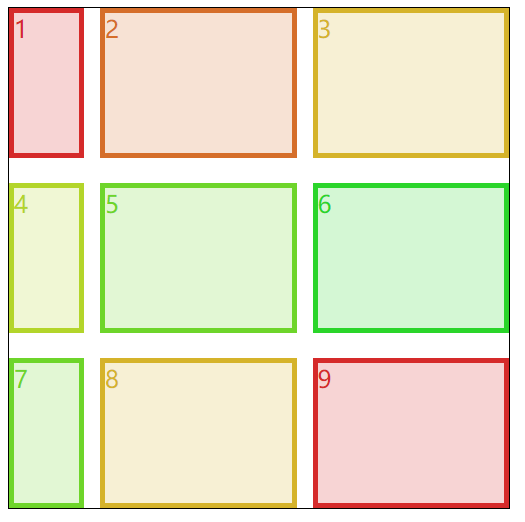

### 6.2 网格元素的盒模型

在[添加网格元素](./9.网格布局.md#四、添加网格元素)这节里，我们确定了添加网格元素后它所在区域的空间大小，也就是我们这节所说的**网格空间**。网格空间可以跨好几个网格单元，网格单元之间由于**栏距**还可以有间隔，这都是网格空间本身的性质。

网格元素在网格空间里布局时，可能因为网格元素本身的盒模型而让网格元素显示的效果而不同（但不会影响网格空间）。其实可以把它看作是一种父子元素的布局，如果子元素（网格元素）是块级元素，那完全可以使用[块级元素的隐藏等式](./2.盒模型.md#_4-2-块级元素的隐藏等式)，也就是`margin-left + border-left-width + padding-left + width + padding-right + border-right-width + margin-right = the width of the parent element`

```html
<html>
<head>
<style>
    .grid { display: grid; height: 200px; width: 400px;
        border: 1px solid;
        grid-template-rows: repeat(2, 100px);
        grid-template-columns: repeat(2, 200px);}
    .box02 {margin: 25px;}
    .box03 {margin: -25px 0;}
    span[class*="box"] { font-size: 1.5em; border: 5px solid; }
    *[class*="01"] { color: hsl(0,67%,50%); border-color: skyblue; }
    *[class*="02"] { color: hsl(24,67%,50%); border-color: salmon; }
    *[class*="03"] { color: hsl(48,67%,50%); border-color: hotPink; }
    *[class*="04"] { color: hsl(72,67%,50%); border-color: lawnGreen; }
</style>
</head>
<body>
    <div class="grid boxed gridlines" id="g1">
        <span class="box01">1</span><span class="box02">2</span>
        <span class="box03">3</span><span class="box04">4</span>
    </div>
</body>
</html>
```

以上代码效果图：  
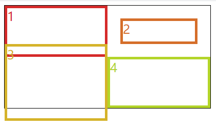

可以看到上面这个例子，4个盒子的宽高都是`auto`，如果都没有内外边距，那么他们都是刚好占满网格空间，box1和box4都是如此。而box2和box3是带了外边距的，box2是正值的外边距，又由于网格空间的宽度始终不变，那么box2的宽度会往内部缩小；box3是负值的外边距，又由于网格空间的宽度始终不变，那么box3的宽度会往外部增大。宽度也是可以这么解释的。

在[块级元素的隐藏等式](./2.盒模型.md#_4-2-块级元素的隐藏等式)下，如果宽度固定，左右的外边距会根据具体的情况进行变化。比如，左右外边距都设置了值，按照书写模式一般会舍弃右外边距；如果右外边距设置的是固定值，左外边距设置的是`auto`，那么左外边距会自动变化；如果左外边距设置的是固定值，右外边距设置的是`auto`，那么右外边距会自动变化。这些都是盒模型布局中常见的知识了。

### 6.3 网格元素的绝对定位

其实与块级元素一样，网格元素使用[定位](./5.定位与浮动.md#二、定位)时也有一个[定位元素的隐藏等式](./5.定位与浮动.md#_2-6-定位元素的隐藏等式)。即使宽高是固定值，“舍弃”以及“auto”与上一节虽然类似但还是比较复杂的，具体可以参考[absolute绝对定位](./5.定位与浮动.md#_2-3-absolute绝对定位)。

```html
<html>
<head>
<style>
    #grid {display: grid; width: 500px;
        grid-template-rows: repeat(3, 100px);
        grid-template-columns: repeat(5, 100px); }
    span { border: 1px dotted red; }
    .exel { grid-row: 2 / 4; grid-column: 2 / 5; position: relative; }
    .exel i { border: 5px solid skyblue;}
    .exel i {
        position: absolute;
        top: 10px; bottom: 20px;
        left: 30px; right: 40px; }
</style>
</head>
<body>
    <div class="grid boxed lines" id="grid">
        <span class="gridlines"></span><span class="gridlines"></span>
        <span class="gridlines"></span><span class="gridlines"></span>
        <span class="gridlines"></span><span class="gridlines"></span>
        <span class="gridlines"></span><span class="gridlines"></span>
        <span class="gridlines"></span>
        <span class="exel"><i class="box01">exel</i></span>
    </div>
</body>
</html>
```

以上代码效果图：  
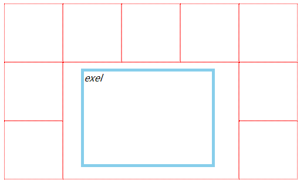

`grid-row-end: auto`和`grid-column-end: auto`，这两个对网格元素盒模型和绝对定位是有影响的，情况不好确定，先留在这里等后面有时间再来研究了。

## 七、网格的对齐方式

网格布局的对齐方式与弹性盒布局的对齐方式十分相像，可以看下表。

| 属性            | 对齐目标                         | 适用于   |
| --------------- | -------------------------------- | -------- |
| justify-self    | 行内方向（横向）上的单个网格元素 | 网格元素 |
| justify-items   | 行内方向（横向）上的全部网格元素 | 网格容器 |
| justify-content | 行内方向（横向）上的整个网格     | 网格容器 |
| align-self      | 块级方向（纵向）上的单个网格元素 | 网格元素 |
| align-items     | 块级方向（纵向）上的全部网格元素 | 网格容器 |
| align-content   | 块级方向（纵向）上的整个网格     | 网格容器 |

### 7.1 xxx-self

`justify-self`（横向）和`align-self`（纵向）是针对某个网格元素来说的，也就是说它设置在网格元素上的。它们共同拥有6个值：

- `start`：让网格元素向网格空间的起边对齐。不受网格空间的`direction: xxx;`影响，但受到网格容器的`direction: xxx;`影响。
- `end`：让网格元素向网格空间的终边对齐。不受网格空间的`direction: xxx;`影响，但受到网格容器的`direction: xxx;`影响。
- `center`：在对齐轴上居中对齐。
- `self-start`：让网格元素向网格空间的**书写模式**的起边对齐。只受网格空间本身的`direction: xxx;`影响。
- `self-end`：让网格元素向网格空间的**书写模式**的终边对齐。只受网格空间本身的`direction: xxx;`影响。
- `stretch`：拉伸，但必须保证网格元素对应的宽或高是`auto`不然不会进行拉伸。

`justify-self`独有的2个值：

- `left`：横向上就是居左对齐，不受任何`direction: xxx;`影响。
- `right`：横向上就是居右对齐，不受任何`direction: xxx;`影响。

`align-self`独有的1个值：

- `baseline`：让当前网格元素与同一轨道中最低的那个网格元素的baseline进行对齐。

```html
<html>
<head>
<style>
body {width: auto;}
.grid {display: grid; padding: 0.5em; margin: 0.25em 0 2em;
    grid-gap: 0.75em 0.5em;}
#g1 {grid-template-rows: 6em; grid-template-columns: repeat(10, 9em);}
#g2 {grid-template-rows: 6em; grid-template-columns: repeat(10, 9em);}

h1 {grid-row: span 1 / 1; grid-column: 1 / span 8;
     background: rgba(0,0,0,0.15);
     padding: 0.5em 0 0.25em;
    text-align: center; font: 1.33em Helvetica, sans-serif; margin: 0;}
h1 code {font: 1.1em monospace, serif;}

#g1 [class*="box"] {height: auto; align-self: center;}
#g2 [class*="box"] {width: auto; justify-self: center;}

#g1 .box01 {justify-self: start;}
#g1 .box02 {justify-self: end;}
#g1 .box03 {justify-self: center;}
#g1 .box04 {justify-self: self-start; direction: rtl;}
#g1 .box05 {justify-self: self-end; direction: rtl;}
#g1 .box06 {justify-self: stretch;}
#g1 .box07 {justify-self: left;}
#g1 .box08 {justify-self: right;}

#g2 .box01 {align-self: start;}
#g2 .box02 {align-self: end;}
#g2 .box03 {align-self: center;}
#g2 .box04 {align-self: self-start; }
#g2 .box05 {align-self: self-end; }
#g2 .box06 {align-self: stretch;}
#g2 .box07 {align-self: baseline;}

div[id] span[class*="box"] {box-sizing: border-box; border: 2px solid; background: transparent;}

span[class*="01"] {grid-row: 1; grid-column: 1;}
span[class*="02"] {grid-row: 1; grid-column: 2;}
span[class*="03"] {grid-row: 1; grid-column: 3;}
span[class*="04"] {grid-row: 1; grid-column: 4;}
span[class*="05"] {grid-row: 1; grid-column: 5;}
span[class*="06"] {grid-row: 1; grid-column: 6;}
span[class*="07"] {grid-row: 1; grid-column: 7;}
span[class*="08"] {grid-row: 1; grid-column: 8;}
span[class*="gridline"] {color: blue; border: 1px dashed; margin: -1px 0 0 -1px;}
</style>
</head>
<body>
    <div class="grid small" id="g1">
        <h1><code>justify-self</code> values <em>(inline-axis alignment)</em></h1>
        <span class="box01">start</span><span class="box02">end</span>
        <span class="box03">center</span><span class="box04">self-start (RTL)</span>
        <span class="box05">self-end (RTL)</span><span class="box06">stretch</span>
        <span class="box07">left</span><span class="box08">right</span>
        <span class="gridline01"></span><span class="gridline02"></span>
        <span class="gridline03"></span><span class="gridline04"></span>
        <span class="gridline05"></span><span class="gridline06"></span>
        <span class="gridline07"></span><span class="gridline08"></span>
    </div>
    <div class="grid small" id="g2">
        <h1><code>align-self</code> values<em>(block-axis alignment)</em></h1>
        <span class="box01">start</span><span class="box02">end</span>
        <span class="box03">center</span><span class="box04">self-start (RTL)</span>
        <span class="box05">self-end (RTL)</span><span class="box06">stretch</span>
        <span class="box07">baseline</span>
        <span class="gridline01"></span><span class="gridline02"></span>
        <span class="gridline03"></span><span class="gridline04"></span>
        <span class="gridline05"></span><span class="gridline06">
        </span><span class="gridline07">Xx</span>
    </div>
</body>
</html>
```

以上代码效果图：  


### 7.2 xxx-items

`justify-items`（横向）和`align-items`（纵向）是针对网格容器中**所有网格元素**而言的（但是设置在网格容器上），可以使用`xxx-self`进行单个覆盖，也就是说`xxx-self`的取值也适用于`xxx-items`。

### 7.3 xxx-content

`justify-content`（横向）和`align-content`（纵向）是针对网格容器中**所有网格单元**而言的，一般用于网格单元总空间小于网格容器时（剩余空间）。它们共同拥有6个值：

- `start`：默认值，让所有网格单元按照横轴的起边对齐，也就是让剩余空间全部放到横轴的终边。受到网格容器的`direction: xxx;`影响
- `end`：让所有网格单元按照横轴的终边对齐，也就是让剩余空间全部放到横轴的起边。受到网格容器的`direction: xxx;`影响
- `center`：让所有网格单元在横轴中间对齐，也就是让剩余空间放到横轴两边，网格单元之间不留空隙。
- `space-between`：网格单元之间的空间会相同，第一个网格单元与start之间不留空隙，最后一个网格单元与end之间不留空隙。
- `space-around`：网格单元之间的空间会相同，第一个网格单元与start有空隙而其数值是网格单元之间空隙的一半，最后一个网格单元与end有空隙而其数值是网格单元之间空隙的一半。
- `space-evenly`：网格单元之间的空间会相同，第一个网格单元与start有空隙而其数值就等于网格单元之间的空隙，最后一个网格单元与end有空隙而其数值就等于网格单元之间的空隙。

`justify-content`（横向）独有`left`和`right`属性（`align-content`没有这两个值），不受到网格容器的`direction: xxx;`影响。

```html
<html>
<head>
<style>
body {width: auto;}
.grid { display: grid; border: 1px solid;
    grid-template-rows: 45px;
    grid-template-columns: repeat(5, 96px); }

h1 { margin: 13px 0 0 2px; padding: 0; text-align: center; }
h1 code {font: 16px monospace, serif;}

#g1 {justify-content: start;direction: rtl;}
#g2 {justify-content: end;direction: rtl;}
#g3 {justify-content: center;}
#g4 {justify-content: space-between;}
#g5 {justify-content: space-around;}
#g6 {justify-content: space-evenly;}
#g7 {justify-content: right;direction: rtl;}
#g8 {justify-content: left;direction: rtl;}

span {border: 1px dashed; }
div[id] span[class*="box"] {box-sizing: border-box; background: hsla(117,50%,50%,0.25);}

span[class*="01"] {grid-row: 1; grid-column: 1;}
span[class*="02"] {grid-row: 1; grid-column: 2;}
span[class*="03"] {grid-row: 1; grid-column: 3;}
span[class*="04"] {grid-row: 1; grid-column: 4;}
span[class*="05"] {grid-row: 1; grid-column: 5;}

</style>
</head>
<body>
    <h1><code>justify-content: start</code></h1>
    <div class="grid small" id="g1">
        <span class="box01"></span><span class="box02"></span>
        <span class="box03"></span><span class="box04"></span>
        <span class="box05"></span>
    </div>
    <h1><code>justify-content: end</code></h1>
    <div class="grid small" id="g2">
        <span class="box01"></span><span class="box02"></span>
        <span class="box03"></span><span class="box04"></span>
        <span class="box05"></span>
    </div>
    <h1><code>justify-content: center</code></h1>
    <div class="grid small" id="g3">
        <span class="box01"></span><span class="box02"></span>
        <span class="box03"></span><span class="box04"></span>
        <span class="box05"></span>
    </div>
    <h1><code>justify-content: space-between</code></h1>
    <div class="grid small" id="g4">
        <span class="box01"></span><span class="box02"></span>
        <span class="box03"></span><span class="box04"></span>
        <span class="box05"></span>
    </div>
    <h1><code>justify-content: space-around</code></h1>
    <div class="grid small" id="g5">
        <span class="box01"></span><span class="box02"></span>
        <span class="box03"></span><span class="box04"></span>
        <span class="box05"></span>
    </div>
    <h1><code>justify-content: space-evenly</code></h1>
    <div class="grid small" id="g6">
        <span class="box01"></span><span class="box02"></span>
        <span class="box03"></span><span class="box04"></span>
        <span class="box05"></span>
    </div>
    <h1><code>justify-content: right</code></h1>
    <div class="grid small" id="g7">
        <span class="box01"></span><span class="box02"></span>
        <span class="box03"></span><span class="box04"></span>
        <span class="box05"></span>
    </div>
    <h1><code>justify-content: left</code></h1>
    <div class="grid small" id="g8">
        <span class="box01"></span><span class="box02"></span>
        <span class="box03"></span><span class="box04"></span>
        <span class="box05"></span>
    </div>
</body>
</html>
```

以上代码效果图：  
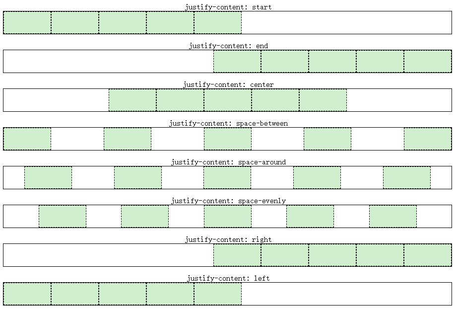

## 八、分层和排序

在[4.4 元素重叠以及异常处理](./9.网格布局.md#_4-4-元素重叠以及异常处理)就出现了元素重叠的现象，它们的重叠顺序是根据网格元素原码顺序而来的，是可以通过传统的`z-index`进行更改，也可以通过`order`进行网格元素顺序的更改以达到改变重叠顺序的目的。

`order`属性设置在网格元素上，用于更改网格元素的顺序，但是如果使用`grid-row`或`grid-column`等进行强制的网格元素添加，`order`会失效。也就是说`order`一般用于[网格流](./9.网格布局.md#五、网格流)上。

默认情况下，所有网格元素被分配为“0”的顺序。网格元素的`order`为负值时，将会显示在默认值“0”之前；网格元素的`order`为正值时，将会显示在默认值“0”之后。如果一些网格元素的`order`相同，则按照源顺序显示。

```html
<html>
<head>
<style>
    #grid {display: grid; width: 80%; height: 9em;
        border: 1px solid;
        grid-auto-flow: column;
        grid-columns: repeat(5, 1fr);}
    span {border: 1px dotted red; margin: 3px;}
    span[class*="box"]::before {content: attr(class);}
    .box02 { order: -1; }
    .box03 { order: -2; }
    .box04 { order: 1; }
</style>
</head>
<body>
    <div class="grid boxed lines" id="grid">
        <span class="box01"></span>
        <span class="box02"></span>
        <span class="box03"></span>
        <span class="box04"></span>
        <span class="box05"></span>
    </div>
</body>
</html>
```

以上代码效果图：  

