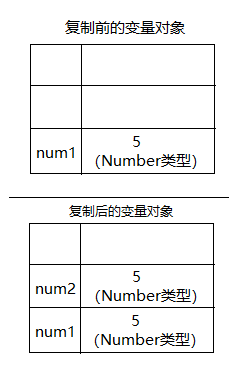
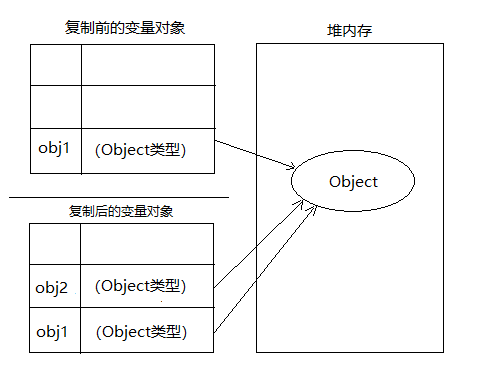
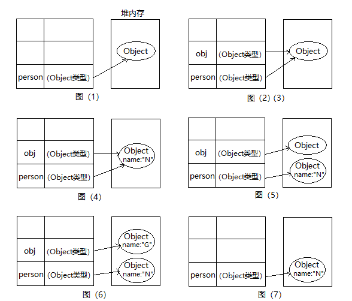

# 变量、作用域和内存问题

## 一、基本类型和应用类型的值

ECMAScript变量的值可以是基本类型或引用类型，之前介绍了Undefined、Null、Boolean、Number和String这5种基本数据类型，它是按 **值** 访问可以 **操作** 保存在变量中的 **实际值**，而引用类型的值是保存在堆内存中，按 **引用** 访问的。

### 1.1 动态的属性

对于应用类型的值，我们可以为其添加属性和方法，也可以改变和删除属性和方法，而对于基本类型的值我们不能添加属性，就算添加了后面访问这个属性也是undefined。

### 1.2 复制变量值

1. 如果从一个变量向另一个变量复制基本类型的值，会在变量对象上创建一个新值。然后把该值复制到为新变量分配的位置上，例：

    ```js
    var num1 = 5;
    var num2 = num1; // num1的5和num2的5完全独立，两变量可以参与任何操作而不会互相影响。
    ```

    

2. 如果从一个变量向另一个变量复制引用类型的值，也会把变量对象中的值赋值一份放到新变量分配的位置上。其实这个值的副本是个指针，和复制前变量指向堆内存中的同一个对象，例：  

    ```js
    var obj1 = new Object();
    var obj2 = obj1; // 地址值复制过去了，地址值之间互不影响，但要操作地址对应的对象就会有影响。
    ```

    

### 1.3 传递参数

- 按值传递：在参数传递过程中，形参和实参占用了 **两个完全不同的内存空间（栈）**，形参所存储的内容是实参存储内容的一份拷贝。
- 按应用传递：在参数传递过程中，形参和实参完全是 **同一块内存空间（栈）**，两份不分彼此。
- 而ECMAScript中所有函数的参数都是 **按值传递** 的。
- 基本类型值的传递如同基本类型变量的复制一样，而应用类型值的传递则如同应用类型变量的复制一样（参考上一节）。

例1：

```js
function addTen(num2) {
    num2 += 10;
    return num2;
}
var num1 = 20;
var result = addTen(num1);
console.log(num1); // 20
console.log(num2); // 30
```

在调用addTen函数时，num1存储内容复制了一份给num2，复制后num1和num2都为20但互不影响；在addTen函数里，num2加了10之后是对num1没有影响的，这是 **按值传递**，所以最后的输出结果num1是20，num2是30；假设它是 **按引用传递** ，那么num1和num2是同一份，最后的值应该都是30才对，与实际输出不一致。

例2：

```js
function setName(obj) {     // (3) 如下图(2)(3)，将person的地址值复制了一份给obj，让obj也指向那个实例化对象
    obj.name = "N";         // (4) 如下图(4)，给那个实例化对象新添一个name属性，该属性值为"N"
    obj = new Object();     // (5) 如下图(5)，又创建了一个Oject的实例化对象，让obj指向这个新的实例化对象
    obj.name = "G";         // (6) 如下图(6)，给新的实例化对象新添一个name属性，该属性值为"G"
}
var person = new Object();  // (1) 如下图(1)，声明了person变量，初始化的值是Oject引用类型的一个实例化对象
setName(person);            // (2) 去调用setName函数，将person这个变量传入
console.log(person.name);   // (7) 如下图(7)，函数调用完会清理其中的局部变量，只剩下外部的person和其指引的对象了
```

  

可以看出来，步骤(5)是关键，它可以指向新的实例化对象；如果是 **按引用传递** 的话，person和obj就是同一份（在栈里），在obj指向新对象时，person也指向新对象，实际上步骤(7)打印出的是"N"，所以它还是 **按值传递**（在堆确实还是同一份，但在栈里不是同一份，是复制了一份）。

### 1.4 检测类型

- 检测变量是不是基本数据类型用`typeof`操作符，而检测引用类型变量是什么类型的对象可以用`instanceof`操作符；
- 所有引用类型的值 **都是Object的实例**，在检测一个引用类型值和Object构造函数时，instanceof操作符始终会返回 **true**；
- 使用instanceof操作符检测 **基本类型** 会返回 **false**，基本类型不是对象。

## 二、执行环境及作用域

在研读《JavaScript高级程序设计》的4.2节后仍有很多不解，需要去研读《你不知道的JavaScript(上卷)》的第一部的一二章和第二部的一二章，你会有转深刻的理解，这里就记录一些浅显的见解吧。

1. js是“解释执行”语言，这里不得不提到js的 **引擎和编译器**。引擎负责整个js程序的 **编译和执行过程**，引擎只是负责编译的 **引导** 而实际上具体编译的活是 **编译器** 在干（词法语法分析并生成可执行的机器指令）。

2. js代码大多是一段段嵌套起来的，那么对代码段可以分成三种：**全局代码段、函数代码段、eval代码段（不推荐使用）**。js代码运行的时候，是先编译再执行，并且编译发生在化码执行前的几微秒甚至更短时间里。但是，这里的编译执行都是按照一段段来的，并不是把文件里的所有代码都编译后再执行的，而是 **编译一段执行一段**。

3. js运行到某段代码时（某个函数被调用时），先编译分析这段代码并创建一个 **执行环境(execution context)**，也称 **执行上文（简称EC）**。执行环境有三个重要的组成：**变量对象、作用域链、this**。
   - **变量对象**：variable object，简称VO。存储着执行环境里的 **所有变量和函数声明**。当执行流在这个执行坏境里执行时，这个变量对象就是 **活动对象(activation object)**。  
   - **作用域**：scope。是 **根据名称查找变量的一套规则**，这个规则只在所处代码段里有效（这里指的是 **作用域范围**），其实作用域存的不是变量对象本身而是指向变量对象的 **指针**。
   - **作用城链**：scope chain。代码段的嵌套使得作用域可以连接到一起了，这祥就形成了一个能 **一级级向上查找变量对象的有序链表**（这样的有序链表其实就是一个指向作用域链范围内所有变量对象的 **指针列表**）。也就是说嵌套在里层的代码段能访问到外层定义的变量，而外层访问不了里层的。
   - **this**：记录着函数被调用时的信息，this绑定的是函数 **调用处的对象**（跟函数本身没关系）。有四种场景（已排优先级)：
     - 如果函数是由new调用的（new绑定），那么this绑定的是新创建的对象。`var bar = new Foo();`，this绑定了bar；
     - 如果函数通过`call`、`apply`调用（显示绑定）或`bind`（硬绑定）调用，那么this绑定的是指定的对象。`var bar = foo.call(obj);`，this绑定了obj；
     - 如果函数由某个上下文对象调用（隐式绑定），那么this绑定的是那个上下文对象。`var bar = obj.foo();`，this绑定了obj；`obj1.obj2.foo();`，this绑定了obj2；
     - 如果不是上面三种，那就是使用默认绑定，this绑定的是全局对象window。严格模式下全局对象无法使用默认绑定，因此this会绑定到undefined。（有个坑爹的地方，假如函数创建在非严格模式的全局环境里，但是在一小块严格模式代码里调用了函数，这个函数可以绑定全局对象）

4. 假如代码段里有`var a = 0;`这句，**编译遇到var** 时（声明提升了），编译器会拿a这个名字 **通过作用域链** 去当前执行环境的 **变量对象** 里查找是否存在，不存在就在变量对象里 **新声明一个a**（存的是undefined），存在的话会 **忽略var** 并继续往下编译。这一段代码段 **编译完后**，**就开始执行** 这一段代码段，执行遇到`a = 0`时（声明提升了，a = 0还在原地），引擎会先拿a这个名字 **通过作用域链** 去当前执行环境的 **变量对象** 里查找是否有a这个变量存在，存在话就拿来用（也就是把0这个值赋给a变量），不存在的话继续向上一级查找，直到最外层的 **全局执行环境** 的 **变量对象** 里还没找到那就抛异常（其实在非严格模式下会在全局执行环境的变量对象里，创建一个全局变量，返回给引擎并不会抛异常）。

5. 在一段代码段运行完（编译了也执行完了），代码段抽象出的执行环境 **会被销毁**，连带着里面的 **变量对象、作用域链和this** 都会被销毁，只有代码段再次被调用时才会建立一个新的执行环境。

6. 之前说代码段被分成三种：**全局代码段、函数代码段、eval代码段（不推荐使用）**。那么可以说js **没有块级作用域**，只有 **全局作用域** 和 **函数作用域**，比如if和for这种语句的{}里的变量也可在外面使用。

7. 为什么不推荐用`eval()`，因为它可以在代码执行时，来声明“代码字符串”里的变量，从而 **改变了编译时的作用域**。类似还有`with()`，它是在代码执行时，把某些对象的属性也当做标识符，从而 **新建了一个作用域**。这两个 **非但没有在编译期被优化，反而在执行期改变了作用域拖慢代码运行速度**，而且这两个在严格模式下是被禁止的。

8. 可以去[函数表达式#闭包](5.函数表达式.md#闭包)进一步学习。

## 三、垃圾收集

js具有 **自动** 垃圾收集机制，这种机制原理：**找出那些不再被使用的变量，然后释放其占用的内存**。

### 3.1 标识清除

标识清除是js **最常见** 的垃极收集方式，垃圾收集器在运行时，它会先给内存中所有的变量 **加上标记**（不管变量有用还是无用），然后垃圾收集器会 **去掉** 那些 **可以被访问** 的变量身上的 **标记**，剩下的那些无法被访问的变量自然还留有标记，最后垃圾收集器对 **留有标记** 的变量进行 **内存清除工作**（销毁标记值和所占内存）。

### 3.2 引用计数

引用计数目前者 **不再被使用在js引擎中**，引用计数会跟踪记录每个值 **被引用的次数**。声明一个变量并给这个变量赋了一个引用类型的值，这个引用次数就是1；当这个引类型的值再被赋给另一个变量时，该值的引用次数加1；当这个引用类型的值不再被引用时，这个引用次数就变成了0，就会被回收。

**循环引用**：对象A中包含一个指向对象B的指针，而对象B中也包含一个指向对象A的指针。（**例如对象A的某属性指向B对象，B对象的某属性指向A对象**）

当代码里存在循环引用这种情况，引用计数时他们的引用次数永远不会为0，**被多次调用后就会导致大量的内有得不到回收**。

### 3.3 内存管理

将变量的值 **设为null**，可以释放其引用（以便于被回收），这种做法叫做 **解除引用**。

解除引用可以用在前面提到的 **循环引用** 上来 **切断连接**，也可以用在不再被使用的全局变量和全局变量的属性上，这也是优化内存占用的最佳方式，为执行中的代码只保有必要的数据，不必要的数据为其解除引用。
