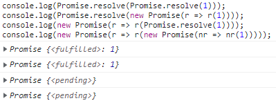

# 异步编程

## EventLoop

> 参考资料 1：[8 Web application APIs](https://html.spec.whatwg.org/multipage/webappapis.html#definitions-3)  
> 参考资料 2：[跟着 whatwg 看一遍事件循环](https://blog.csdn.net/qq_34436866/article/details/106941350)  
> 参考资料 3：[HTML 系列：macrotask 和 microtask](https://zhuanlan.zhihu.com/p/24460769)

js 引擎是**单线程**运行的，同一时刻只能执行一个代码块。比如请求接口时，如果 js 引擎停下来等服务端传来响应，那就会阻塞其他代码运行。所以 js 引擎处理接口是**异步**的，会将接口响应任务存**消息队列**里然后就执行其他代码了，等后面**执行栈空闲了**再来处理响应任务。类似的还有定时器、侦听器等，它们可以说是**异步请求同步执行**，意思是请求我发给你了，但我得处理其他主要事情（异步请求）；就算你响应立马给我了，我也只是暂时排在任务列表里，手头里主要事情做完了才会去处理响应（同步处理）。

js 引擎对这些异步操作就是使用**EventLoop 事件循环**来调配处理的，所用的消息队列分为**task 队列**和**microtask 队列**。EventLoop 的一个处理回合：首先会先执行**task 队列**中的一个任务，然后再执行**microtask 队列**里的**所有**任务，最后再根据需要与否去**渲染页面**。在这个回合中是同步执行的，不会出现既要处理这个任务也要处理那个任务。

EventLoop 中**task 队列**可能有多个，原因是其中一个 task 队列负责优先级比较高的任务（鼠标键盘事件等），另一个 task 队列负责普通的任务（定时器等）；还有**task 队列**是`Set`而不是`Queue`，EventLoop 会从中取**最早并且可执行**的任务出来并推入执行栈中执行。比较常见的 task：`setTimeout`、`setInterval`、`setImmediate`、`requestAnimationFrame`、`I/O`，还有类似`click`、`ajax`还有`<script>`标签里的代码。

EventLoop 中**microtask 队列**一般只有一个，并且是`Queue`，找元素用的是**出队列**的方式。比较常见的 microtask：`Promise`、`Object.observe`、`MutationObserver`。

```html
<html>
  <head>
    <script>
      (function test() {
        setTimeout(() => {
          console.log(1);
        }, 0);
        new Promise((resolve) => {
          console.log(2);
          for (var i = 0; i < 10000; i++) {
            i == 9999 && resolve(3);
          }
          console.log(4);
        }).then((data) => {
          console.log(data);
        });
        console.log(5);
      })();
    </script>
    <script>
      (function test2() {
        setTimeout(() => {
          console.log(6);
        }, 0);
        new Promise((resolve) => {
          console.log(7);
          for (var i = 0; i < 10000; i++) {
            i == 9999 && resolve(8);
          }
          console.log(9);
        }).then((data) => {
          console.log(data);
        });
        console.log(10);
      })();
    </script>
  </head>
  <body></body>
  <html></html>
</html>
```

上面这段程序在谷歌浏览器中执行的，其打印顺序就是：`2 4 5 3 7 9 10 8 1 6`。

- 首先两个`<script>`标签里代码的运行是两个 task，先添加进 task 队列里；
- 从 task 队列里取可执行的 task，也就是第一个`<script>`标签开始执行；
- 遇到`setTimeout`，将它放入 task 队列里；
- 因为 Promise 内部是同步的，所以先打印**2 和 4**，在`resolve()`后会把 Promise 的 then 回调函数放入 microtask 队列里；
- 遇到`console.log(5)`，打印完**5**才表示一个 task 执行完了，现在得去执行 microtask 队列**所有**任务；
  - microtask 队列目前就一个 then 回调函数，那么打印**3**，结束 microtask 队列，进入新的 task。
- 从 task 队列里取可执行的 task，也就是第二个`<script>`标签开始执行；
- 遇到`setTimeout`，将它放入 task 队列里；
- 因为 Promise 内部是同步的，所以先打印**7 和 9**，在`resolve()`后会把 Promise 的 then 回调函数放入 microtask 队列里；
- 遇到`console.log(10)`，打印完**10**才表示一个 task 执行完了，现在得去执行 microtask 队列**所有**任务；
  - microtask 队列目前就一个 then 回调函数，那么打印**8**，结束 microtask 队列，进入新的 task。
- 从 task 队列里取可执行的 task，也就第一个`setTimeout`，打印**1**；
- 从 task 队列里取可执行的 task，也就第二个`setTimeout`，打印**6**；
- 结束了，以上省略了 UI 渲染，因为没有涉及到页面的操作。

上面这些都是说浏览器的 EventLoop，其实 node 环境中还是不一样的，**node.js**有用到`process.nextTick`，它并不是 EventLoop 中的一部分，它是优先于**microtask**执行的；还有一个`setImmediate`，是个定时器，在 I/O 操作中先于任何其他定时器的，但非 I/O 操作里`setImmediate`的先后就不一定了，比较受线程性能的影响（比如设置毫秒数是 0 到几十的时候，setTimeout 一般优于 setImmediate）。有兴趣可以查看[Node.js 事件循环](https://nodejs.org/zh-cn/docs/guides/event-loop-timers-and-nexttick/#what-is-the-event-loop)。

```js
(() => {
  setImmediate(() => {
    console.log(1);
  }, 0);
  setTimeout(() => {
    console.log(2);
  }, 0);
  function a() {
    setImmediate(() => {
      console.log(3);
    }, 0);
    setTimeout(() => {
      console.log(4);
    }, 0);
    new Promise((resolve) => {
      console.log(5);
      resolve(6);
      console.log(7);
    }).then((data) => {
      console.log(data);
    });
    console.log(8);
    process.nextTick(() => {
      console.log(9);
    });
    console.log(10);
  }
  new Promise((resolve) => {
    console.log(11);
    resolve(12);
    console.log(13);
  }).then((data) => {
    console.log(data);
  });
  a();
  console.log(14);
  process.nextTick(() => {
    console.log(15);
  });
  console.log(16);
})();
```

上面这段程序在**node**中执行的，其打印顺序就是：`11 13 5 7 8 10 14 16 9 15 12 6 2 4 1 3`。具体不展开了，有时间再来扩展 node 中 EventLoop。

## Promise

上一节后，我们对异步操作的背后有了比较清晰的认知，但这都是浏览器内部的处理，我们书写**互相依赖**的异步操作的时候，就非常容易形成“回调地狱”，所以后面 es6 提出了使用**Promise**来解决这种问题。

### 什么是 Promise

**Promise**内存储着一个异步操作，这个异步操作要等到未来才会有结果。Promise 存储的异步操作有三种状态：**pending（进行中）**、**fulfilled（已兑现）**和**rejected（已拒绝）**，这三种状态就是异步操作的结果赋予的，其他人改变不了。

还有一个经常跟 Promise 一起使用的术语：**resolved（已决议）**。它表示异步操作**敲定好了状态**，该状态可能是 fulfilled 也可能是 rejected。

### 调用处使用 Promise

未推出 Promise 时，一般做法就是回调函数会作为异步函数的**入参**，异步函数里的异步操作结束后会根据结果来执行对应的入参（执行回调函数）。推出 Promise 后，不会将回调函数传给异步函数，而是异步函数会**返回 Promise 对象**，异步操作结束后会根据结果来调用 Promise 对象的`then`中对应的回调函数。

```js
// 以前的调用：将sucFun和failFun以参数的形式传给异步函数doA，根据需要会执行sucFun和failFun
doA(data, sucFun, failFun);
// 使用Promise：异步函数doA会返回一个promise对象，根据需要会执行promise对象的then方法里的sucFun和failFun
doA(data).then(sucFun, failFun);
```

`.then(onFulfilled[, onRejected])`中第一个参数是成功回调函数，第二个参数是失败回调函数（可选参数），并且 then 会返回了一个 Promise 对象，那就可以继续使用 then，这样就会形成一种链式调用。以前接口互相依赖时采用嵌套写法，写起来非常占位置也不美观，现在使用 Promise 会非常清爽。

```js
// 以前，函数嵌套
doA(
  data,
  (rlt) => {
    doB(
      rlt,
      (newRlt) => {
        doC(
          newRlt,
          (finRlt) => {
            console.log("FinalResult:", finRlt);
          },
          failFun
        );
      },
      failFun
    );
  },
  failFun
);

// 使用Promise，链式
doA()
  .then((rlt) => {
    return doB(rlt); // 返回doB的Promise对象，好让后面继续使用链式结构
  })
  .then((newRlt) => {
    return doC(newRlt);
  })
  .then((finRlt) => {
    console.log("FinalResult:", finRlt);
  })
  .catch(failFun);
```

注意：onFulfilled 或 onRejected 执行完后，then 是返回的一个**新 promise**。也就是说你在 onFulfilled 或 onRejected 里自己返回一个值或者 Error 时，也是返回一个 promise，可以继续在后面写 then 这种链式调用。

### Promise 对象内部

上一节是说怎么使用 Promise 的方式**调用异步函数**，并且展示了多个异步函数时使用 Promise 方式的**优势**。这一节说的是异步函数内部会**返回**一个**Promise 对象**，这个过程会是一个什么样子呢？

首先在异步函数里创建一个 Promise 对象，`new Promise((resolve, reject) => {})`；Promise 构造函数会传递一个参数，这个参数是一个**executor 处理器函数**，是专门用于处理具体的异步操作的；操作完异步操作当然还要通知调用方，executor 函数的两个入参**resolve**和**reject**就是专门做这些事的；当异步任务顺利完成且返回结果值时，会执行**resolve**方法，将 Promise 对象的状态置为`fulfilled`；而当异步任务失败且返回失败原因，会执行**resolve**方法，将 Promise 对象的状态置为`rejected`。

```js
function doA(data) {
    // Promise对象内部（当前小节的内容）
    return new Promise((resolve, reject) => { // 这个匿名函数其实是executor函数
        /* 某某异步操作 */
        if (/* 操作成功 */)
            resolve(result); // 通知操作成功，data是异步操作的结果
        else
            reject(error); // 通知操作失败，error是一个异常对象
    });
}
// 调用处使用Promise（上一小节的内容）
doA(data).then((result) => { // 接收resolve通知
    console.log(result);
}, (error) => { // 接收reject通知
    console.log(error);
});
```

一个使用 Promise 封装 ajax 的例子：

```js
function get(url) {
  return new Promise((resolve, reject) => {
    $.ajax({
      url: url,
      method: "get",
      success: (data) => {
        resolve(data);
      },
      error: (xhr, statusText) => {
        reject(statusText);
      },
    });
  });
}
get("xxx").then(
  (result) => {
    return result;
  },
  (error) => {
    return error;
  }
);
```

### 关于错误处理

**错误处理**：遇到异常抛出时，会顺着 Promise 链寻找下一个**onRejected**失败回调函数（then 中的 onRejected），如果没有一个 onRejected，就会去`.catch()`里指定的函数里执行。可以看[调用处使用 promise](./7.异步编程.md#调用处使用promise)的第二个例子，其中有三次 failFun，但最后只用`.catch()`来处理。

可以对错误进行精准的捕获，只是需要**嵌套 Promise**。下面这个例子中内部嵌套了一个 Promise，并且还带了一个 catch，这个 catch 能精准捕获到 doB 和 doC 的失败，而 doA 只会被最外层的 catch 会捕获。

```js
// 使用Promise，链式
doA()
  .then((rlt) =>
    doB(rlt)
      .then((optRlt) => doC(optRlt))
      .catch((e) => {
        console.log(e.message);
      })
  )
  .then((newRlt) => doD(newRlt))
  .then((finRlt) => {
    console.log("FinalResult:", finRlt);
  })
  .catch(failFun);
```

### 时序和拒绝事件

已经变成 resolve 状态的 Promise 对象，会通知 then()里对应的函数，这个通知传递的过程是异步的。也就是说传递到 then()中的回调函数是会被放到一个 microtask 队列里的，不过 Promise 对象里其他的执行还是同步，这就能印证[EventLoop](./7.异步编程.md#eventloop)里第一个例子中`2`和`4`为什么先于`3`打印。

**拒绝事件**：当 Promise 被拒绝时，如果有 reject 函数处理了，就会派发 rejectionhandled 事件到全局作用域；如果没有经过 reject 函数处理，则会派发 unhandledrejection 事件到全局作用域。两个事件都有**promise**属性和**reason**属性，其中 promise 属性是指向被驳回的 promise，reason 属性是说明被驳回的原因。

```js
window.addEventListener(
  "unhandledrejection",
  (event) => {
    /* 你可以在这里添加一些代码，以便检查
     event.promise 中的 promise 和
     event.reason 中的 rejection 原因 */
    event.preventDefault();
  },
  false
);
```

### Promise 组合工具

**Promise.resolve(value)**：手动创建一个已经 resolve 的 Promise 对象，相当于`new Promise(resolve => resolve(value))`（但不完全是，因为下一节会讲`new Promise(r => r(v))`中`v`是个 Promise 对象的情况）。

**Promise.reject(value)**：手动创建一个已经 reject 的 Promise 对象，相当于`new Promise((resolve, reject) => reject(value))`。

**var p = Promise.all([p1, p2, p3])**：all 接受一个 Promise 对象数组（也可以是 Iterator 并且返回 Promise 对象），当数组里所有的 Promise 对象状态为 fulfilled 时，p 这个 Promise 对象状态才为 fulfilled，并且结果也会组成数组传递给 p 的回调函数；当数组里只要一个被 rejected 了，那么 p 就是 rejected 状态，其结果会传递给 p 的回调函数。

**var p = Promise.race([p1, p2, p3])**：race 接受一个 Promise 对象数组（也可以是 Iterator 并且返回 Promise 对象），当数组里只要一个被确定状态了，那么 p 就是随之确定状态了，其结果会传递给 p 的回调函数。

```js
// 1.并行操作
Promise.all([func1(), func2(), func3()]).then(([result1, result2, result3]) => {});
// 2.归并，从Promise.resolve()开始执行func1再执行func2再执行func3，最后到result3
[func1, func2, func3]
  .reduce((p, f) => p.then(f), Promise.resolve())
  .then((result3) => {
    /* use result3 */
  });
// 3.跟上面2是一样的，直接后面追加加，上面肯定要灵活一些
Promise.resolve().then(func1).then(func2).then(func3);
// 4.其实就是用函数封装了2
const composeAsync = (...funcs) => (x) => funcs.reduce(applyAsync, Promise.resolve(x));
// 5.其实就是用函数封装了3
const applyAsync = (acc, val) => acc.then(val);
```

### resolve 一个 Promise 对象

你可能会遇到这样的问题：`Promise.resolve(Promise.resolve(1))`、`Promise.resolve(new Promise(r => r(1)))`、`new Promise(r => r(Promise.resolve(1)))`、`new Promise(r => r(new Promise(nr => nr(1))))`，这四个有什么区别？

```js
console.log(Promise.resolve(Promise.resolve(1)));
console.log(Promise.resolve(new Promise((r) => r(1))));
console.log(new Promise((r) => r(Promise.resolve(1))));
console.log(new Promise((r) => r(new Promise((nr) => nr(1)))));
```

在控制台里打印上面的代码，会有如下结果：



其实就是问`Promise.resolve(v)`和`new Promise(r => r(v))`的区别。

- `Promise.resolve(v)`：如果`v`是普通值，会将这个普通值包装成已经`fulfilled`的 Promise 实例；如果`v`本就是一个 Promise 实例，那就会原封不动返回`v`。
- `new Promise(r => r(v))`：如果`v`是普通值，那整体会是一个已经`fulfilled`的 Promise 实例；但是如果`v`本就是一个 Promise 实例，那底层会调用`ResolvePromise(promise, resolution)`去**处理**，其中入参`promise`是`new Promise(r => r(xxx))`本身，入参`resolution`是`v`。具体的：
  - 处理时会创建 PromiseResolveThenableJob，创建的 PromiseResolveThenableJob 会作为一个 microtask；
  - 然后会运行 PromiseResolveThenableJob 让`v`的 then 里的回调函数进入 microtask 队列，也就是占了一个 microtask；
  - 运行完后，`new Promise(r => r(xxx))`本身状态会变为`fulfilled`，那么总的来说`new Promise(r => r(v)`整体变为`fulfilled`会**占用两个 microtask 时序**。

另外一个知识点，`then()`对外暴露应该是一个 Promise 对象，如果在 then 内部`return v;`，这个`return v;`要分两种情况，其实和上面的`new Promise(r => r(v))`是一样的。

- 如果`return v;`语句的值是一个是普通值，那 then 对外暴露的 Promise 对象其实就是将这个普通值`v`包装成已经`fulfilled`的 Promise 对象。
- 如果`return v;`语句的值本就是一个 Promise 对象，那么底层会调用`ResolvePromise(promise, resolution)`处理，入参`promise`就是 then 对外暴露的 Promise 对象，resolution 就是`v`这个 Promise 对象。会经过 PromiseResolveThenableJob 的创建和运行（占用两个 microtask 时序），最后让 then 对外暴露的 Promise 对象的状态变为`fulfilled`。

为什么不直接让`v`赋给目标 Promise 对象，这样就太简单粗暴了，`v`的状态是`pending`还是`fulfilled`是不确定（即使是`fulfilled`，但它的 then 回调函数还没执行）。得使用 PromiseResolveThenableJob 来确定`v`的状态并执行它的 then 回调函数，这些走完后才能让目标 Promise 也`fulfilled`。

<!-- tabs:start -->

<!-- tab:1 -->

```js
// begin 1 then 2 3 4
const p = new Promise((resolve) => {
  console.log("begin");
  resolve("then");
});
// 原封不动返回p，所以相当于p.then(v => console.log(v))，那么"then"会比2先打印
Promise.resolve(p).then((v) => console.log(v));

new Promise((resolve) => {
  console.log(1);
  resolve();
})
  .then(() => console.log(2))
  .then(() => console.log(3))
  .then(() => console.log(4));
```

<!-- tab:2 -->

```js
// begin 1 2 3 then 4
const p = new Promise((resolve) => {
  console.log("begin");
  resolve("then");
});
// resolve(p)，创建PromiseResolveThenableJob会占用一个microtask
// 运行PromiseResolveThenableJob，让p的then回调函数执行，这也会占用一个microtask
new Promise((resolve) => {
  resolve(p);
}).then((v) => console.log(v)); // 经过两个时序（打印了2和3）才打印了"then"

new Promise((resolve) => {
  console.log(1);
  resolve();
})
  .then(() => console.log(2))
  .then(() => console.log(3))
  .then(() => console.log(4));
```

<!-- tab:3 -->

```js
// begin 1 test 2 3 4 then
const p = new Promise((resolve) => {
  console.log("begin");
  resolve("then");
});
// Promise.resolve(p).then相当于p.then，那么"test"会先于2，这个同第一个例子
// 第一个then里是return Promise.resolve(v)，这会触发ResolvePromise(promise, resolution)，
// promise入参是代表第一个then的promise，resolution入参是v。跟上一个例子一样要占用两个micrtask时序
Promise.resolve(p)
  .then((v) => {
    console.log("test");
    return Promise.resolve(v); // 其实如果是return v;那就不会触发ResolvePromise了
  })
  .then((v) => console.log(v)); // 但是比上一例子多了一个then，那么"then"会在4后面打印了

new Promise((resolve) => {
  console.log(1);
  resolve();
})
  .then(() => console.log(2))
  .then(() => console.log(3))
  .then(() => console.log(4));
```

<!-- tabs:end -->

参考资料：

- [关于 ResolvePromise](https://chromium.googlesource.com/v8/v8.git/+/refs/heads/9.0-lkgr/src/builtins/promise-resolve.tq#88)
- 至于 PromiseResolveThenableJob 为什么会消耗两个 micrtask 可以看[resolve(resolvedPromise)情况源码](https://www.zhihu.com/question/430549238/answer/1624864911)这篇文章。

## async 和 await

### 简单使用 async 和 await

**async**和**await**的搭配使用，可以写出更简洁的基于 Promise 的异步行为。async 用来修饰函数表示函数中即将使用 await 表达式，async 函数一定会返回一个 promise 对象（就算没有也会被 Promise.resolve 转换）；await 用于暂停整个 async 函数的执行进程并出让其控制权，只有当其等待的基于 promise 的异步操作被兑现或被拒绝之后才会恢复进程；其实 await 可以用于普通函数，也就是 await 等到的是一个普通值，它就是不会让出控制权（不阻塞后面的代码）。基本语法：

```js
async function name([param[, param[, ... param]]]) {
    statements // 0个或者多个await表达式
}
```

我们来使用**async**和**await**重写之前 Promise 的例子

```js
// 使用Promise，链式
doA()
  .then((rlt) => {
    return doB(rlt); // 返回doB的Promise对象，好让后面继续使用链式结构
  })
  .then((newRlt) => {
    return doC(newRlt);
  })
  .then((finRlt) => {
    console.log("FinalResult:", finRlt);
  })
  .catch(failFun);

// 使用async和await
async function doSomething() {
  try {
    const rlt = await doA();
    const newRlt = await doB(rlt);
    const finRlt = await doC(newRlt);
    console.log("FinalResult:", finRlt);
  } catch (failFun) {}
}
```

改写精准的错误捕获例子

```js
// 使用Promise，链式
doA()
  .then((rlt) =>
    doB(rlt)
      .then((optRlt) => doC(optRlt))
      .catch((e) => {
        console.log(e.message);
      })
  )
  .then((newRlt) => doD(newRlt))
  .then((finRlt) => {
    console.log("FinalResult:", finRlt);
  })
  .catch(failFun);

// 使用async和await
async function doSomething() {
  try {
    const rlt = await doA();
    let optRlt = null;
    let newRlt = null;
    try {
      optRlt = await doB(rlt);
      newRlt = await doC(optRlt);
    } catch (e) {
      console.log(e.message);
    }
    const finRlt = await doD(newRlt);
    console.log("FinalResult:", finRlt);
  } catch (failFun) {}
}
```

### async 和 await 相关执行顺序

我们先看一下 EventLoop、Promise、async/await 等结合起来的题目：

<!-- tabs:start -->

<!-- tab:什么都不加 -->

```js
// 输出依次为5 1 6 2 3 7 4
function testSometing() {
  console.log("1");
  return "2";
}
async function testAsync() {
  console.log("3");
  return Promise.resolve("4");
}
async function test() {
  console.log("5");
  // await "2"，会转换为await Promise.resolve("2")，状态是`fulfilled`
  const v1 = await testSometing();
  console.log(v1);
  const v2 = await testAsync();
  console.log(v2);
}

test();

const promise = new Promise((resolve) => {
  console.log("6");
  resolve("7");
});
promise.then((val) => console.log(val));
```

<!-- tab:只加上Promise.resolve -->

```js
// 输出依次为5 1 6 2 3 7 4
function testSometing() {
  console.log("1");
  return Promise.resolve("2");
}
async function testAsync() {
  console.log("3");
  return Promise.resolve("4");
}
async function test() {
  console.log("5");
  // await Promise.resolve("2")，状态是`fulfilled`
  const v1 = await testSometing();
  console.log(v1);
  const v2 = await testAsync();
  console.log(v2);
}

test();

const promise = new Promise((resolve) => {
  console.log("6");
  resolve("7");
});
promise.then((val) => console.log(val));
```

<!-- tab:只加上async -->

```js
// 输出依次为5 1 6 2 3 7 4
async function testSometing() {
  console.log("1");
  return "2";
}
async function testAsync() {
  console.log("3");
  return Promise.resolve("4");
}
async function test() {
  console.log("5");
  // await Promise.resolve("2")，状态是`fulfilled`
  const v1 = await testSometing();
  console.log(v1);
  const v2 = await testAsync();
  console.log(v2);
}

test();

const promise = new Promise((resolve) => {
  console.log("6");
  resolve("7");
});
promise.then((val) => console.log(val));
```

<!-- tab:既加上async也加上Promise.resolve -->

```js
// 输出依次为5 1 6 7 2 3 4
async function testSometing() {
  console.log("1");
  return Promise.resolve("2");
}
async function testAsync() {
  console.log("3");
  return Promise.resolve("4");
}
async function test() {
  console.log("5");
  // testSometing()里用了async标识，并且返回是`return Promise.resolve("2")`
  // 这会导致要经过ResolvePromise(promise, resolution)的处理，入参promise是
  // testSometing()对外暴露的Promise对象，入参resolution是Promise.resolve("2")
  // 处理完后`await testSometing()`这里才`fulfilled`，那么`7`会先于`2`打印
  const v1 = await testSometing();
  console.log(v1);
  const v2 = await testAsync();
  console.log(v2);
}

test();

const promise = new Promise((resolve) => {
  console.log("6");
  resolve("7");
});
promise.then((val) => console.log(val));
```

<!-- tabs:end -->

要解释上面这些例子必须先弄懂**不带**async/await 的异步执行顺序问题，也就是[resolve 一个 Promise 对象](./7.异步编程.md#resolve一个promise对象)的内容。

然后还要知道 async 函数的对外暴露的得是一个 Promise 对象，如果在 sync 函数内部`return v;`，它的处理和`then()`一样：

- 如果`return v;`语句的值是一个是普通值，那 async 函数的对外暴露的 Promise 对象其实就是将这个普通值`v`包装成已经`fulfilled`的 Promise 对象。
- 如果`return v;`语句的值本就是一个 Promise 对象，那么底层会调用`ResolvePromise(promise, resolution)`处理，入参`promise`就是 async 函数的对外暴露的 Promise 对象，入参`resolution`就是`v`这个 Promise 对象。会经过 PromiseResolveThenableJob 的创建和运行（占用两个 microtask 时序），最后让 async 函数的对外暴露的 Promise 对象的状态变为`fulfilled`。

最后还要知道 await 等到的值是普通值是会被`Promise.resolve()`进行隐式转换（转换后是`fulfilled`的）。
