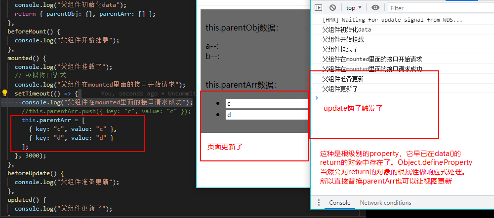
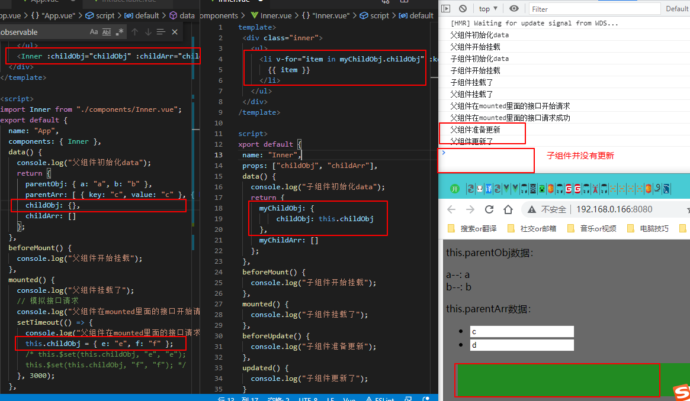
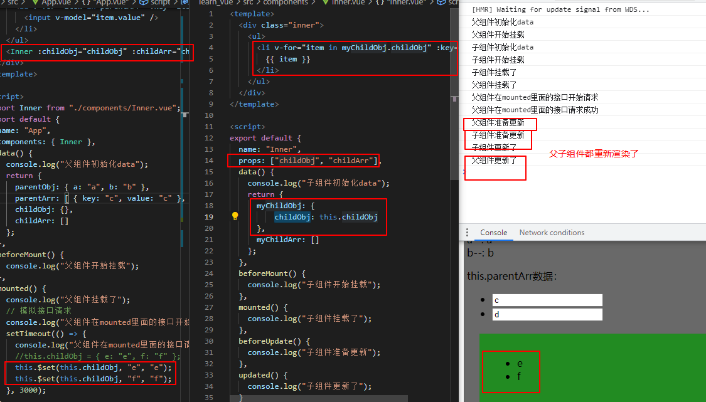
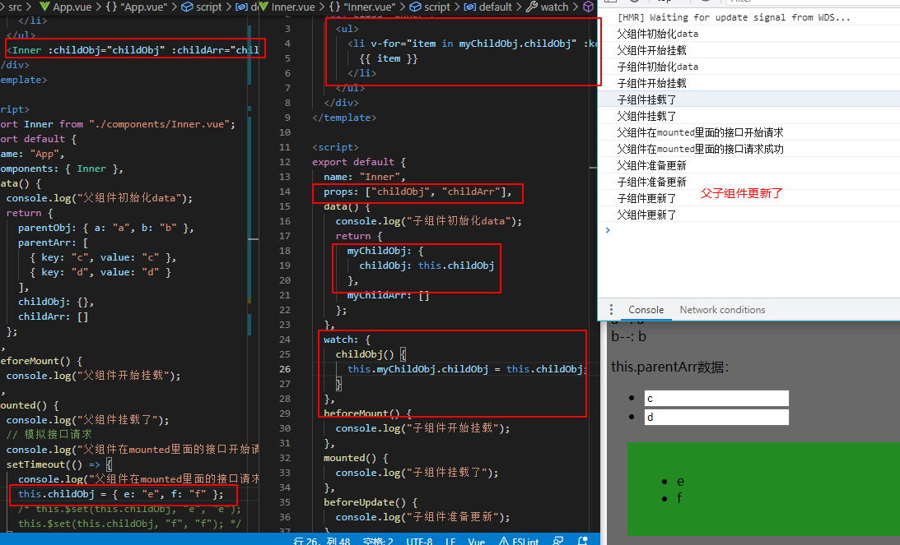
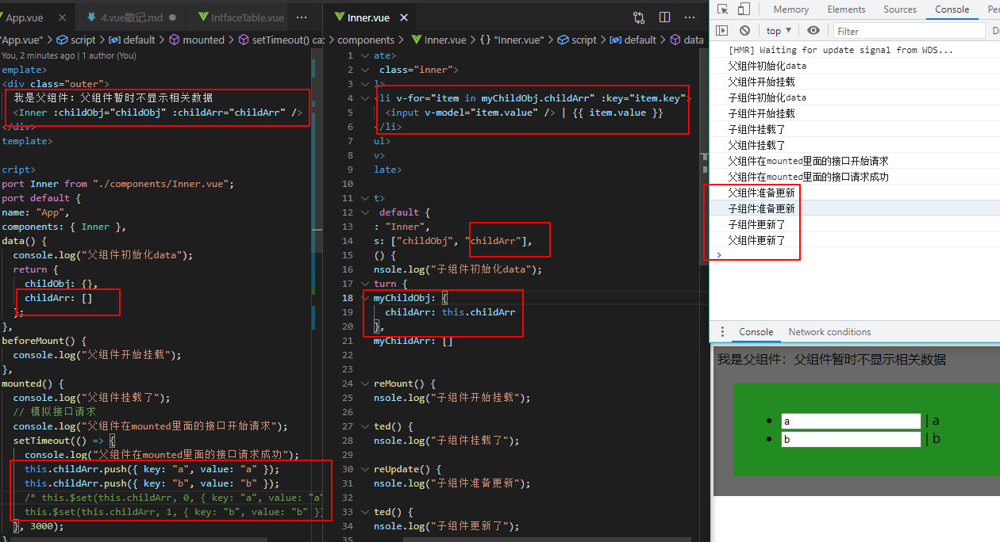

# vue散记

## 深入理解Vue2响应式

### 响应式数据为何不响应

先看下面的代码，组件在挂载后请求了接口，更改了数据，那视图为何不更新呢？update相关钩子也没有触发。看完代码会有对应的解释。

```vue
<template>
  <div class="outer">
    <p>this.parentObj数据：</p>
    <div>a--: {{ parentObj.a }}</div>
    <div>b--: {{ parentObj.b }}</div>
    <br />
    <p>this.parentArr数据：</p>
    <ul>
      <li v-for="item in parentArr" :key="item.key">
        <input v-model="item.value" />
      </li>
    </ul>
  </div>
</template>

<script>
export default {
  name: "App",
  data() {
    console.log("父组件初始化data");
    return { parentObj: {}, parentArr: [] };
  },
  beforeMount() {
    console.log("父组件开始挂载");
  },
  mounted() {
    console.log("父组件挂载了");
    // 模拟接口请求
    console.log("父组件在mounted里面的接口开始请求");
    setTimeout(() => {
      console.log("父组件在mounted里面的接口请求成功");
      this.parentObj.a = "a";
      this.parentObj.b = "b";
      this.parentArr[0] = { key: "c", value: "c" };
      this.parentArr[1] = { key: "d", value: "d" };
    }, 3000);
  },
  beforeUpdate() {
    console.log("父组件准备更新");
  },
  updated() {
    console.log("父组件更新了");
  }
};
</script>

<style scoped>
.outer {
  padding: 10px;
  background-color: dimgray;
}
</style>

```


如果有读过前面写的[1.vue基础](/book-web/web前端js框架/学习Vue/1.vue基础.md)里的第七章内容**Vue的数据监视**，就会知道上面例子不更新视图的原因了。下面就简单说一下。

在执行组件**构造函数**时（初始化时），会对传进来的option配置项（data、props、methods等）进行“解读”，其中将data和props就使用了`Object.defineProperty()`做成了响应式数据。响应式数据，我们常用的**简单类型**就不用说了，这里要说的就是上面例子中的**对象**和**数组**（特殊对象）。

vue会遍历（深层次的是递归）**对象**的属性，将它的属性使用`Object.defineProperty()`里的`getter`和`setter`，也就是在**访问**或**修改**对象的属性时就会“响应”。

至于**数组**，它是比较特殊的、聚合式的对象。vue对数组每一项这项**本身**不会做成响应式，但是**这项如果是个对象**，就会对这个**对象的属性**使用`Object.defineProperty()`做成了响应式的；那数组每项本身怎么办呢？每一项都是带了**下标索引**的，vue对数组的一些操作方法“动了手脚”，例如`push()`、`pop()`、`shift()`、`unshift()`、`splice()`、`sort()`、`reverse()`方法在被人使用时会“响应式”。

说到这里，你就应该明白`Object.defineProperty()`一直是围绕着**对象**的**属性**来实现响应式的。那么，对象和数组如果作为了**另一个响应式对象**的**属性**，那么这个对象和数组就是响应式的（注意，数组某索引位置上的对象不是这种情况）。`data()`的`return`的对象就是，比如上面那个例子，`parentObj`和`parentArr`就是作为`data() {return {}}`的`return`的对象的**属性**（叫做根级响应式property），那么`parentObj`和`parentArr`本身是响应式的。

上面的文字要仔细思考和理解。那我们改下代码，让组件的视图可以进行更新。数组`parentArr`的可以改成`this.parentArr.push({ key:"c", value: "c" })`，属于那8中方式之一，效果如下。


数组`parentArr`的还可以改成`this.parentArr = [{ key:"c", value: "c" }, { key:"d", value: "d" }]`。这种刚刚也讲了，`parentArr`本身是`data`里`return`的对象的属性（根级响应式property），效果如下。



对象`parentObj`的改法，`this.parentObj={a:'a',b:'b'}`，它受限于`data()`里定义时的情况，给它声明了属性就可以更改该属性进行视图重新渲染，你一个属性都没设置那目前就只能替换整个对象（接下来会说额外加响应式属性），效果如下。


最后要说的一点就是，对象在组件初始化时（执行构造函数），**没有预先设置属性**（像上面的`parentObj`在最初一个属性都没有），我现在突然想加上新的响应式属性要怎么做？如果你是想加**根级响应式property**，这个是不允许的，只能在`data()`里提前定义（声明）好**根级响应式property**。如果你想加在一个已存在的响应式对象上，那么可以使用`Vue.set`或者`vm.$set`（修改已有的也行）。


对于数组，`Vue.set`或者`vm.$set`可以为它添加或修改某索引上的那项，如果那项是个对象，那么会将该对象的**属性**做成一个响应式的。**但是**，那项本身不是响应式的，例如`this.parentArr[0] = { key: "e", value: "e" }`这样的还是不行。


最后的最后再啰嗦一遍，`Object.defineProperty()`是围绕**对象**的**属性**实现响应式的，这是在组件初始化时做的（组件构造函数只会最初执行一次）。后面**没有通过vue提供的方法来加的属性**是**没有响应式，没有响应式！没有响应式**！如果要**加**（修改值不算），就一定得通过Vue提供的方法（你想无中生有，不可能！得补票！）。所以，要么你在data/props里声明好对象**有哪些属性**，要么后面自己用`Vue.set`或者`vm.$set`来**补**（切记不能加**根级响应式property**）！

### props与响应式

我们经常对组件进行拆分，然后使用prop进行传参，子组件用props进行接收。子组件的props也会像data一样做成响应式数据。只是props是不允许修改的，我们经常将props赋给data里的数据。来看一些问题。

#### 模板要怎样才重新渲染

<!-- tabs:start -->

<!-- tab:App.vue -->

```vue
<template>
  <div class="outer">
    <p>this.parentObj数据：</p>
    <div>a--: {{ parentObj.a }}</div>
    <div>b--: {{ parentObj.b }}</div>
    <br />
    <p>this.parentArr数据：</p>
    <ul>
      <li v-for="item in parentArr" :key="item.key">
        <input v-model="item.value" />
      </li>
    </ul>
    <Inner :childObj="childObj" :childArr="childArr" />
    <!-- <Inner /> -->
  </div>
</template>

<script>
import Inner from "./components/Inner.vue";
export default {
  name: "App",
  components: { Inner },
  data() {
    console.log("父组件初始化data");
    return {
      parentObj: { a: "a", b: "b" },
      parentArr: [
        { key: "c", value: "c" },
        { key: "d", value: "d" }
      ],
      childObj: {},
      childArr: []
    };
  },
  beforeMount() {
    console.log("父组件开始挂载");
  },
  mounted() {
    console.log("父组件挂载了");
    // 模拟接口请求
    console.log("父组件在mounted里面的接口开始请求");
    setTimeout(() => {
      console.log("父组件在mounted里面的接口请求成功");
      this.childObj = { e: "e", f: "f" };
      this.childArr = [
        { key: "g", value: "g" },
        { key: "h", value: "h" }
      ];
    }, 3000);
  },
  beforeUpdate() {
    console.log("父组件准备更新");
  },
  updated() {
    console.log("父组件更新了");
  }
};
</script>

<style scoped>
.outer {
  padding: 10px;
  background-color: dimgray;
}
</style>
```

<!-- tab:Inner.vue -->

```vue
<template>
  <div class="inner">模板没有使用props和data</div>
</template>

<script>
export default {
  name: "Inner",
  props: ["childObj", "childArr"],
  data() {
    console.log("子组件初始化data");
    return { myChildObj: {}, myChildArr: [] };
  },
  watch: {
    childObj: {
      handler(newValue, oldValue) {
        console.log(
          "子组件watch childObj：新值newValue是",
          newValue,
          "旧值oldValue是",
          oldValue
        );
      }
    },
    childArr: {
      handler(newValue, oldValue) {
        console.log(
          "子组件watch childArr：新值newValue是",
          newValue,
          "旧值oldValue是",
          oldValue
        );
      }
    }
  },
  beforeMount() {
    console.log("子组件开始挂载");
  },
  mounted() {
    console.log("子组件挂载了");
  },
  beforeUpdate() {
    console.log("子组件准备更新");
  },
  updated() {
    console.log("子组件更新了");
  }
};
</script>

<style>
.inner {
  padding: 20px;
  margin: 20px;
  background-color: forestgreen;
}
</style>
```

<!-- tabs:end -->

我们会发现，在接口请求后，数据发生了改变，父组件进行了重新渲染，而子组件并没有，效果图如下。


这是因为组件的重新渲染，**是template里用的数据发生变化时，才会重新渲染**，否则是不会进行重新渲染的（**当然，响应式数据变了会“通知”组件去重新解析模板，至于页面重不重新渲染是元素diff比较结果而决定的**）。像上面的例子，父组件的`<Inner />`处就因为`childObj`和`childArr`的数据变化而导致重新渲染，如果此时去掉这两个，那么父组件在mounted后就不会引起视图重新渲染了。子组件更加明显，它的template根本就没有用到任何数据，就更不用谈重新渲染视图了。

#### props数据变了但页面未变

上面这个都是小问题。如果将props赋给data里的属性，会怎样？看下面的代码。

<!-- tabs:start -->

<!-- tab:App.vue -->

```vue
<template>
  <div class="outer">
    <p>this.parentObj数据：</p>
    <div>a--: {{ parentObj.a }}</div>
    <div>b--: {{ parentObj.b }}</div>
    <p>this.parentArr数据：</p>
    <ul>
      <li v-for="item in parentArr" :key="item.key">
        <input v-model="item.value" />
      </li>
    </ul>
    <Inner :childObj="childObj" :childArr="childArr" />
  </div>
</template>

<script>
import Inner from "./components/Inner.vue";
export default {
  name: "App",
  components: { Inner },
  data() {
    console.log("父组件初始化data");
    return {
      parentObj: { a: "a", b: "b" },
      parentArr: [
        { key: "c", value: "c" },
        { key: "d", value: "d" }
      ],
      childObj: {},
      childArr: []
    };
  },
  beforeMount() {
    console.log("父组件开始挂载");
  },
  mounted() {
    console.log("父组件挂载了");
    // 模拟接口请求
    console.log("父组件在mounted里面的接口开始请求");
    setTimeout(() => {
      console.log("父组件在mounted里面的接口请求成功");
      this.childObj = { e: "e", f: "f" };
      /* this.$set(this.childObj, "e", "e");
      this.$set(this.childObj, "f", "f"); */
    }, 3000);
  },
  beforeUpdate() {
    console.log("父组件准备更新");
  },
  updated() {
    console.log("父组件更新了");
  }
};
</script>
<style scoped>
.outer {
  padding: 5px;
  background-color: dimgray;
}
</style>
```

<!-- tab:Inner.vue -->

```vue
<template>
  <div class="inner">
    <ul>
      <li v-for="item in myChildObj.childObj" :key="item">{{ item }}</li>
    </ul>
  </div>
</template>

<script>
export default {
  name: "Inner",
  props: ["childObj", "childArr"],
  data() {
    console.log("子组件初始化data");
    return { myChildObj: { childObj: this.childObj }, myChildArr: [] };
  },
  beforeMount() {
    console.log("子组件开始挂载");
  },
  mounted() {
    console.log("子组件挂载了");
  },
  beforeUpdate() {
    console.log("子组件准备更新");
  },
  updated() {
    console.log("子组件更新了");
  }
};
</script>
<style>
.inner {
  padding: 20px;
  margin: 20px;
  background-color: forestgreen;
}
</style>
```

<!-- tabs:end -->

我们会发现，在接口请求后，数据发生了改变，父组件进行了重新渲染，而子组件并没有，效果图如下。



这是因为`myChildObj.childObj`一直都是`{}`空字面量对象，即使`myChildObj`和`childObj`本身被做成了响应式属性，但这又如何？父组件的mounted中改了`childObj`的地址值（引用），让它指向一个新对象；在子组件中，props中的`childObj`也会随着父组件变化，它也指向了一个新对象（因为直接将`childObj`的新引用传进来了）；那么子组件的data里的`myChildObj.childObj`也会指向新对象吗？

当然不会，它们之间只是**初始化时**在`data(){}`中进行了一个“地址值”（引用）的复制，对象中的`:`就是赋值，对象引用赋给了`myChildObj.childObj`。总的来说，子组件的props的`this.childObj`指向的对象**已经变了**，而data的`this.myChildObj.childObj`还是指向的是**老对象**，子组件的template里用的数据是`this.myChildObj.childObj`而不是`this.childObj`，所以子组件**不会重新渲染**。

#### 怎样修改前面的代码

那么怎样更改呢？将父组件代码中的`this.childObj = { e: "e", f: "f" }`进行注释，它下面的两行代码的注释放开即可。也就是加了`this.$set(this.childObj, "e", "e")`和`this.$set(this.childObj, "f", "f")`，看过上一小节就知道`childObj`在父组件初始化时没有`e`和`f`两个响应式属性，所以mounted后要加上两个新响应式属性就得用`this.$set`。只要不是更改父组件的childObj的引用，那么父组件`childObj`和子组件的props的`childObj`以及data的`myChildObj.childObj`就会**指向同一个对象**，对象添加新响应式属性也就是响应式数据变化了，那么父组件和子组件都会进行重新渲染。效果图如下。



还有另一种改法，在子组件了监听`childObj`的变化，一旦它变了，就将它重新赋值给`myChildObj.childObj`。并由于`myChildObj.childObj`是个响应式属性，它变了就能引起子组件重新渲染。效果图如下。



#### prop传数组是同样的问题

经常会遇到，在父组件请求接口得到数据，经过简单处理后，截取其中的**数组类型**的表格数据，将该数据通过prop传递给子组件。然后这个表格还会包含有Input控件，也就是说数据模型是个表单数据。例如`this.form.list`，这个list实际是通过prop传过来的。

它遇到的问题可能和上一小节差不多。出现问题的原因可能是处理接口响应时，中途没有一条一条push进父组件的`this.list`，而是在最后处理完直接`this.list = list`。list引用对象被替换成新的了，子组件还是用的旧的，这就导致子组件表格渲染不出来。`push`可以解决，`this.$set(this.list, index, obj)`也能解决，在子组件写`watch`也能解决。

<!-- tabs:start -->

<!-- tab:App.vue -->

```vue
<template>
  <div class="outer">
    我是父组件：父组件暂时不显示相关数据
    <Inner :childObj="childObj" :childArr="childArr" />
  </div>
</template>

<script>
import Inner from "./components/Inner.vue";
export default {
  name: "App",
  components: { Inner },
  data() {
    console.log("父组件初始化data");
    return {
      childObj: {},
      childArr: []
    };
  },
  beforeMount() {
    console.log("父组件开始挂载");
  },
  mounted() {
    console.log("父组件挂载了");
    // 模拟接口请求
    console.log("父组件在mounted里面的接口开始请求");
    setTimeout(() => {
      console.log("父组件在mounted里面的接口请求成功");
      this.childArr.push({ key: "a", value: "a" });
      this.childArr.push({ key: "b", value: "b" });
      /* this.$set(this.childArr, 0, { key: "a", value: "a" });
      this.$set(this.childArr, 1, { key: "b", value: "b" }); */
    }, 3000);
  },
  beforeUpdate() {
    console.log("父组件准备更新");
  },
  updated() {
    console.log("父组件更新了");
  }
};
</script>

<style scoped>
.outer {
  padding: 5px;
  background-color: dimgray;
}
</style>

```

<!-- tab:Inner.vue -->

```vue
<template>
  <div class="inner">
    <ul>
      <li v-for="item in myChildObj.childArr" :key="item.key">
        <input v-model="item.value" /> | {{ item.value }}
      </li>
    </ul>
  </div>
</template>

<script>
export default {
  name: "Inner",
  props: ["childObj", "childArr"],
  data() {
    console.log("子组件初始化data");
    return {
      myChildObj: {
        childArr: this.childArr
      },
      myChildArr: []
    };
  },
  beforeMount() {
    console.log("子组件开始挂载");
  },
  mounted() {
    console.log("子组件挂载了");
  },
  beforeUpdate() {
    console.log("子组件准备更新");
  },
  updated() {
    console.log("子组件更新了");
  }
};
</script>

<style>
.inner {
  padding: 20px;
  margin: 20px;
  background-color: forestgreen;
}
</style>

```

<!-- tabs:end -->



如果这个子组件是个弹窗dialog，在没有真正保存到服务器时，这个**数组类型**的表格数据还要有最原始的一份（或者将数据还原）。其实和上面一样，只是多了将数组**复制**一份（例如concat等）这个步骤，将原始数据和正在操作的数据**分隔**即可。用props方式，如果在父组件里复制list再传进去，那么会在data**有两个类似的list**；要是在传到子组件里再复制，它可能通过**props能修改对象的bug**就你的原始list弄乱（props原则上是不允许修改的）。那么最好还是在父组件复制了再传进去。如果你实在**不想**在父组件里多处一个“**正操作**”的list，那么可以考虑使用EventBus**全局事件总线**。

如果子组件不是弹窗而改用EventBus那就有点没必要了，孙组件或者兄弟组件可以用EventBus；如果是自上而下传方法，可以考虑`provide/inject`；如果是小范围组件的数据共享，可以考虑使用`Vue.observable( object )`，它是小型的Vuex。
