# 学习mysql的准备工作

## mysql简介

MySql是web server中最流行的**关系型数据库管理系统**（RDBMS）。[官网](https://www.mysql.com/)可免费下载，仅用于学习；它是轻量级的，易学易用。

为何使用 MySql 而不是 mogondb：

- MySql是企业内最常用的存储工具，一般都有专人运维。
- MySql也是社区最常用的存储工具，有问题随时可查。

## 一些概念

1. 关系：描述两个集合的元素，如何相互联系或者一一对应的数学概念。
2. 数据库：用于存放数据、访问数据和操作数据的存储仓库。
3. RDBMS：就是关系型数据库管理系统，比如DB2、Oracle和MySQL。
4. 数据库实例：是数据库在服务器中实际运行的一个进程，用来加载数据库。
5. sql：英文全称是Structured Query Language，中文名是结构化查询语言。是用于管理关系数据库管理系统的一种计算机语言。
6. sql主要分为数据定义语言(DDL)和数据操作语言(DML)。在有些资料里会将查询操作从DML里分出来，叫做数据查询语言(DQL)。其实sql还有数据控制语言(DCL)，在有些资料里会将Commit、Rollback（事务的提交和回滚）、SavePoint设置保存点从DCL中分出来，叫做事务控制语言(TCL)。

## 本地安装mysql

如果是使用云厂商的mysql数据库可以跳过本小节直接看下一节内容。

**mysql下载**：

1. 我们打开[https://dev.mysql.com/downloads/mysql/](https://dev.mysql.com/downloads/mysql/)网址，可能需要代理上网。
2. 其中`Select Operating System`是选择你的操作系统类型。
3. 然后我们没有选择`Installer`类型的安装包，我们选择的是`Windows (x86, 64-bit), ZIP Archive`这种解压包。并且我们暂时也用不着`Debug Binaries & Test Suite`类型的解压包。
    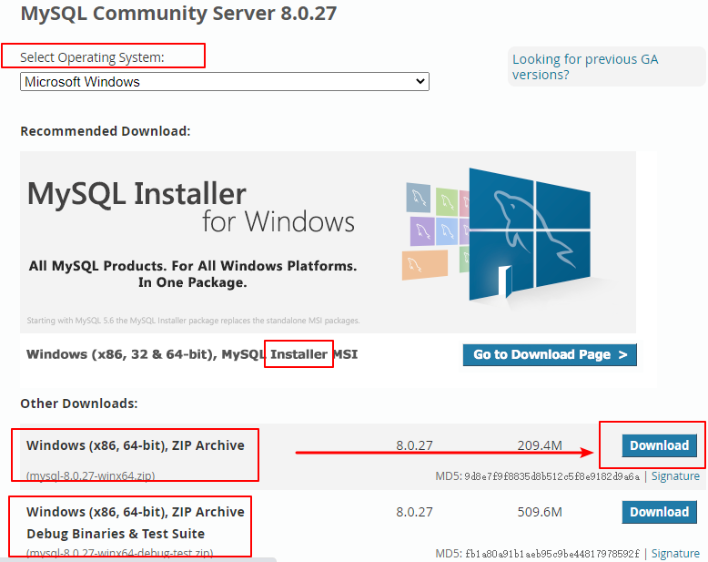  
4. 点击`Download`然后会跳转到一个页面，我们选择最底部的`No thanks, just start my download.`也就是不使用登录用户下载。
    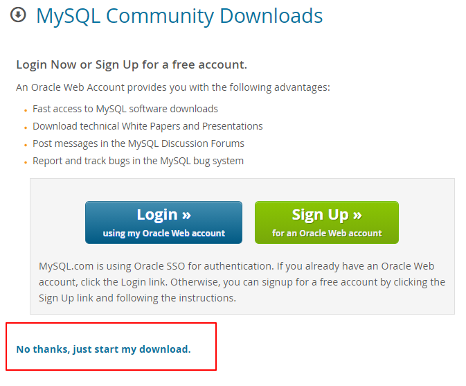  

**mysql安装**：

1. 解压下载后的zip，如下图。
    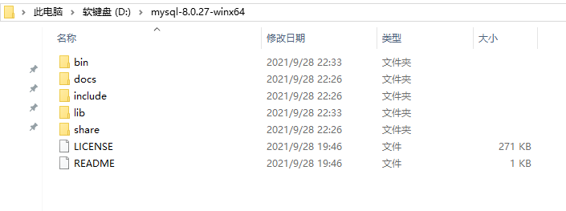  
2. 配置环境变量，将mysql文件夹下的bin路径添加到变量值中，注意得用`;`分隔（win10会智能一点）。右击“我的电脑”——选择“属性”——选择“高级系统设置”——选择“高级”——选择“环境变量”。在“系统变量”中选中“Path”进行编辑。
    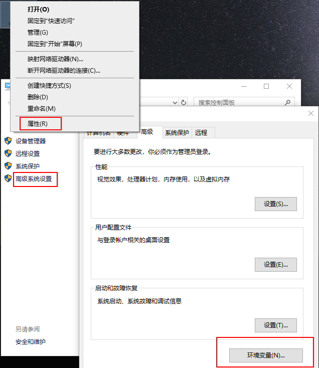  
    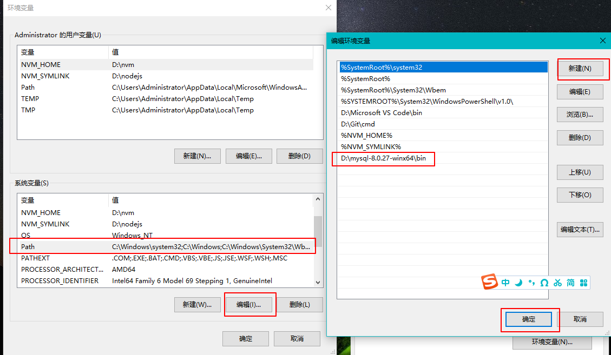  
3. 配置初始化的my.ini文件，在mysql目录里新增my.ini文件

    ```txt
    [client]
    # 设置客户端的端口号
    port=3306
    # 设置客户端默认字符集
    default-character-set=utf8
    [mysql]
    # 设置mysql客户端默认字符集
    default-character-set=utf8
    [mysqld]
    # 设置mysql服务运行时的端口号
    port=3306
    # 设置mysql的安装目录，双斜杠
    basedir=D:\\mysql-8.0.27-winx64
    # 设置mysql的数据存放目录
    datadir=D:\\mysql-8.0.27-winx64\\data
    # 允许最大连接数，如果出现Too Many Connections的错误就需要增加最大连接数
    max_connections=200
    # 允许连接失败的次数。防止被攻击，超过会禁止host连接，重启mysql服务器或flush hosts命令可让host继续连接
    max_connect_errors=10
    # 数据库和数据库表的默认字符集(mysql服务端)，utf8是3字节的，utf8mb4是4字节的可以支持一些Emoji表情
    character-set-server=utf8mb4
    # 数据库字符集对应一些排序规则,要属于character-set-server对应值的集合内
    collation-server = utf8mb4_general_ci
    # 设置client连接mysql时的字符集,防止乱码
    init_connect='SET NAMES utf8mb4'
    # 创建新表时将使用的默认存储引擎
    default-storage-engine=INNODB
    # 默认使用mysql_native_password插件认证
    default_authentication_plugin=mysql_native_password
    # MySQL连接闲置超过一定时间后(单位：秒)将会被强行关闭
    wait_timeout = 1800
    # MySQL默认的wait_timeout 值为8个小时，interactive_timeout参数需要同时配置才能生效
    interactive_timeout = 1800
    # 大小写不敏感：1，大小写敏感0
    lower_case_table_names=0
    #限制单个文件大小,默认1G,太大了
    max_binlog_size = 100M
    # 数据库错误日志文件
    log_error=D:\\mysql-8.0.27-winx64\\log\\error.log
    # 设置临时表最大值，这是每次连接都会分配，不宜设置过大 max_heap_table_size 和 tmp_table_size 要设置一样大
    max_heap_table_size = 2048M
    tmp_table_size = 2048M
    # 每个连接都会分配的一些排序、连接等缓冲，一般设置为 2MB 就足够了
    sort_buffer_size = 2M
    join_buffer_size = 2M
    read_buffer_size = 2M
    read_rnd_buffer_size = 2M
    # 0,每秒写一次log,并flush到磁盘；1,每次事务提交时，写log,同时flush到磁盘；2,每次事务提交时写log,每秒flush一次到磁盘
    innodb_flush_log_at_trx_commit = 1
    ```

4. 安装mysql，先以管理员身份运行cmd。
   - 进入到mysql安装目录下，输入`mysqld --install`来安装mysql服务。
   - 然后输入`mysqld --initialize --console`来初始化mysql，会出现`A temporary password is generated for root@localhost:`，它的后面就是root用户的初始密码，一定要记住。
   - 输入`net start mysql`开启mysql服务（如果失败了，那就输入`mysqld --remove`卸载mysql服务，再重新安装），如果输入`net stop mysql`这是停止mysql服务。
   - 输入`mysqladmin -u用户名 -p旧密码 password 新密码`来修改那个初识密码，例如`mysqladmin -uroot -p123456 password 123`。输入`mysql -u root -p`也可以修改密码。

## 云厂商mysql

我们上线的项目是站库分离的，也就是后端代码与数据库不在同一台服务器上。这样的好处是减轻本地个人计算机的压力，云厂商的云数据库可以存放正开发的数据库，也可以存放已经上线的数据库，也就是它可以存放不同项目不同状态的数据库，更好的维护。况且云数据库也很便宜，新人优惠买3年也只要60元，双十一每年也只要10块钱。

我们以阿里云为例，进入[https://www.aliyun.com/product/rds/mysql](https://www.aliyun.com/product/rds/mysql)这个网站，新用户会有优惠活动。

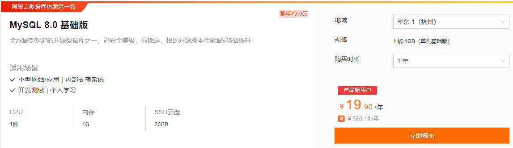

如果你不是新用户，那就只能点击页面顶部的“立即购买”按照原价来购买了。例如下面这种，买的一个月的，一核一G，只有20G存储空间，我选的是在上海的mysql云数据库（选里你近的）。

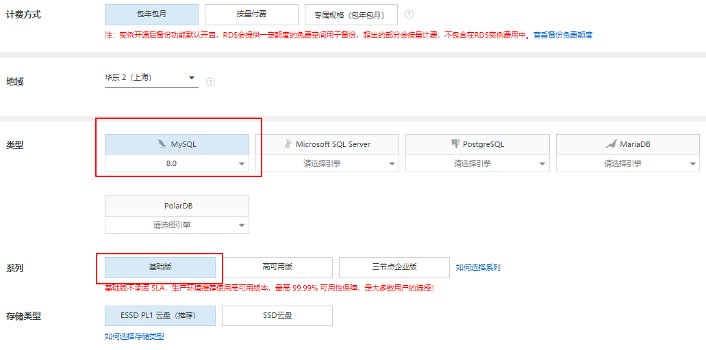  
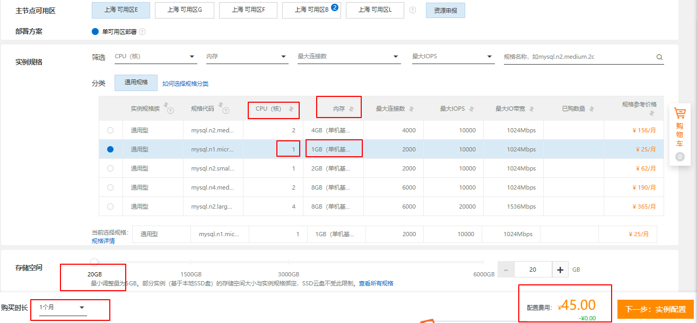  

购买完成后进入[https://rdsnext.console.aliyun.com/dashboard](https://rdsnext.console.aliyun.com/dashboard)页面，然后按照下图可以完成创建账户和数据库以及连接数据库。（查询MYSQL数据库版本`SELECT VERSION()`）

  
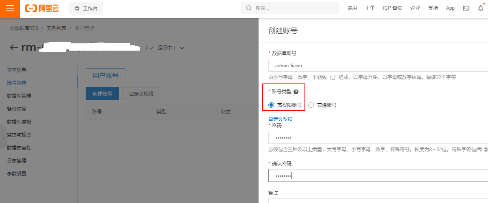  
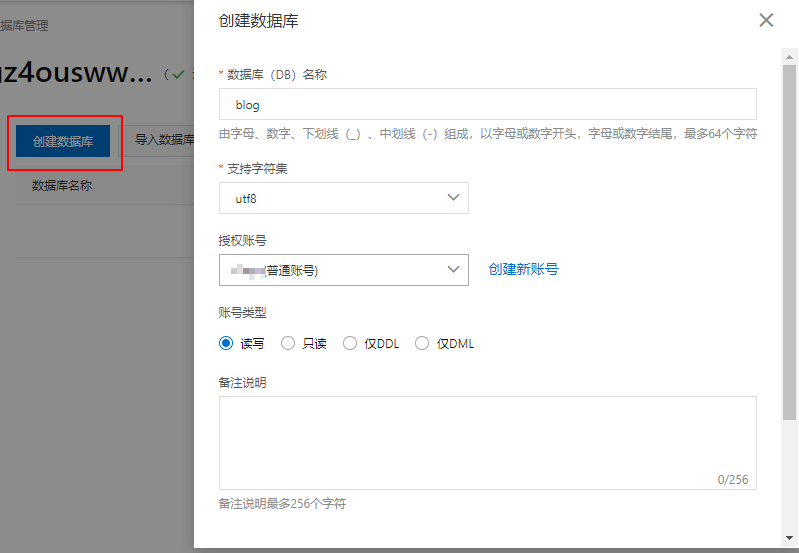  
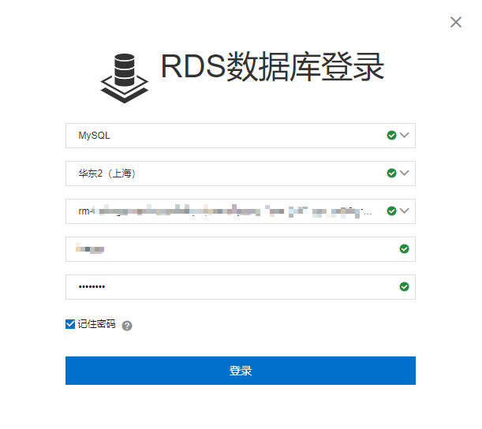  

## 数据库客户端navicat

我们使用的数据库客户端是[Navicat](https://www.navicat.com.cn)，**navicat**的下载安装可以去[navicat官网](https://www.navicat.com.cn/products)下载Navicat Premium 15的试用版，破解的话可以看[知乎的这篇文章](https://zhuanlan.zhihu.com/p/384645315)。

navicat破解：选择版本，选择navicat.exe，补丁，注册码生成，复制请求码，激活码生成。

navicat的基本设置在“工具-选项”里：

- 布景主题：深色
- 启动画面：从上次离开的画面继续
- 查询：在关闭前提示保存新建的查询或配置文件，自动保存间隔修改为60s
- 常规颜色：`220,220,170`
- 关键字颜色：`86,156,214`
- 字符串颜色：`206,145,120`
- 数字颜色：`181,206,168`
- 注释颜色：`106,153,85`

## navicat连接阿里云mysql

在项目上线时，我们是将代码部署到云厂商的云服务器上的，然后云服务器也是可以安装mysql的（跟第一节内容差不多），也就是站库不分离的。使用数据库客户端连接数据库，要通过云服务器的**外网地址**与连接，具体就不展开，因为我们使用的是站库分离的方式。

站库分离，到时候云服务器要通过**内网地址**与云数据库进行连接，这个也不展开了。而在我们本地开发项目时（还未上线正在开发中），需要使用数据库客户端navicat连接云数据库的，这要通过云数据库的**外网地址**。

navicat连接阿里云云数据库mysql步骤：

- 首先进入[阿里云工作台](https://homenew.console.aliyun.com/)的[资源实例视图](https://homenew.console.aliyun.com/home/dashboard/ResourceDashboard)，进入你的阿里云mysql的实例。
    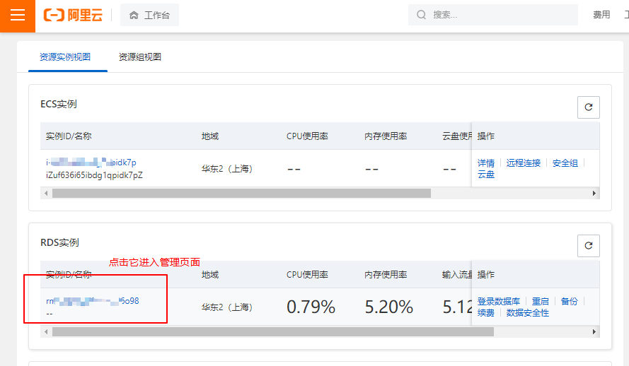
- 然后查看我们的mysql实例的连接详情，我们需要申请一下**外网地址**（点击“申请外网地址”按钮即可），然后还要设置一下白名单。
    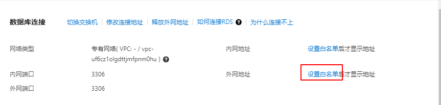
- 阿里云mysql白名单的设置，首先把default的`127.0.0.1`改为ecs私网地址（因为我们是站库分离的，如果没有ecs就改成其他的IP，只要不是`127.0.0.1`就行），再设置一个自己电脑IP地址（该IP是你自己电脑的公网IP，在百度上查询自己电脑的公网IP，像我用的长城宽带，IP几乎每天都不一样）。
    [阿里云mysql白名单设置](./img/学习mysql的准备工作/阿里云mysql白名单设置.png)
- 设置完白名单后再点击“查看连接详情”，就能看到阿里云mysql的**外网地址**了。
    [已获取阿里云mysql外网地址](./img/学习mysql的准备工作/已获取阿里云mysql外网地址.png)
- 在navicat面板里找到“连接-阿里云-阿里云云数据库MySql版”
    [navicat连接阿里云mysql](./img/学习mysql的准备工作/navicat连接阿里云mysql.png)
- 在“新建连接”里，连接名随意填，主机名就是阿里云mysql的**外网地址**，端口号一般是3306（上一步也能看到端口号），用户名和密码在[阿里云mysql数据库](./学习mysql的准备工作#阿里云mysql数据库)这一节的“创建账号”里说过了，最好用阿里云mysql的高权限账号，比如我的是`admin_liawn`。
    [navicat新建连接](./img/学习mysql的准备工作/navicat新建连接.png)
- 创建好连接后你可以点击一下“测试连接”按钮，如果不成功，很有可能是你的阿里云mysql白名单设置有问题，可以暂时把白名单设置成`0.0.0.0/0`，直到你真的弄清楚你本地的公网地址，再把`0.0.0.0/0`改为你的公网地址。如果成功，保存连接，在navicat面板右击连接名，然后选择“打开连接”。
    [进行连接阿里云mysql](./img/学习mysql的准备工作/进行连接阿里云mysql.png)
- 如果还有问题，可以查看[解决无法连接实例问题](https://help.aliyun.com/document_detail/127814.htm)。

## 建库建专用用户

可以直接在阿里云mysql里建库，也可以通过navicat连接阿里云mysql之后，在navicat上进行建库。这里讲第二种，我们右击“阿里云MySql”（名字是在创建连接时随意取的），然后选择“新建数据库”。我们新建数据库`blog_dev`用于开发环境，字符集使用`utf8mb4`（支持复杂的Unicode）。

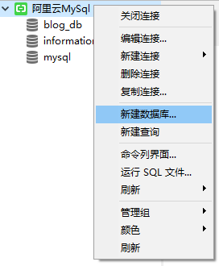  
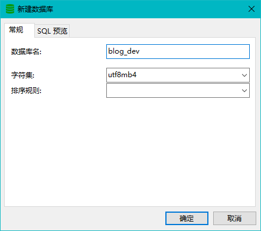  

然后我们给新数据库`blog_dev`新建一个专用的“用户”，这个用户只能操作阿里云mysql里的这个`blog_dev`数据库，其他数据库没有权限。
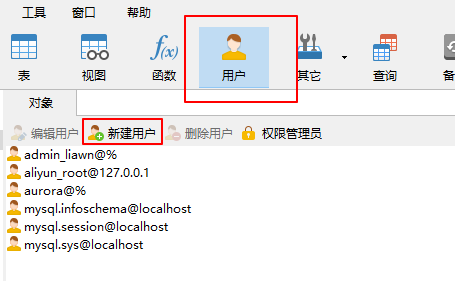  
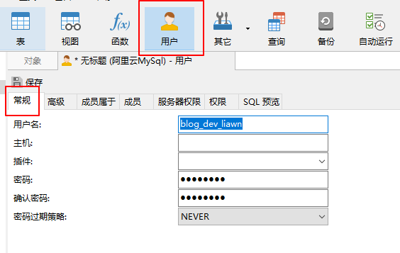  
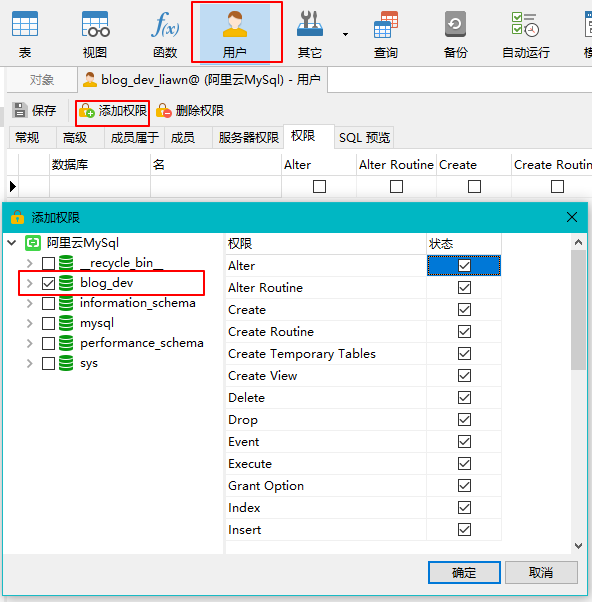  

如果点击“用户”报`1142 - SELECT command denied to user`错误，那表示你没有权限，要将“阿里云MySql”这个连接信息的用户名改为阿里云mysql的高权限账号，比如我的高权限账号是`admin_liawn`。
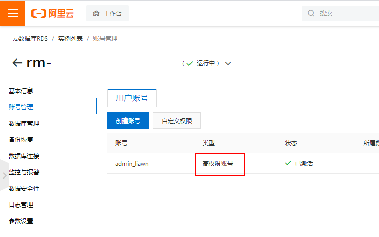  
  

等专用用户创建成功后，我们再将连接信息的用户改为这个专用用户。
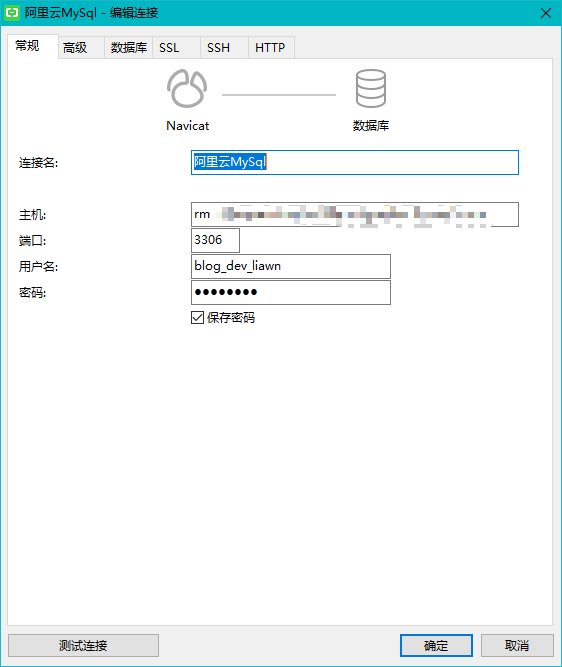  

常用的系统类函数以及sql

- `version()`：查看数据库版本号。`SELECT VERSION();`
- `database()`：查看当前库。`SELECT DATABASE();`
- `user()`：查看当前用户。`SELECT USER();`
- `SHOW DATABASES`：查看所有数据库。
- `SHOW TABLES`：查看当前库里的所有表。
