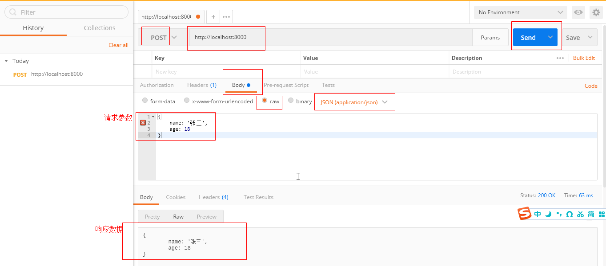

# 处理Http请求

## 搭建Http服务

首先需要引入http模块，使用它的createServer方法来创建一个http服务。createServer方法的形参是一个回调函数，在每次接收到请求时被执行。该回调函数有两个形参，第一个是请求对象，第二个是响应对象。在最后，需要使用listen方法来监听一个端口（第一个形参），服务就绪时会执行第二个形参（回调函数）。

```js
// 引入http模块
const http = require('http')
// 服务会部署在哪个端口
const port = 8000
// 创建一个服务
const server = http.createServer((req, res) => {
    // 状态码
    res.statusCode = 200
    // 数据形式
    res.setHeader('Content-Type', 'text/plain')
    // 返回给客户端的信息
    res.end('你好世界\n')
})
// 服务就绪
server.listen(port, () => {
    console.log('服务已启动');
})
```

## 处理get请求

GET请求是客户端向服务端请求查询一些数据，可以在URL带上查询参数。浏览器URL直接回车请求就是一个GET请求。请看下面这个例子，浏览器输入`http://localhost:8000/?key=1&name=2`并回车，req.method的值是`GET`，`req.url`的值是`/?key=1&name=2`，经过URLSearchParams处理过后，返回到页面的值是一个JSON字符串`{"key":"1","name":"2"}`。

```js
// 引入http模块
const http = require('http')
const { URL } = require('url')
// 服务会部署在哪个端口
const port = 8000
// 创建一个服务
const server = http.createServer((req, res) => {
    // 什么类型的请求，请求的地址
    console.log('req.method', req.method);
    console.log('req.url', req.url);
    // URL相关信息
    const url = new URL(req.url, `http://${req.headers.host}`);
    const resData = {};
    // 显示键/值对，处理成对象
    for (const item of url.searchParams) {
        resData[item[0]] = item[1]
    }
    // 状态码
    res.statusCode = 200
    // 数据形式
    res.setHeader('Content-Type', 'application/json')
    // 返回给客户端的信息
    res.end(JSON.stringify(resData))
})
// 服务就绪
server.listen(port, () => {
    console.log('服务已启动');
})
```

当 request.url 为 `'/status?name=ryan'` 且 request.headers.host 为 `'localhost:3000'` 时：

```js
$ node
> new URL(request.url, `http://${request.headers.host}`)
URL {
  href: 'http://localhost:3000/status?name=ryan',
  origin: 'http://localhost:3000',
  protocol: 'http:',
  username: '',
  password: '',
  host: 'localhost:3000',
  hostname: 'localhost',
  port: '3000',
  pathname: '/status',
  search: '?name=ryan',
  searchParams: URLSearchParams { 'name' => 'ryan' },
  hash: ''
}
```

## 处理post请求

POST请求是客户端向服务端传递一些数据，这些数据大多数用于修改更新服务端存储数据。POST请求可以使用ajax/axios来发送，如果不想写代码，可以使用谷歌应用商店里的[postman](https://chrome.google.com/webstore/detail/postman-interceptor/aicmkgpgakddgnaphhhpliifpcfhicfo/related?hl=zh)来模拟发送POST请求。

node处理POST请求的处理与GET不一样，它的接收数据可能会很大，所以它使用了`req.on('data')`来一直接收数据，在数据接收完后有`req.on('end')`来收尾。

```js
// 引入http模块
const http = require('http')
// 服务会部署在哪个端口
const port = 8000
// 创建一个服务
const server = http.createServer((req, res) => {
    if (req.method === 'POST') {
        console.log('req Content-Type', req.headers['content-type']);
        let postData = '';
        // 接收数据
        req.on('data', chunk => {
            postData += chunk;
        });
        // 数据接收完毕
        req.on('end', () => {
            console.log('postData', postData);
            // 状态码
            res.statusCode = 200
            // 数据形式
            res.setHeader('Content-Type', 'application/json')
            // 返回给客户端的信息
            res.end(JSON.stringify(postData))
        })
    }
})
// 服务就绪
server.listen(port, () => {
    console.log('服务已启动');
})
```

打开谷歌浏览器，进入`chrome://apps`，点击`Postman`，我们在以下界面填写相应的数据。地址栏里填写完整的地址，包括端口号；点击Body，然后选择raw，然后选择数据类型为`JSON(application/json)`；在textArea里输入请求数据例如`{name:'张三',age:18}`，最后点击Send就可以发送一个POST请求了。（下图的请求参数是“Bad String”，字符串得使用双引号，并且这个key也得用双引号包裹）



看一下同时处理GET和POST请求：

```js
// 引入http模块
const http = require('http')
const { URL } = require('url')
// 服务会部署在哪个端口
const port = 8000
// 创建一个服务
const server = http.createServer((req, res) => {
    // 什么请求
    const method = req.method
    // 数据形式
    res.setHeader('Content-Type', 'application/json')
    // 状态码
    res.statusCode = 200
    // URL相关信息
    const url = new URL(req.url, `http://${req.headers.host}`);

    if (method === 'GET') {
        const resData = {};
        for (const item of url.searchParams) {
            resData[item[0]] = item[1];
        }
        // 返回给客户端的信息
        res.end(JSON.stringify(resData));
    } else if (method === 'POST') {
        let postData = '';
        // 接收数据
        req.on('data', chunk => {
            postData += chunk;
        });
        // 数据接收完毕
        req.on('end', () => {
            // 返回给客户端的信息
            res.end(JSON.stringify(postData))
        })
    }
})
// 服务就绪
server.listen(port, () => {
    console.log('服务已启动');
})
```
