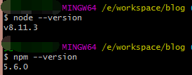
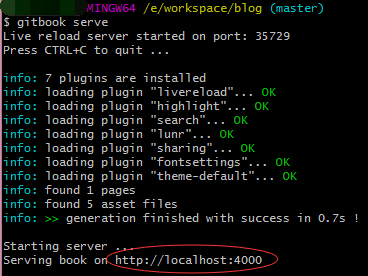

# 使用gitbook写blog

## 了解GitBook

&nbsp;&nbsp;&nbsp;&nbsp;[GitBook](http://gitbook.hushuang.me/)是一款基于Node.js的文档编写工具，支持[Markdown](http://gitbook.hushuang.me/syntax/markdown.html)和[AsciiDoc](http://gitbook.hushuang.me/syntax/asciidoc.html)文档格式，并且可以将这些文档组织成一本书的形式。与Git搭配更容易管理文档，当然也可以使用GitHub的Pages来部署你的“书”。这样就可以尽情的使用这一套流程来充实你的个人博客啦！

## 环境搭建

1. 之前有写过[Npm的使用](Npm的使用.md)，简单来说就是先下载安装[Node.js](https://nodejs.org/zh-cn/)，已安装Node.js的就直接安装[GitBook](http://gitbook.hushuang.me/)，Node.js安装完后使用两条命令检查一下：**node --version** 和 **npm --version**  
  
2. 全局安装GitBook，命令是 **npm install gitbook-cli -g**
3. 然后在当前目录下创建一本书，命令是 **gitbook init**，会生成README和SUMMARY，一个是说明文档，一个是书的目录。

## 配置book.json

- 常规设置：  

| 变量        | 说明                                                                  |
| ----------- | --------------------------------------------------------------------- |
| root        | 包含所有图书文件的根文件夹的路径，除了book.json                       |
| structure   | 指定自述，摘要，词汇表等的路径。                                      |
| title       | 书的标题，默认值从README中提取。在GitBook.com上，此字段已预填。       |
| description | 您的图书说明，默认值从自述文件中提取。在GitBook.com上，此字段已预填。 |
| author      | 作者姓名。在GitBook.com上，此字段已预填。                             |
| isbn        | 书的国际码ISBN                                                        |
| language    | 语言ISO规范的书的语言，默认值是en                                     |
| direction   | 文本的方向。可以是rtl或ltr，默认值取决于language 的值                 |
| gitbook     | GitBook的版本。使用SemVer规范并接受诸如“> = 3.0.0”的条件              |

- 常用插件：  
  - "chapter-fold"：左侧目录折叠。
  - "code"：代码块的行数和复制按钮。
  - "search-pro"：高级搜索（含中文），需要去掉默认插件即"-lunr"和"-search"。
  - "splitter"：侧边栏宽度可调节。
  - "sharing-plus"：分享。
  - "pageview-count"：阅读量计数。
  - "lightbox"：当前页将图打开放大显示。
  - "theme-fexa": 定制化主题。
  - "anchor-navigation-ex"：悬浮的“目录”和“返回顶部”。

&nbsp;&nbsp;&nbsp;&nbsp;配置好后使用 **gitbook install** 命令进行插件安装。参考链接[https://www.cnblogs.com/mingyue5826/p/10307051.html](https://www.cnblogs.com/mingyue5826/p/10307051.html)

## 使用GitBook

1. 预览这本书可以使用 **gitbook serve** 先本地编译，再通过日志里它给的地址去预览这本书  
  
2. 在项目中编写你的md文档，如果想要将它添加到书里并显示，那么在SUMMARY.md文档中合适的位置新增一个“标题”（使用md的链接语法），再使用 **gitbook serve** 命令进行编译（只要修改了就要重新编译），并打开地址去预览新的内容。  
3. 部署到线上作为自己的个人博客。先使用 **gitbook build** 对书进行打包，会生成_book文件夹。可以使用GitHub和Gitee的Pages进行部署。例如使用Gitee，进入线上仓库（部署的位置），依次点击“服务”-“Gitee Pages”，然后选择好你要部署的分支和目录（_book文件夹）。
      

## 常见问题

1. **文件404问题**：Git是默认忽略大小写问题的，修改文件夹的大小写上传到Git远程代码库，将这个远程代码库的build部分部署到服务器上，在访问修改文件夹下的文件时会出现404问题。**解决方案：打开本地项目的.git目录下的config文件，修改里面的ignorecase选项为false。**  
2. 其他问题可以通过服务器上的文件与本地文件对比找出解决方案。
