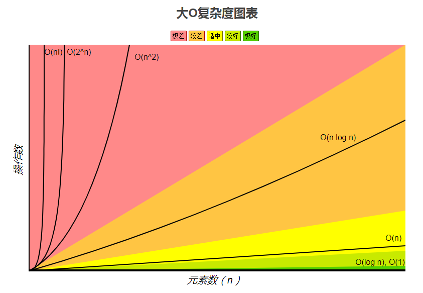
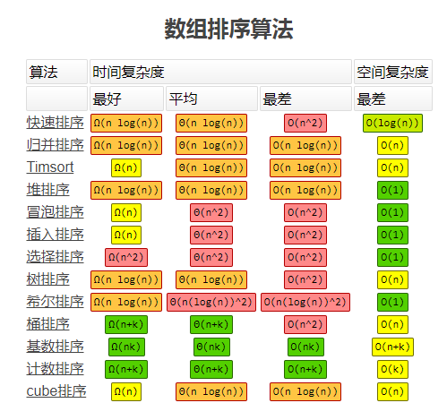
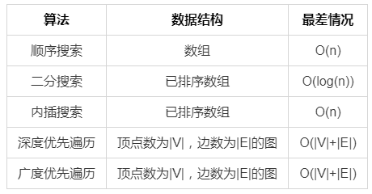

# 算法复杂度

## 大O表示法

&nbsp;&nbsp;&nbsp;&nbsp;大O表示法是用于描述算法的性能和复杂程度，可以表示时间上的复杂度也可以表示空间上的复杂度。时间复杂度一般考虑的CPU时间的占用，而空间复杂度一般考虑的内存的占用。  
&nbsp;&nbsp;&nbsp;&nbsp;大O主要分类有下列几种：  

|    符号    |   名称    |     例子      |
| :--------: | :-------: | :-----------: |
|    O(1)    |  常数阶   |     0731      |
|    O(n)    |  线性阶   |     5n+2      |
|   O(n^2)   |  平方阶   |   2n^2+3n+4   |
| O(log(n))  |  对数阶   |   3log(n)+4   |
| O(nlog(n)) | nlog(n)阶 | 3nlog(n)+4n+5 |
|   O(n^3)   |  立方阶   | 2n^3+3n^2+n+5 |
|   O(2^n)   |  指数阶   |      2^n      |

## 理解大O表示法

1.**O(1)**：不管参数如何，只运行一次。

```js
// 不管num多大，在函数里只会运行一次，其时间复杂度就是O(1)
function increment(num) {
    return ++num;
}
```

2.**O(n)**：跟给定参数有关，运行情况一般是线性的。

```js
/*
    顺序搜索，最好的情况就是第一个就搜索到，最坏的情况是最后一个
    搜索到，平均情况下就跟array的长度有关；对应的最好情况时间复杂
    度是O(1)，平均和最差的时间复杂度是O(n)
*/
function sequentialSearch<T>(array: T[], value: T) {
    for (let i = 0; i < array.length; i++) {
        if (value === array[i]) {
            return i;
        }
    }
    return -1;
}
```

3.**O(n^2)**：跟线性类似，但是多用于两层的嵌套循环。

```js
// 冒泡排序，元素之间有了比较，会使用两层循环，也就是说最坏和平
// 均复杂度是O(n^2)，最好情况是已排好序，只遍历一轮也就是O(n)
function bubbleSort<T>(array: T[]) {
    const length = array.length;
    if (length < 2) {
        return array;
    }
    for (let i = 0; i < length; i ++) {
        // 交换状态
        let hasSwap: boolean = false;
        // 减i是因为每轮都把最大的冒泡到末尾了，下一轮无需再处理
        for (let j = 0; j < length - i - 1; j ++) {
            // 如果array[j]大于array[j + 1]就交换
            if (array[j] > array[j + 1]) {
                swap(array, j, j + 1);
                hasSwap = true;
            }
        }
        /*
            如果某一轮里没有冒泡交换过，代表已经提前排好顺序了。
            这是冒泡排序最好复杂度为O(N)的原因，其他情况是O(N^2)
        */
        if (!hasSwap) {
            break;
        }
    }
    return array;
}
```

4.**O(log(n))**：常用于while循环和递归，条件跟n有关。

```js
// 二分搜索，每次取一个中间值与目标值对比。
// 2^x=n，对2进行x次方才能完成n项的搜索，即对数log(n)，底数是2
function binarySearch<T>(array: T[], value: T): number {
    let low: number = 0;
    let high: number = sortedArray.length - 1;
    // low大于high才停止搜索
    while (low <= high) {
        // 每次取中间数，大概2^x完成这n项的搜索
        const mid = low + Math.floor((high - low) / 2);
        const midValue = sortedArray[mid];
        if (value < midValue) {
            high = mid - 1;
        } else if (value > midValue) {
            low = mid + 1;
        } else {
            return mid;
        }
    }
    return -1;
}
```

4.**O(nlog(n))**：常用于一层n次循环套上while循环或递归，例如常见的[归并排序](https://gitee.com/liawnliu/datastructures_ts/blob/master/src/ts/algorithms/sorting/merge-sort.ts)和[快速排序](https://gitee.com/liawnliu/datastructures_ts/blob/master/src/ts/algorithms/sorting/quick-sort.ts)。代码较多就不展开了，具体是具体章节查看。

## 时间复杂度的比较

&nbsp;&nbsp;&nbsp;&nbsp;在这网站[https://www.bigocheatsheet.com/](https://www.bigocheatsheet.com/)可以看到相关信息。  
  
  
**补充一个图的时间复杂度表：**  

  
  

**补充一个搜索算法的最差时间复杂度表：**  

  
